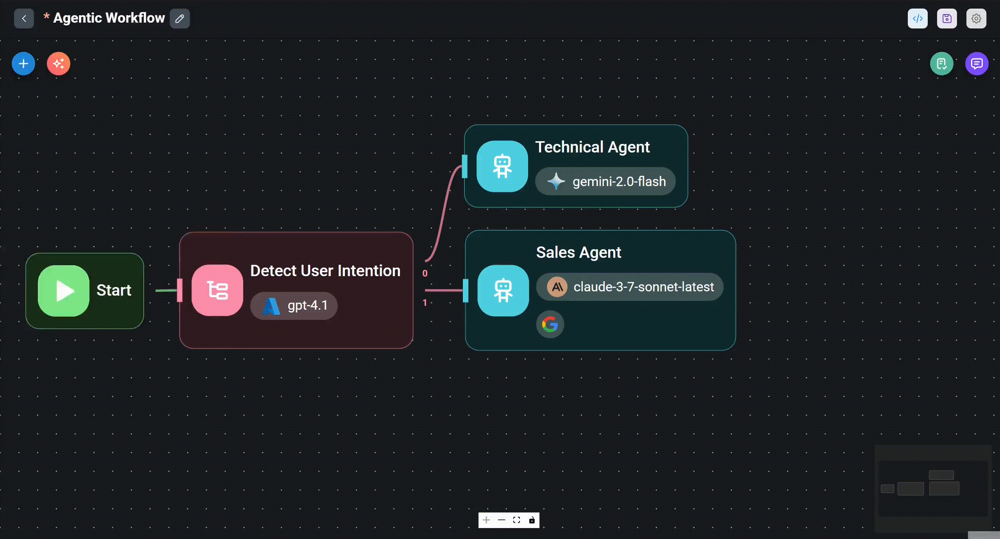
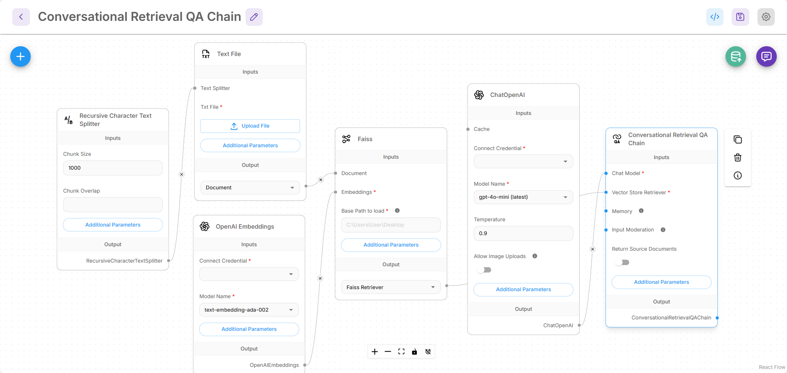
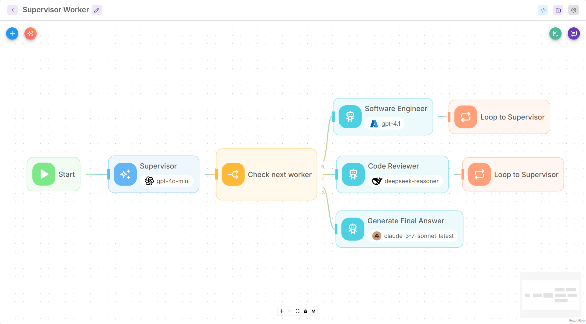

# 소개

<figure><figcaption></figcaption></figure>

Flowise는 AI Agent와 LLM 워크플로우를 구축하기 위한 오픈 소스 생성형 AI 개발 플랫폼입니다.

다음을 포함하는 완전한 솔루션을 제공합니다:

* [x] 비주얼 빌더(Visual Builder)
* [x] 추적 및 분석(Tracing & Analytics)
* [x] 평가(Evaluations)
* [x] Human in the Loop
* [x] API, CLI, SDK, 임베디드 챗봇(Embedded Chatbot)
* [x] 팀 및 워크스페이스(Teams & Workspaces)

주요 비주얼 빌더는 다음 3가지입니다:

* Assistant
* Chatflow
* Agentflow

## Assistant

Assistant는 AI Agent를 생성하는 가장 초보자 친화적인 방법입니다. 사용자는 지시를 따르고, 필요할 때 도구를 사용하며, 업로드한 파일([RAG](https://en.wikipedia.org/wiki/Retrieval-augmented_generation))에서 지식 베이스를 검색하여 사용자 질의에 응답할 수 있는 채팅 assistant를 만들 수 있습니다.

<figure><picture><source srcset=".gitbook/assets/Screenshot 2025-06-10 232758.png" media="(prefers-color-scheme: dark)"></picture><figcaption></figcaption></figure>

## Chatflow

Chatflow는 단일 에이전트 시스템, 챗봇 및 간단한 LLM 플로우를 구축하도록 설계되었습니다. Assistant보다 더 유연합니다. 사용자는 Graph RAG, Reranker, Retriever 등과 같은 고급 기법을 사용할 수 있습니다.

<figure><picture><source srcset=".gitbook/assets/screely-1749594035877.png" media="(prefers-color-scheme: dark)"></picture><figcaption></figcaption></figure>

## Agentflow

Agentflow는 Chatflow와 Assistant의 상위 집합(superset)입니다. 채팅 assistant, 단일 에이전트 시스템, 멀티 에이전트 시스템, 그리고 복잡한 워크플로우 오케스트레이션을 만드는 데 사용할 수 있습니다. 자세히 알아보기 [Agentflow V2](using-flowise/agentflowv2.md)

<figure><picture><source srcset=".gitbook/assets/screely-1749594631028.png" media="(prefers-color-scheme: dark)"></picture><figcaption></figcaption></figure>

## Flowise 기능

| 기능 영역                       | Flowise 기능                                                                                                         |
| ---------------------------- | ------------------------------------------------------------------------------------------------------------------- |
| 오케스트레이션                  | 비주얼 에디터, 오픈 소스 및 독점 모델 지원, 표현식, 커스텀 코드, 분기/반복/라우팅 로직                                            |
| 데이터 수집 및 통합             | 100개 이상의 소스, 도구, 벡터 데이터베이스, 메모리에 연결                                                                  |
| 모니터링                       | 실행 로그, 비주얼 디버깅, 외부 로그 스트리밍                                                                             |
| 배포                          | 셀프 호스팅 옵션, 에어갭(air-gapped) 배포                                                                              |
| 데이터 처리                    | 데이터 변환, 필터, 집계, 커스텀 코드, RAG 인덱싱 파이프라인                                                               |
| 메모리 및 계획                  | 다양한 메모리 최적화 기법 및 통합                                                                                       |
| MCP 통합                      | MCP 클라이언트/서버 Node, 도구 목록, SSE, 인증 지원                                                                     |
| 안전성 및 제어                  | 입력 모더레이션 및 출력 후처리                                                                                          |
| API, SDK, CLI                | API 접근, JS/Python SDK, 커맨드 라인 인터페이스                                                                        |
| 임베디드 및 공유 챗봇           | 커스터마이징 가능한 임베디드 채팅 위젯 및 컴포넌트                                                                        |
| 템플릿 및 컴포넌트             | 템플릿 마켓플레이스, 재사용 가능한 컴포넌트                                                                              |
| 보안 제어                      | RBAC, SSO, 암호화된 자격 증명, 시크릿 매니저, 속도 제한, 제한된 도메인                                                     |
| 확장성                        | 수직/수평 확장, 높은 처리량/워크플로우 부하                                                                              |
| 평가                          | 데이터셋, 평가자(Evaluators) 및 평가(Evaluations)                                                                      |
| 커뮤니티 지원                  | 활발한 커뮤니티 포럼                                                                                                   |
| 벤더 지원                      | SLA 지원, 컨설팅, 고정/결정적 가격 책정                                                                                 |

## 기여하기

이 프로젝트에 도움을 주고 싶으시다면 [기여 가이드(Contribution Guide)](https://github.com/FlowiseAI/Flowise/blob/main/CONTRIBUTING.md)를 검토해 주세요.

## 도움이 필요하신가요?

지원 및 추가 논의가 필요하시면 저희 [Discord](https://discord.gg/jbaHfsRVBW) 서버로 방문해 주세요.
