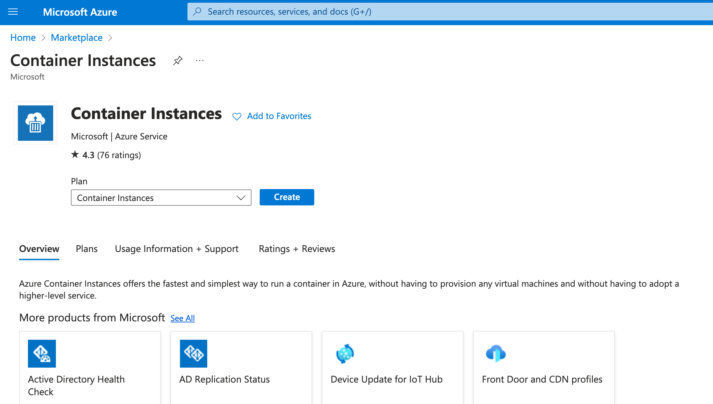
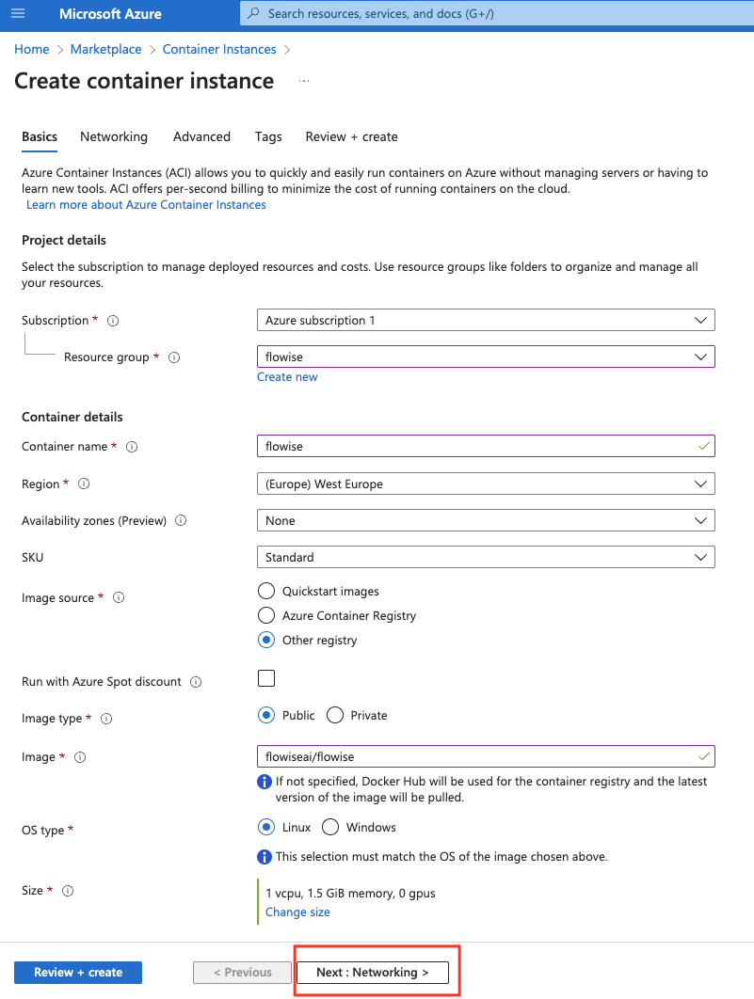
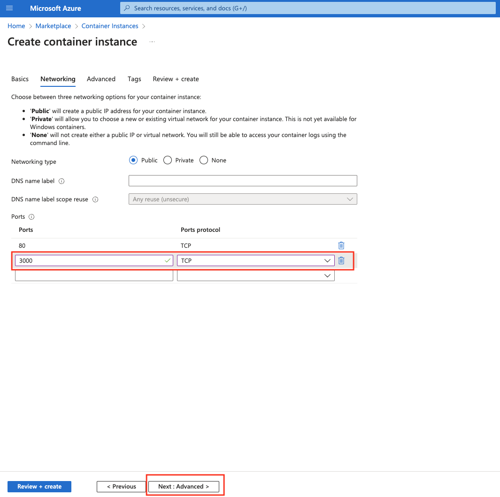
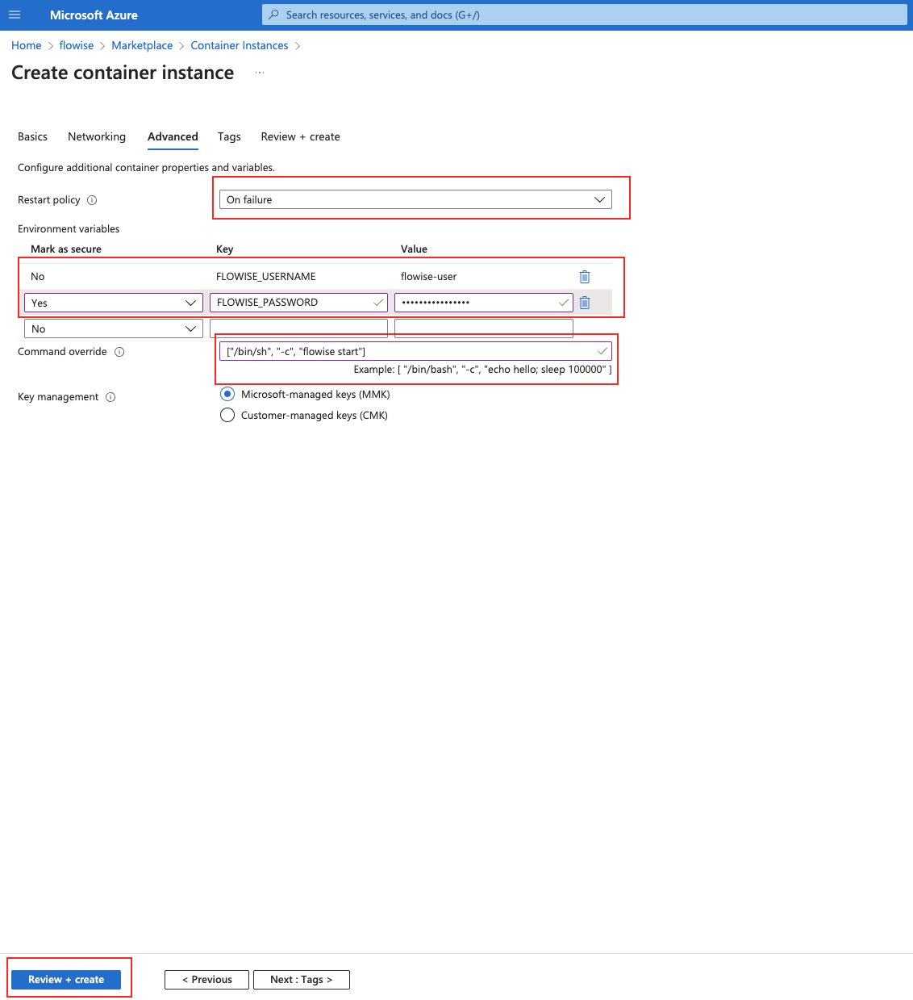
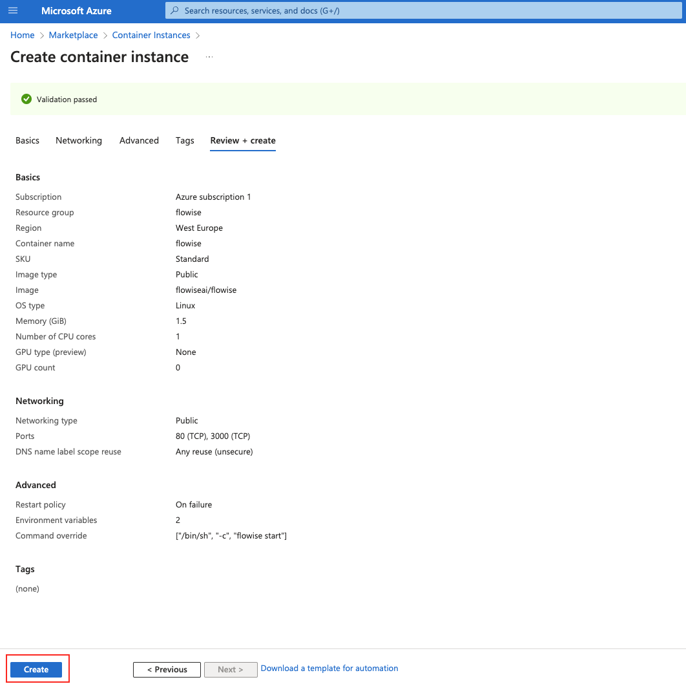
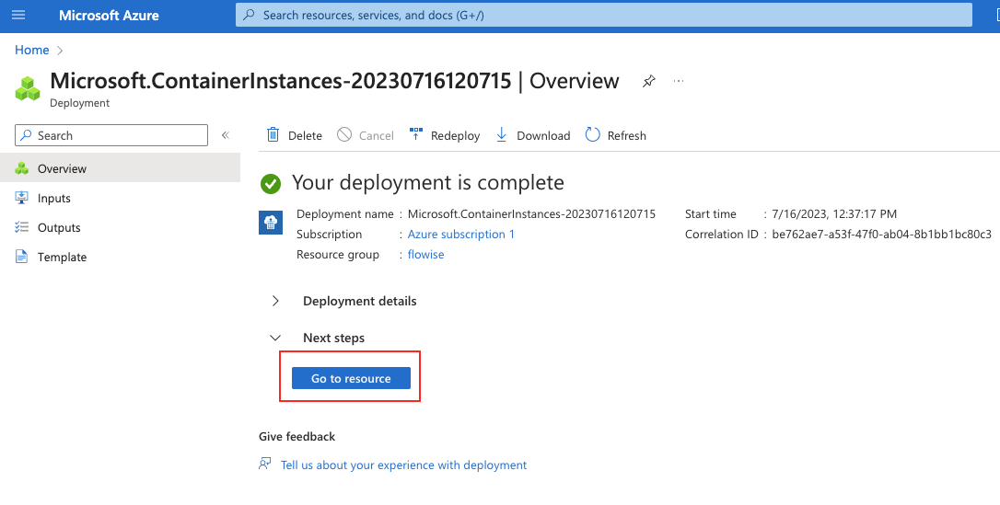
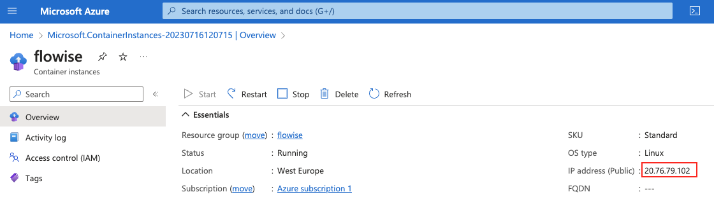
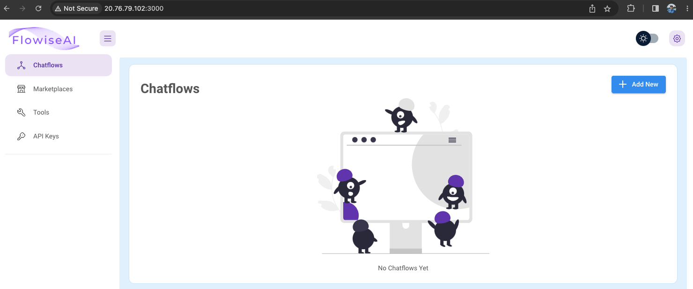

# Azure

***

## Postgres와 함께 Azure App Service로 Flowise 배포하기: Terraform 사용

### 사전 요구사항

1. **Azure 계정**: 활성 구독이 있는 Azure 계정이 있는지 확인합니다. 계정이 없는 경우 [Azure Portal](https://portal.azure.com/)에서 가입하세요.
2. **Terraform**: 머신에 Terraform CLI를 설치합니다. [Terraform 웹사이트](https://www.terraform.io/downloads.html)에서 다운로드하세요.
3. **Azure CLI**: Azure CLI를 설치합니다. 설치 방법은 [Azure CLI 문서 페이지](https://docs.microsoft.com/en-us/cli/azure/install-azure-cli)에서 확인할 수 있습니다.

### 환경 설정

1. **Azure 로그인**: 터미널 또는 명령 프롬프트를 열고 다음을 사용하여 Azure CLI에 로그인합니다:

```bash
az login --tenant <Your Subscription ID> --use-device-code 
```

프롬프트를 따라 로그인 과정을 완료합니다.

2. **구독 설정**: 로그인한 후 다음을 사용하여 Azure 구독을 설정합니다:

```bash
az account set --subscription <Your Subscription ID>
```

3. **Terraform 초기화**:

Terraform 프로젝트 디렉터리에 `terraform.tfvars` 파일이 아직 없다면 생성하고 다음 내용을 추가합니다:

```hcl
subscription_name = "subscrpiton_name"
subscription_id = "subscription id"
project_name = "webapp_name"
db_username = "PostgresUserName"
db_password = "strongPostgresPassword"
flowise_secretkey_overwrite = "longandStrongSecretKey"
webapp_ip_rules = [
  {
    name = "AllowedIP"
    ip_address = "X.X.X.X/32"
    headers = null
    virtual_network_subnet_id = null
    subnet_id = null
    service_tag = null
    priority = 300
    action = "Allow"
  }
]
postgres_ip_rules = {
  "ValbyOfficeIP" = "X.X.X.X"
  // Add more key-value pairs as needed
}
source_image = "flowiseai/flowise:latest"
tagged_image = "flow:v1"
```

플레이스홀더를 본인의 설정에 맞는 실제 값으로 교체합니다.

파일 트리 구조는 다음과 같습니다:

```
flow
├── database.tf
├── main.tf
├── network.tf
├── output.tf
├── providers.tf
├── terraform.tfvars
├── terraform.tfvars.example
├── variables.tf
├── webapp.tf
├── .gitignore // ignore your .tfvars and .lock.hcf, .terraform

```

Terraform 구성의 각 `.tf` 파일은 일반적으로 인프라스트럭처 코드(IaC)의 서로 다른 측면을 포함합니다:

<details>

<summary>`database.tf`는 Postgres 데이터베이스에 대한 구성을 정의합니다.</summary>

```yaml

// database.tf

// Database instance
resource "azurerm_postgresql_flexible_server" "postgres" {
  name                         = "postgresql-${var.project_name}"
  location                     = azurerm_resource_group.rg.location
  resource_group_name          = azurerm_resource_group.rg.name
  sku_name                     = "GP_Standard_D2s_v3"
  storage_mb                   = 32768
  version                      = "11"
  delegated_subnet_id          = azurerm_subnet.dbsubnet.id
  private_dns_zone_id          = azurerm_private_dns_zone.postgres.id
  backup_retention_days        = 7
  geo_redundant_backup_enabled = false
  auto_grow_enabled            = false
  administrator_login          = var.db_username
  administrator_password       = var.db_password
  zone                         = "2"

  lifecycle {
    prevent_destroy = false
  }
}

// Firewall
resource "azurerm_postgresql_flexible_server_firewall_rule" "pg_firewall" {
  for_each         = var.postgres_ip_rules
  name             = each.key
  server_id        = azurerm_postgresql_flexible_server.postgres.id
  start_ip_address = each.value
  end_ip_address   = each.value
}

// Database
resource "azurerm_postgresql_flexible_server_database" "production" {
  name      = "production"
  server_id = azurerm_postgresql_flexible_server.postgres.id
  charset   = "UTF8"
  collation = "en_US.utf8"

  # prevent the possibility of accidental data loss
  lifecycle {
    prevent_destroy = false
  }
}

// Transport off
resource "azurerm_postgresql_flexible_server_configuration" "postgres_config" {
  name      = "require_secure_transport"
  server_id = azurerm_postgresql_flexible_server.postgres.id
  value     = "off"
}
```

</details>

<details>

<summary>`main.tf`는 Azure 공급자 구성을 포함하고 Azure 리소스 그룹을 정의하는 기본 구성 파일일 수 있습니다.</summary>

```yaml
// main.tf
resource "random_string" "resource_code" {
  length  = 5
  special = false
  upper   = false
}

// resource group
resource "azurerm_resource_group" "rg" {
  location = var.resource_group_location
  name     = "rg-${var.project_name}"
}

// Storage Account
resource "azurerm_storage_account" "sa" {
  name                     = "${var.subscription_name}${random_string.resource_code.result}"
  resource_group_name      = azurerm_resource_group.rg.name
  location                 = azurerm_resource_group.rg.location
  account_tier             = "Standard"
  account_replication_type = "LRS"

  blob_properties {
    versioning_enabled = true
  }

}

// File share
resource "azurerm_storage_share" "flowise-share" {
  name                 = "flowise"
  storage_account_name = azurerm_storage_account.sa.name
  quota                = 50
}

```

</details>

<details>

<summary>`network.tf`는 가상 네트워크, 서브넷, 네트워크 보안 그룹 등의 네트워킹 리소스를 포함합니다.</summary>

```yaml
// network.tf

// Vnet
resource "azurerm_virtual_network" "vnet" {
  name                = "vn-${var.project_name}"
  location            = azurerm_resource_group.rg.location
  resource_group_name = azurerm_resource_group.rg.name
  address_space       = ["10.3.0.0/16"]
}

resource "azurerm_subnet" "dbsubnet" {
  name                                      = "db-subnet-${var.project_name}"
  resource_group_name                       = azurerm_resource_group.rg.name
  virtual_network_name                      = azurerm_virtual_network.vnet.name
  address_prefixes                          = ["10.3.1.0/24"]
  private_endpoint_network_policies_enabled = true
  delegation {
    name = "delegation"
    service_delegation {
      name = "Microsoft.DBforPostgreSQL/flexibleServers"
    }
  }
  lifecycle {
    ignore_changes = [
      service_endpoints,
      delegation
    ]
  }
}

resource "azurerm_subnet" "webappsubnet" {

  name                 = "web-app-subnet-${var.project_name}"
  resource_group_name  = azurerm_resource_group.rg.name
  virtual_network_name = azurerm_virtual_network.vnet.name
  address_prefixes     = ["10.3.8.0/24"]

  delegation {
    name = "delegation"
    service_delegation {
      name = "Microsoft.Web/serverFarms"
    }
  }
  lifecycle {
    ignore_changes = [
      delegation
    ]
  }
}

resource "azurerm_private_dns_zone" "postgres" {
  name                = "private.postgres.database.azure.com"
  resource_group_name = azurerm_resource_group.rg.name
}

resource "azurerm_private_dns_zone_virtual_network_link" "postgres" {
  name                  = "private-postgres-vnet-link"
  resource_group_name   = azurerm_resource_group.rg.name
  private_dns_zone_name = azurerm_private_dns_zone.postgres.name
  virtual_network_id    = azurerm_virtual_network.vnet.id
}

```

</details>

<details>

<summary>`providers.tf`는 Azure와 같은 Terraform 공급자를 정의합니다.</summary>

```yaml
// providers.tf
terraform {
  required_version = ">=0.12"

  required_providers {
    azurerm = {
      source  = "hashicorp/azurerm"
      version = "=3.87.0"
    }
    random = {
      source  = "hashicorp/random"
      version = "~>3.0"
    }
  }
}

provider "azurerm" {
  subscription_id = var.subscription_id
  features {}
}
```

</details>

<details>

<summary>`variables.tf`는 모든 `.tf` 파일에서 사용되는 변수를 선언합니다.</summary>

```yaml
// variables.tf
variable "resource_group_location" {
  default     = "westeurope"
  description = "Location of the resource group."
}

variable "container_rg_name" {
  default     = "acrllm"
  description = "Name of container regrestry."
}

variable "subscription_id" {
  type        = string
  sensitive   = true
  description = "Service Subscription ID"
}

variable "subscription_name" {
  type        = string
  description = "Service Subscription Name"
}


variable "project_name" {
  type        = string
  description = "Project Name"
}

variable "db_username" {
  type        = string
  description = "DB User Name"
}

variable "db_password" {
  type        = string
  sensitive   = true
  description = "DB Password"
}

variable "flowise_secretkey_overwrite" {
  type        = string
  sensitive   = true
  description = "Flowise secret key"
}

variable "webapp_ip_rules" {
  type = list(object({
    name                      = string
    ip_address                = string
    headers                   = string
    virtual_network_subnet_id = string
    subnet_id                 = string
    service_tag               = string
    priority                  = number
    action                    = string
  }))
}

variable "postgres_ip_rules" {
  description = "A map of IP addresses and their corresponding names for firewall rules"
  type        = map(string)
  default     = {}
}

variable "flowise_image" {
  type        = string
  description = "Flowise image from Docker Hub"
}

variable "tagged_image" {
  type        = string
  description = "Tag for flowise image version"
}
```

</details>

<details>

<summary>`webapp.tf` 서비스 플랜과 Linux 웹 앱을 포함하는 Azure App Services</summary>

```yaml
// webapp.tf
#Create the Linux App Service Plan
resource "azurerm_service_plan" "webappsp" {
  name                = "asp${var.project_name}"
  resource_group_name = azurerm_resource_group.rg.name
  location            = azurerm_resource_group.rg.location
  os_type             = "Linux"
  sku_name            = "P3v3"
}

resource "azurerm_linux_web_app" "webapp" {
  name                = var.project_name
  resource_group_name = azurerm_resource_group.rg.name
  location            = azurerm_resource_group.rg.location
  service_plan_id     = azurerm_service_plan.webappsp.id

  app_settings = {
    DOCKER_ENABLE_CI                    = true
    WEBSITES_CONTAINER_START_TIME_LIMIT = 1800
    WEBSITES_ENABLE_APP_SERVICE_STORAGE = false
    DATABASE_TYPE                       = "postgres"
    DATABASE_HOST                       = azurerm_postgresql_flexible_server.postgres.fqdn
    DATABASE_NAME                       = azurerm_postgresql_flexible_server_database.production.name
    DATABASE_USER                       = azurerm_postgresql_flexible_server.postgres.administrator_login
    DATABASE_PASSWORD                   = azurerm_postgresql_flexible_server.postgres.administrator_password
    DATABASE_PORT                       = 5432
    FLOWISE_SECRETKEY_OVERWRITE         = var.flowise_secretkey_overwrite
    PORT                                = 3000
    SECRETKEY_PATH                      = "/root"
    DOCKER_IMAGE_TAG                    = var.tagged_image
  }

  storage_account {
    name         = "${var.project_name}_mount"
    access_key   = azurerm_storage_account.sa.primary_access_key
    account_name = azurerm_storage_account.sa.name
    share_name   = azurerm_storage_share.flowise-share.name
    type         = "AzureFiles"
    mount_path   = "/root"
  }


  https_only = true

  site_config {
    always_on              = true
    vnet_route_all_enabled = true
    dynamic "ip_restriction" {
      for_each = var.webapp_ip_rules
      content {
        name       = ip_restriction.value.name
        ip_address = ip_restriction.value.ip_address
      }
    }
    application_stack {
      docker_image_name        = var.flowise_image
      docker_registry_url      = "https://${azurerm_container_registry.acr.login_server}"
      docker_registry_username = azurerm_container_registry.acr.admin_username
      docker_registry_password = azurerm_container_registry.acr.admin_password
    }
  }

  logs {
    http_logs {
      file_system {
        retention_in_days = 7
        retention_in_mb   = 35
      }

    }
  }

  identity {
    type = "SystemAssigned"
  }

  lifecycle {
    create_before_destroy = false

    ignore_changes = [
      virtual_network_subnet_id
    ]
  }

}

resource "azurerm_app_service_virtual_network_swift_connection" "webappvnetintegrationconnection" {
  app_service_id = azurerm_linux_web_app.webapp.id
  subnet_id      = azurerm_subnet.webappsubnet.id

  depends_on = [azurerm_linux_web_app.webapp, azurerm_subnet.webappsubnet]
}

```

</details>

참고: `.terraform` 디렉터리는 프로젝트를 초기화할 때(`terraform init`) Terraform에 의해 생성되며, Terraform 실행에 필요한 플러그인과 바이너리 파일을 포함합니다. `.terraform.lock.hcl` 파일은 사용 중인 정확한 공급자 버전을 기록하여 서로 다른 머신에서 일관된 설치를 보장하는 데 사용됩니다.

Terraform 프로젝트 디렉터리로 이동하여 다음을 실행합니다:

```bash
terraform init
```

이는 Terraform을 초기화하고 필요한 공급자를 다운로드합니다.

### Terraform 변수 구성

### Terraform으로 배포하기

1.  **배포 계획**: Terraform plan 명령어를 실행하여 어떤 리소스가 생성될지 확인합니다:

    ```bash
    terraform plan
    ```
2.  **배포 적용**: 계획이 만족스럽다면 변경 사항을 적용합니다:

    ```bash
    terraform apply
    ```

    프롬프트가 표시되면 작업을 확인하고, Terraform이 리소스 생성을 시작합니다.
3. **배포 확인**: Terraform이 완료되면 IP 주소나 도메인 이름과 같이 정의된 출력값을 출력합니다. Azure Portal에서 리소스가 올바르게 배포되었는지 확인합니다.

***

## Azure Container Instance: Azure Portal UI 또는 Azure CLI 사용

### 사전 요구사항

1. _(선택 사항)_ CLI 기반 명령어를 따라하려면 [Azure CLI를 설치](https://learn.microsoft.com/en-us/cli/azure/install-azure-cli)합니다

## 영구 스토리지 없이 Container Instance 생성

영구 스토리지가 없으면 데이터가 메모리에 보관됩니다. 즉, 컨테이너를 재시작하면 저장한 모든 데이터가 사라집니다.

### Portal에서

1. Marketplace에서 Container Instances를 검색하고 Create를 클릭합니다:

<figure><figcaption><p>Azure Marketplace의 Container Instances 항목</p></figcaption></figure>

2. 리소스 그룹, 컨테이너 이름, 리전, 이미지 소스 `Other registry`, 이미지 유형, 이미지 `flowiseai/flowise`, OS 유형, 크기를 선택하거나 생성합니다. 그런 다음 "Next: Networking"을 클릭하여 Flowise 포트를 구성합니다:

<figure><figcaption><p>Container Instance 생성 마법사의 첫 번째 페이지</p></figcaption></figure>

3. 기본 `80 (TCP)` 옆에 새 포트 `3000 (TCP)`을 추가합니다. 그런 다음 "Next: Advanced"를 선택합니다:

<figure><figcaption><p>Container Instance 생성 마법사의 두 번째 페이지. 네트워킹 유형과 포트를 묻습니다.</p></figcaption></figure>

4. Restart policy를 `On failure`로 설정합니다. Command override `["/bin/sh", "-c", "flowise start"]`를 추가합니다. 마지막으로 "Review + create"를 클릭합니다:

<figure><figcaption><p>Container Instance 생성 마법사의 세 번째 페이지. 재시작 정책, 환경 변수, 컨테이너 시작 시 실행되는 명령을 묻습니다.</p></figcaption></figure>

5. 최종 설정을 검토하고 "Create"를 클릭합니다:

<figure><figcaption><p>Container Instance의 최종 검토 및 생성 페이지.</p></figcaption></figure>

6. 생성이 완료되면 "Go to resource"를 클릭합니다

<figure><figcaption><p>Azure의 리소스 생성 결과 페이지.</p></figcaption></figure>

7. IP 주소를 복사하고 포트로 :3000을 추가하여 Flowise 인스턴스를 방문합니다:

<figure><figcaption><p>Container Instance 개요 페이지</p></figcaption></figure>

<figure><figcaption><p>Container Instance로 배포된 Flowise 애플리케이션</p></figcaption></figure>

### Azure CLI를 사용하여 생성

1. 리소스 그룹을 생성합니다 (이미 있는 경우 생략)

```bash
az group create --name flowise-rg --location "West US"
```

2. Container Instance를 생성합니다

```bash
az container create -g flowise-rg \
	--name flowise \
	--image flowiseai/flowise \
	--command-line "/bin/sh -c 'flowise start'" \
	--ip-address public \
	--ports 80 3000 \
	--restart-policy OnFailure
```

3. 위 명령어의 출력에서 출력된 IP 주소(포트 :3000 포함)를 방문합니다.

## 영구 스토리지와 함께 Container Instance 생성

영구 스토리지를 포함한 Container Instance 생성은 CLI를 사용해서만 가능합니다:

1. 리소스 그룹을 생성합니다 (이미 있는 경우 생략)

```bash
az group create --name flowise-rg --location "West US"
```

2. 위 리소스 그룹 내에 Storage Account 리소스를 생성합니다 (또는 기존 것을 사용). 방법은 [여기](https://learn.microsoft.com/en-us/azure/storage/files/storage-how-to-use-files-portal?tabs=azure-portal)에서 확인할 수 있습니다.
3. Azure Storage 내에서 새 File share를 생성합니다. 방법은 [여기](https://learn.microsoft.com/en-us/azure/storage/files/storage-how-to-use-files-portal?tabs=azure-portal)에서 확인할 수 있습니다.
4. Container Instance를 생성합니다

```bash
az container create -g flowise-rg \
	--name flowise \
	--image flowiseai/flowise \
	--command-line "/bin/sh -c 'flowise start'" \
	--environment-variables DATABASE_PATH=/opt/flowise/.flowise SECRETKEY_PATH=/opt/flowise/.flowise LOG_PATH=/opt/flowise/.flowise/logs BLOB_STORAGE_PATH=/opt/flowise/.flowise/storage \
	--ip-address public \
	--ports 80 3000 \
	--restart-policy OnFailure \
	--azure-file-volume-share-name here goes the name of your File share \
	--azure-file-volume-account-name here goes the name of your Storage Account \
	--azure-file-volume-account-key here goes the access key to your Storage Account \
	--azure-file-volume-mount-path /opt/flowise/.flowise
```

5. 위 명령어의 출력에서 출력된 IP 주소(포트 :3000 포함)를 방문합니다.
6. 이제부터 데이터는 File share에서 찾을 수 있는 SQLite 데이터베이스에 저장됩니다.

Azure Container Instance에 배포하는 동영상 튜토리얼을 시청하세요:


