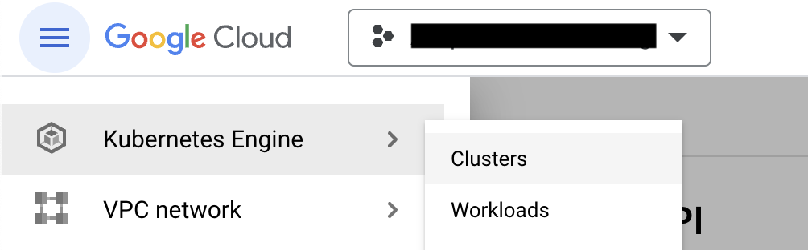
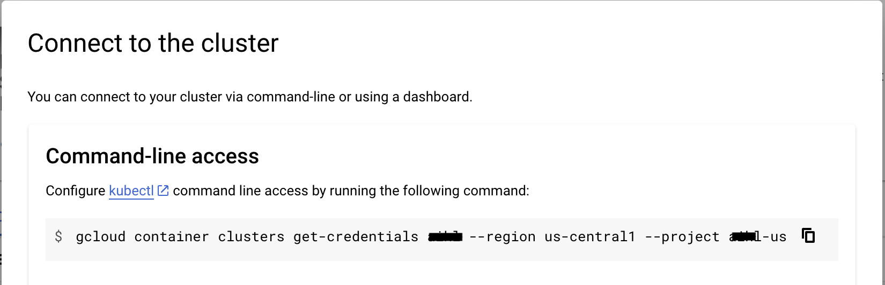
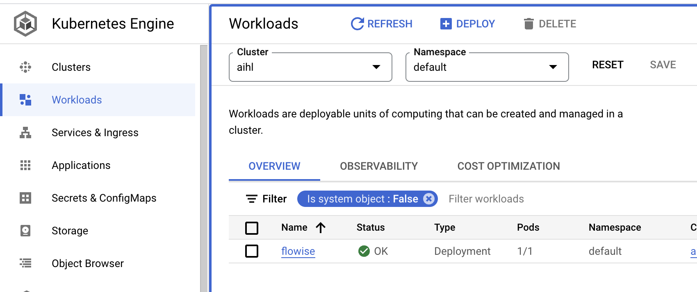
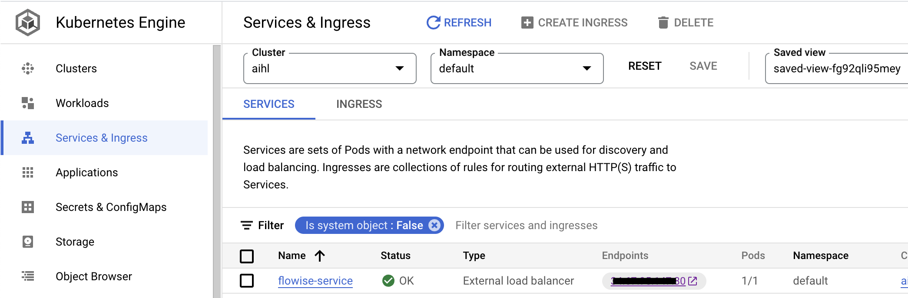

# GCP

***

## 사전 요구사항

1. Google Cloud \[ProjectId]를 기록해 둡니다
2. [Git](https://git-scm.com/book/en/v2/Getting-Started-Installing-Git)을 설치합니다
3. [Google Cloud CLI](https://cloud.google.com/sdk/docs/install-sdk)를 설치합니다
4. [Docker Desktop](https://docs.docker.com/desktop/)을 설치합니다

## Kubernetes 클러스터 설정

1. 클러스터가 없는 경우 Kubernetes 클러스터를 생성합니다.

<figure><figcaption><p>`Clusters`를 클릭하여 생성합니다.</p></figcaption></figure>

2. 클러스터 이름을 지정하고, 적절한 리소스 위치를 선택하며, `Autopilot` 모드를 사용하고 나머지 모든 기본 구성을 유지합니다.
3. 클러스터가 생성되면 작업 메뉴에서 'Connect' 메뉴를 클릭합니다

<figure><figcaption></figcaption></figure>

4. 명령어를 복사하여 터미널에 붙여넣고 Enter를 눌러 클러스터에 연결합니다.
5. 아래 명령어를 실행하고 `gke_[ProjectId]_[DataCenter]_[ClusterName]` 형식의 올바른 컨텍스트 이름을 선택합니다

```
kubectl config get-contexts
```

6. 현재 컨텍스트를 설정합니다

```
kubectl config use-context gke_[ProjectId]_[DataCenter]_[ClusterName]
```

## Docker 이미지 빌드 및 푸시

다음 명령어를 실행하여 Docker 이미지를 빌드하고 GCP Container Registry에 푸시합니다.

1. Flowise를 복제합니다

```
git clone https://github.com/FlowiseAI/Flowise.git
```

2. Flowise를 빌드합니다

```
cd Flowise
pnpm install
pnpm build
```

3. `Dockerfile` 파일을 약간 수정합니다.

> nodejs의 플랫폼을 지정합니다
>
> ```
> FROM --platform=linux/amd64 node:18-alpine
> ```
>
> 설치를 위해 python3, make, g++를 추가합니다
>
> ```
> RUN apk add --no-cache python3 make g++
> ```

3. Docker 이미지로 빌드합니다. Docker desktop 앱이 실행 중인지 확인하세요

```
docker build -t gcr.io/[ProjectId]/flowise:dev .
```

4. Docker 이미지를 GCP container registry에 푸시합니다.

```
docker push gcr.io/[ProjectId]/flowise:dev
```

## GCP에 배포

1. 프로젝트에 `yamls` 루트 폴더를 생성합니다.
2. 해당 폴더에 `deployment.yaml` 파일을 추가합니다.

```
# deployment.yaml
apiVersion: apps/v1
kind: Deployment
metadata:
  name: flowise
  labels:
    app: flowise
spec:
  selector:
    matchLabels:
      app: flowise
  replicas: 1
  template:
    metadata:
      labels:
        app: flowise
    spec:
      containers:
      - name: flowise
        image: gcr.io/[ProjectID]/flowise:dev
        imagePullPolicy: Always
        resources: 
          requests:
            cpu: "1"
            memory: "1Gi"
```

3. 해당 폴더에 `service.yaml` 파일을 추가합니다.

```
# service.yaml
apiVersion: "v1"
kind: "Service"
metadata:
  name: "flowise-service"
  namespace: "default"
  labels:
    app: "flowise"
spec:
  ports:
  - protocol: "TCP"
    port: 80
    targetPort: 3000
  selector:
    app: "flowise"
  type: "LoadBalancer"

```

아래와 같이 보일 것입니다.

<figure><figcaption></figcaption></figure>

4. 다음 명령어를 실행하여 yaml 파일을 배포합니다.

```
kubectl apply -f yamls/deployment.yaml
kubectl apply -f yamls/service.yaml
```

5. GCP의 `Workloads`로 이동하면 pod가 실행 중인 것을 확인할 수 있습니다.

<figure><figcaption></figcaption></figure>

6. `Services & Ingress`로 이동하면 Flowise가 호스팅되는 `Endpoint`를 클릭할 수 있습니다.

<figure><figcaption></figcaption></figure>

## 축하합니다!

GCP에 Flowise 앱을 성공적으로 호스팅했습니다 [🥳](https://emojipedia.org/partying-face/)

## 타임아웃

기본적으로 GCP는 프록시에 30초의 타임아웃을 할당합니다. 이로 인해 응답이 반환되는 데 30초 임계값보다 오래 걸리는 경우 문제가 발생했습니다. 이 문제를 해결하려면 YAML 파일을 다음과 같이 변경합니다:

참고: 타임아웃을 (예를 들어) 10분으로 설정하려면 -- 아래에서 600초를 지정합니다.

1. 다음 내용으로 `backendconfig.yaml` 파일을 생성합니다:

```yaml
apiVersion: cloud.google.com/v1
kind: BackendConfig
metadata:
  name: flowise-backendconfig
  namespace: your-namespace
spec:
  timeoutSec: 600
```

2. 실행: `kubectl apply -f backendconfig.yaml`
3. `BackendConfig`에 대한 다음 참조로 `service.yaml` 파일을 업데이트합니다:

```yaml
apiVersion: v1
kind: Service
metadata:
  annotations:
    cloud.google.com/backend-config: '{"default": "flowise-backendconfig"}'
  name: flowise-service
  namespace: your-namespace
...
```

4. 실행: `kubectl apply -f service.yaml`
