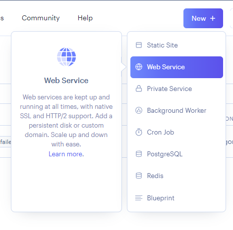
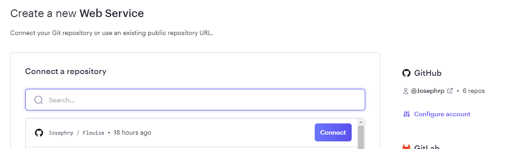
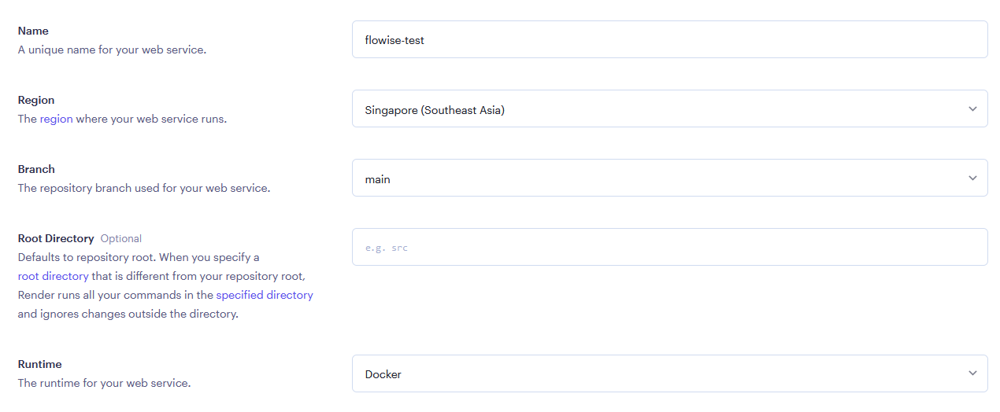
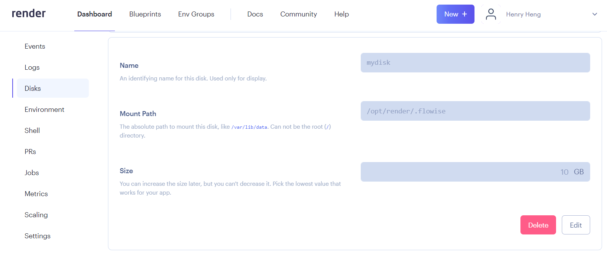

# Render

***

1. [Flowise 공식 저장소](https://github.com/FlowiseAI/Flowise)를 포크합니다.
2. GitHub 프로필을 방문하여 포크가 성공적으로 완료되었는지 확인합니다.
3. [Render](https://dashboard.render.com)에 로그인합니다.
4. **New +**를 클릭합니다.

<figure><figcaption></figcaption></figure>

5. **Web Service**를 선택합니다.

<figure><figcaption></figcaption></figure>

6. GitHub 계정을 연결합니다.
7. 포크한 Flowise 저장소를 선택하고 **Connect**를 클릭합니다.

<figure><figcaption></figcaption></figure>

8. 원하는 **Name**과 **Region**을 입력합니다.
9. **Runtime**으로 `Docker`를 선택합니다.

<figure><figcaption></figcaption></figure>

9. **Instance**를 선택합니다.

<figure><figcaption></figcaption></figure>

10. _(선택 사항)_ 앱 수준 인증을 추가하려면 **Advanced**를 클릭하고 `Environment Variable`을 추가합니다:

* FLOWISE\_USERNAME
* FLOWISE\_PASSWORD

<figure><figcaption></figcaption></figure>

인스턴스를 실행할 node 버전으로 `NODE_VERSION`을 값 `18.18.1`로 추가합니다.

구성할 수 있는 환경 변수 목록이 있습니다. [environment-variables.md](../environment-variables.md "mention")를 참고하세요.

11. **Create Web Service**를 클릭합니다.

<figure><figcaption></figcaption></figure>

12. 배포된 URL로 이동하면 끝입니다 [🚀](https://emojipedia.org/rocket/)[🚀](https://emojipedia.org/rocket/)

<figure><figcaption></figcaption></figure>

## 영구 디스크(Persistent Disk)

Render에서 실행되는 서비스의 기본 파일 시스템은 임시(ephemeral)입니다. Flowise 데이터는 배포와 재시작 시 유지되지 않습니다. 이 문제를 해결하기 위해 [Render Disk](https://render.com/docs/disks)를 사용할 수 있습니다.

1. 왼쪽 사이드바에서 **Disks**를 클릭합니다.
2. 디스크 이름을 지정하고 **Mount Path**를 `/opt/render/.flowise`로 설정합니다.

<figure><figcaption></figcaption></figure>

3. **Environment** 섹션을 클릭하고 다음의 새 환경 변수를 추가합니다:

* HOST - `0.0.0.0`
* DATABASE\_PATH - `/opt/render/.flowise`
* APIKEY\_PATH - `/opt/render/.flowise`
* LOG\_PATH - `/opt/render/.flowise/logs`
* SECRETKEY\_PATH - `/opt/render/.flowise`
* BLOB\_STORAGE\_PATH - `/opt/render/.flowise/storage`

<figure><figcaption></figcaption></figure>

4. **Manual Deploy**를 클릭한 후 **Clear build cache & deploy**를 선택합니다.

<figure><figcaption></figcaption></figure>

5. 이제 Flowise에서 플로우를 생성하고 저장해 보세요. 그런 다음 서비스를 재시작하거나 재배포해 보면, 이전에 저장한 플로우를 여전히 확인할 수 있습니다.

Render에 배포하는 방법을 영상으로 확인하세요.




