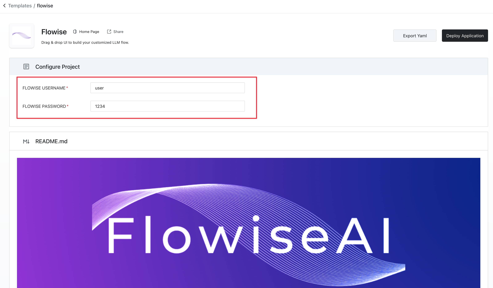
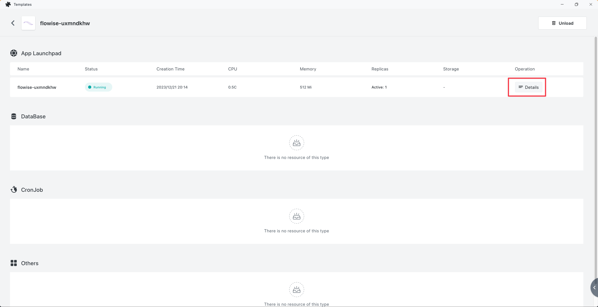
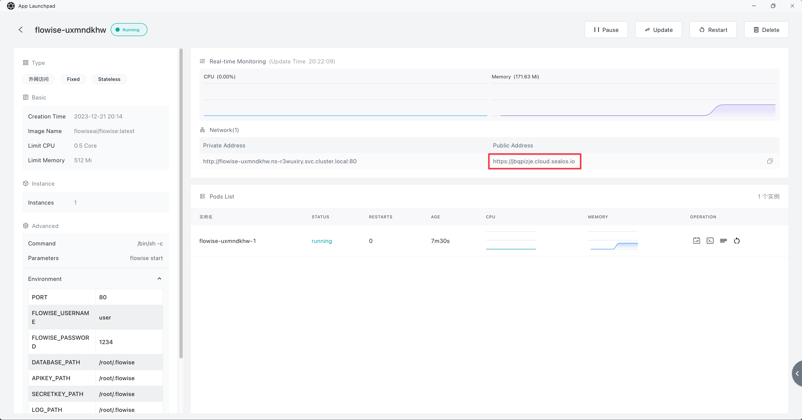
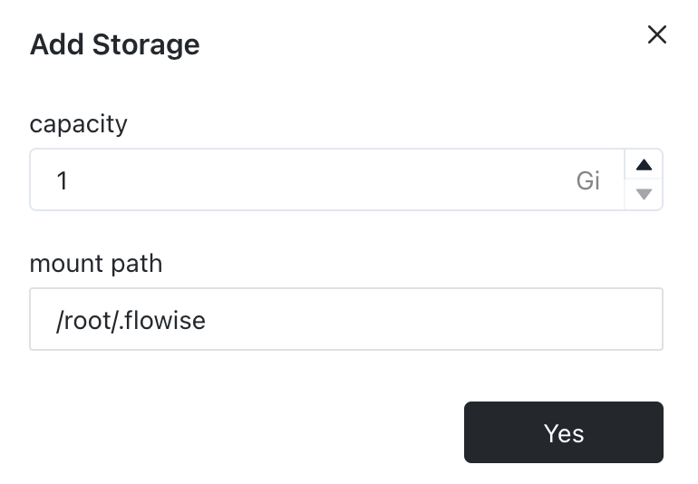

# Sealos

***

1. 다음의 사전 구성된 [템플릿](https://template.sealos.io/deploy?templateName=flowise) 또는 아래 버튼을 클릭합니다.

2. 인증을 추가합니다.
   * FLOWISE\_USERNAME
   * FLOWISE\_PASSWORD

<figure><figcaption></figcaption></figure>

3. 템플릿 페이지에서 "Deploy Application"을 클릭하여 배포를 시작합니다.
4. 배포가 완료되면 "Details"를 클릭하여 애플리케이션의 세부 정보로 이동합니다.

<figure><figcaption></figcaption></figure>

5. 애플리케이션 상태가 running으로 전환될 때까지 기다립니다. 그 후 외부 링크를 클릭하면 외부 도메인을 통해 애플리케이션의 웹 인터페이스를 직접 열 수 있습니다.

<figure><figcaption></figcaption></figure>

## 영구 볼륨(Persistent Volume)

앱 세부 정보 페이지의 오른쪽 상단에서 "Update"를 클릭한 다음 "Advanced" -> "Add volume"을 클릭하고 "mount path"의 값으로 `/root/.flowise`를 입력합니다.

<figure><figcaption></figcaption></figure>

마무리하려면 "Deploy" 버튼을 클릭합니다.

이제 Flowise에서 플로우를 생성하고 저장해 보세요. 그런 다음 서비스를 재시작하거나 재배포해 보면, 이전에 저장한 플로우를 여전히 확인할 수 있습니다.
