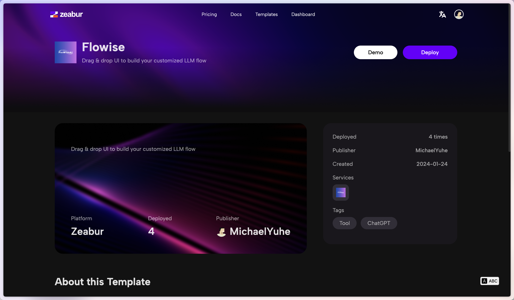
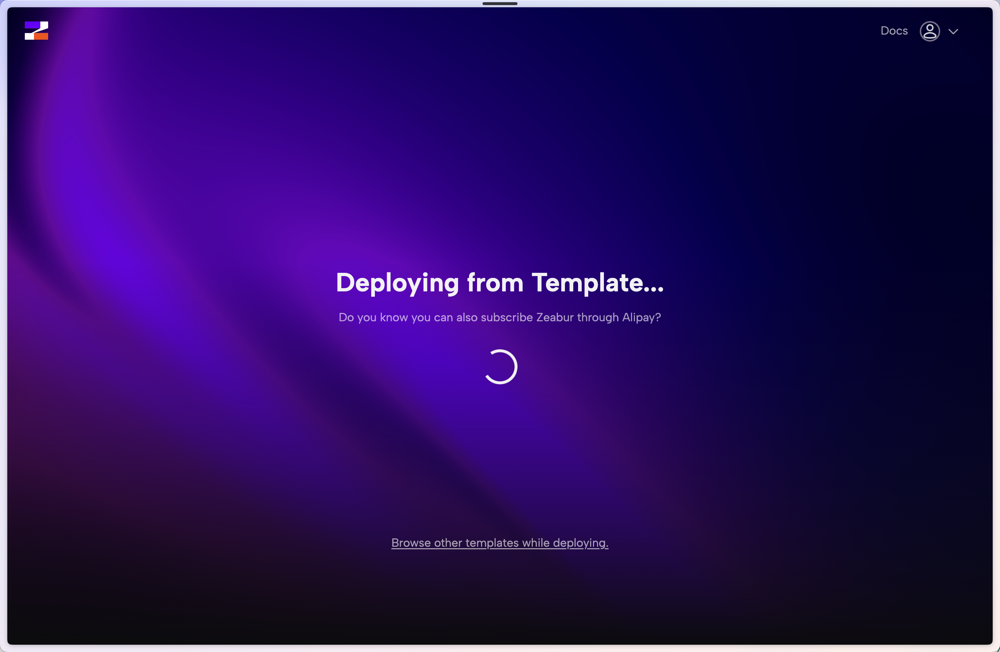
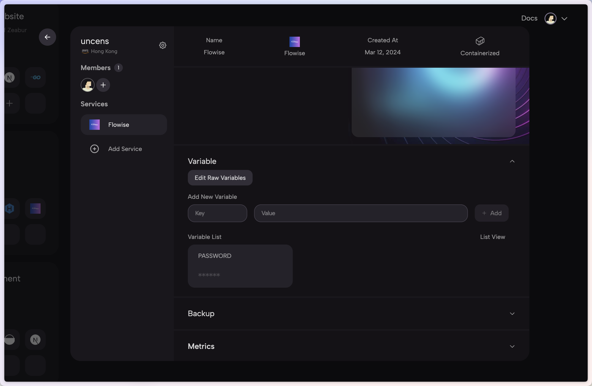

# Zeabur

***


Zeabur에서 만든 다음 템플릿은 오래된 것(2024-01-24 기준)이라는 점에 유의하세요.


1. 다음의 사전 구성된 [템플릿](https://zeabur.com/templates/2JYZTR) 또는 아래 버튼을 클릭합니다.

2. Deploy를 클릭합니다.

<figure><figcaption></figcaption></figure>

3. 원하는 리전을 선택하고 계속 진행합니다.

<figure><figcaption></figcaption></figure>

4. Zeabur 대시보드로 리디렉션되며 배포 과정을 확인할 수 있습니다.

<figure><figcaption></figcaption></figure>

5. 인증을 추가하려면 Variables 탭으로 이동하여 다음을 추가합니다:

* FLOWISE\_USERNAME
* FLOWISE\_PASSWORD

<figure><figcaption></figcaption></figure>

6. 구성할 수 있는 환경 변수 목록이 있습니다. [environment-variables.md](../environment-variables.md "mention")를 참고하세요.

이것으로 끝입니다! 이제 Zeabur에 Flowise가 배포되었습니다 [🎉](https://emojipedia.org/party-popper/)[🎉](https://emojipedia.org/party-popper/)

## 영구 볼륨(Persistent Volume)

Zeabur가 자동으로 영구 볼륨을 생성해 주므로 이에 대해 걱정할 필요가 없습니다.
