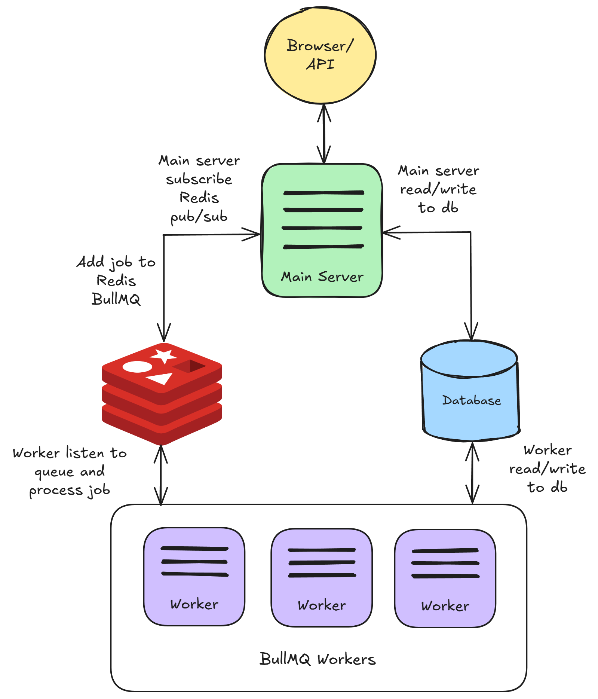
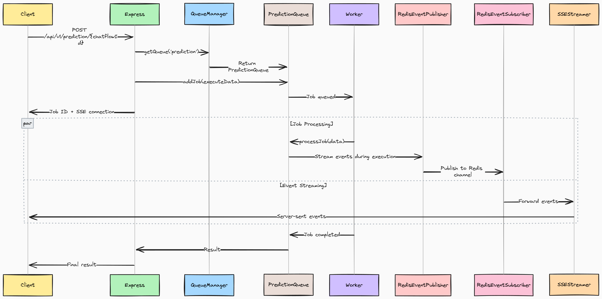

# Queue를 사용하여 Flowise 실행하기

기본적으로 Flowise는 NodeJS 메인 스레드에서 실행됩니다. 그러나 예측(prediction) 수가 많아지면 확장성이 좋지 않습니다. 따라서 `main`(기본값)과 `queue`라는 2가지 모드를 구성할 수 있습니다.

## Queue 모드

다음 environment variable을 사용하면 Flowise를 `queue` 모드로 실행할 수 있습니다.

<table><thead><tr><th width="263">Variable</th><th>Description</th><th>Type</th><th>Default</th></tr></thead><tbody><tr><td>MODE</td><td>Flowise를 실행할 모드</td><td>Enum String: <code>main</code>, <code>queue</code></td><td><code>main</code></td></tr><tr><td>WORKER_CONCURRENCY</td><td>한 worker가 병렬로 처리할 수 있는 job 수입니다. worker가 1개라면, 동시에 처리할 수 있는 예측 작업 수를 의미합니다. 자세한 <a href="https://docs.bullmq.io/guide/workers/concurrency">정보</a></td><td>Number</td><td>10000</td></tr><tr><td>QUEUE_NAME</td><td>message queue의 이름</td><td>String</td><td>flowise-queue</td></tr><tr><td>QUEUE_REDIS_EVENT_STREAM_MAX_LEN</td><td>event stream은 크기가 너무 커지지 않도록 자동으로 트리밍됩니다. 자세한 <a href="https://docs.bullmq.io/guide/events">정보</a></td><td>Number</td><td>10000</td></tr><tr><td>REDIS_URL</td><td>Redis URL</td><td>String</td><td></td></tr><tr><td>REDIS_HOST</td><td>Redis host</td><td>String</td><td>localhost</td></tr><tr><td>REDIS_PORT</td><td>Redis port</td><td>Number</td><td>6379</td></tr><tr><td>REDIS_USERNAME</td><td>Redis username (선택 사항)</td><td>String</td><td></td></tr><tr><td>REDIS_PASSWORD</td><td>Redis password (선택 사항)</td><td>String</td><td></td></tr><tr><td>REDIS_TLS</td><td>Redis TLS connection (선택 사항) 자세한 <a href="https://redis.io/docs/latest/operate/oss_and_stack/management/security/encryption/">정보</a></td><td>Boolean</td><td>false</td></tr><tr><td>REDIS_CERT</td><td>Redis 자체 서명 인증서</td><td>String</td><td></td></tr><tr><td>REDIS_KEY</td><td>Redis 자체 서명 인증서 key 파일</td><td>String</td><td></td></tr><tr><td>REDIS_CA</td><td>Redis 자체 서명 인증서 CA 파일</td><td>String</td><td></td></tr></tbody></table>

`queue` 모드에서는 메인 서버가 요청을 처리하고 job을 message queue로 보내는 역할을 담당합니다. 메인 서버는 job을 실행하지 않습니다. 하나 이상의 worker가 queue에서 job을 받아 실행하고 결과를 다시 전송합니다.

이를 통해 동적 Scaling이 가능합니다. 작업 부하가 증가하면 worker를 추가하고, 부하가 적은 기간에는 worker를 제거할 수 있습니다.

작동 방식은 다음과 같습니다:

1. 메인 서버는 웹에서 예측 또는 기타 요청을 받아 이를 job으로 queue에 추가합니다.
2. 이러한 job queue는 본질적으로 처리를 기다리는 작업 목록입니다. 별도의 프로세스 또는 스레드인 worker가 이러한 job을 받아 실행합니다.
3. job이 완료되면 worker는:
   * 결과를 데이터베이스에 기록합니다.
   * job 완료를 알리는 event를 전송합니다.
4. 메인 서버는 event를 받아 결과를 UI로 다시 전송합니다.
5. Redis pub/sub도 데이터를 UI로 다시 스트리밍하는 데 사용됩니다.

<figure><figcaption></figcaption></figure>

## Flow Diagram

<figure><figcaption></figcaption></figure>

#### 1. 요청 진입점 (Request Entry Point)

예측 요청이 Express 서버에 도달하면 즉시 `MODE=QUEUE`인지 확인합니다. true이면 직접 실행에서 비동기 queue 처리로 전환됩니다.

#### 2. Job 생성 및 이중 채널 (Job Creation & Dual Channels)

시스템은 두 개의 병렬 경로를 생성합니다:

* **Job Channel**: 요청 데이터가 BullMQ를 통해 Redis job이 되고, HTTP 스레드는 완료를 기다립니다
* **Stream Channel**: Redis pub/sub를 통한 실시간 업데이트를 위해 SSE connection이 설정됩니다

#### 3. Worker 처리 (Worker Processing)

독립적인 worker 프로세스가 job을 위해 Redis를 폴링합니다. job이 할당되면:

* 전체 실행 컨텍스트를 재구성합니다 (DB, component, abort controller)
* node 단위 처리로 workflow를 실행합니다
* 실시간 event(token, tool, 진행 상황)를 Redis 채널에 게시합니다

#### 4. 실시간 통신 (Real-time Communication)

실행 중에:

* [**RedisEventPublisher**](https://github.com/FlowiseAI/Flowise/blob/main/packages/server/src/queue/RedisEventPublisher.ts)는 worker에서 Redis로 event를 브로드캐스트합니다
* [**RedisEventSubscriber**](https://github.com/FlowiseAI/Flowise/blob/main/packages/server/src/queue/RedisEventSubscriber.ts)는 Redis에서 SSE 클라이언트로 event를 전달합니다
* [**SSEStreamer**](https://github.com/FlowiseAI/Flowise/blob/main/packages/server/src/utils/SSEStreamer.ts)는 event를 브라우저에 실시간으로 전달합니다

#### 5. 완료 및 응답 (Completion & Response)

job이 완료되면 결과가 Redis에 저장됩니다:

* HTTP 스레드의 차단이 해제되고 결과를 받습니다
* SSE connection이 정상적으로 종료됩니다
* 리소스가 정리됩니다 (abort controller, connection)

## 로컬 설정 (Local Setup)

### Redis 시작

메인 서버와 worker를 시작하기 전에 Redis가 먼저 실행되고 있어야 합니다. Redis를 별도의 머신에서 실행할 수 있지만, 서버 및 worker 인스턴스에서 접근 가능한지 확인하세요.

예를 들어, 이 [가이드](https://www.docker.com/blog/how-to-use-the-redis-docker-official-image/)를 따라 Docker에서 Redis를 실행할 수 있습니다.

### 메인 서버 시작

위에서 언급한 environment variable을 구성하는 것을 제외하면, 기본적으로 Flowise를 실행하는 것과 동일합니다.

```bash
pnpm start
```

### Worker 시작

메인 서버와 마찬가지로 위의 environment variable을 구성해야 합니다. 메인 인스턴스와 worker 인스턴스 모두 동일한 `.env` 파일을 사용하는 것을 권장합니다. 유일한 차이점은 worker를 실행하는 방법입니다. 다른 터미널을 열고 다음을 실행하세요:

```bash
pnpm run start-worker
```


메인 서버와 worker는 동일한 secret key를 공유해야 합니다. [#for-credentials](environment-variables.md#for-credentials "mention")를 참조하세요. Production 환경에서는 성능을 위해 데이터베이스로 Postgres를 사용하는 것을 권장합니다.


## Docker 설정 (Docker Setup)

### 방법 1: 사전 빌드된 Image (권장)

이 방법은 Docker Hub의 사전 빌드된 Docker image를 사용하므로 가장 빠르고 안정적인 배포 옵션입니다.

**Step 1: Environment 설정**

`docker` 디렉터리에 `.env` 파일을 생성합니다:

```bash
# Basic Configuration
PORT=3000
WORKER_PORT=5566

# Queue Configuration (Required)
MODE=queue
QUEUE_NAME=flowise-queue
REDIS_URL=redis://redis:6379

# Optional Queue Settings
WORKER_CONCURRENCY=5
REMOVE_ON_AGE=24
REMOVE_ON_COUNT=1000
QUEUE_REDIS_EVENT_STREAM_MAX_LEN=1000
ENABLE_BULLMQ_DASHBOARD=false

# Database (Optional - defaults to SQLite)
DATABASE_PATH=/root/.flowise

# Storage
BLOB_STORAGE_PATH=/root/.flowise/storage

# Secret Keys
SECRETKEY_PATH=/root/.flowise

# Logging
LOG_PATH=/root/.flowise/logs
```

**Step 2: 배포**

```bash
cd docker
docker compose -f docker-compose-queue-prebuilt.yml up -d
```

**Step 3: 배포 확인**

```bash
# Check container status
docker compose -f docker-compose-queue-prebuilt.yml ps

# View logs
docker compose -f docker-compose-queue-prebuilt.yml logs -f flowise
docker compose -f docker-compose-queue-prebuilt.yml logs -f flowise-worker
```

### 방법 2: 소스에서 빌드

이 방법은 소스 코드에서 Flowise를 빌드하며, 개발이나 커스텀 수정에 유용합니다.

**Step 1: Environment 설정**

[방법 1](running-flowise-using-queue.md#method-1-pre-built-images-recommended)과 동일한 `.env` 파일을 생성합니다.

**Step 2: 배포**

```bash
cd docker
docker compose -f docker-compose-queue-source.yml up -d
```

**Step 3: Build 프로세스**

소스 빌드는 다음을 수행합니다:

* 소스에서 메인 Flowise 애플리케이션을 빌드합니다
* 소스에서 worker image를 빌드합니다
* Redis 및 네트워킹을 설정합니다

**Step 4: Build 모니터링**

```bash
# Watch build progress
docker compose -f docker-compose-queue-source.yml logs -f

# Check final status
docker compose -f docker-compose-queue-source.yml ps
```

### Health Check

모든 compose 파일에는 health check가 포함되어 있습니다:

```bash
# Check main instance health
curl http://localhost:3000/api/v1/ping

# Check worker health
curl http://localhost:5566/healthz
```

## Queue Dashboard

`ENABLE_BULLMQ_DASHBOARD`를 true로 설정하면 사용자가 `<your-flowise-url.com>/admin/queues`로 이동하여 모든 job, 상태, 결과, 데이터를 볼 수 있습니다.

<figure><figcaption></figcaption></figure>
