# Zapier Zaps

***

## 사전 요구 사항

1. Zapier에 [로그인](https://zapier.com/app/login)하거나 [회원가입](https://zapier.com/sign-up)하세요
2. [deployment](../../configuration/deployment/)를 참조하여 클라우드 호스팅 버전의 Flowise를 만드세요.

## 설정

1. [Zapier Zaps](https://zapier.com/app/zaps)로 이동하세요
2. **Create**를 클릭하세요

<figure>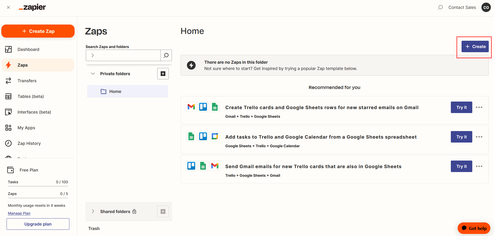<figcaption></figcaption></figure>

### Trigger 메시지 수신

1.  **Discord**를 클릭하거나 검색하세요

    <figure>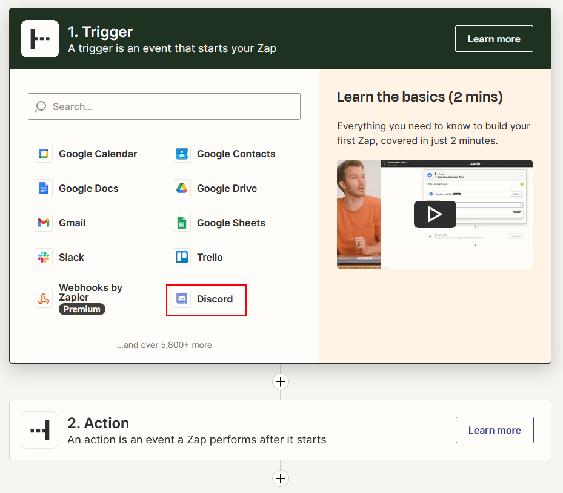<figcaption></figcaption></figure>
2.  **New Message Posted to Channel**을 이벤트로 선택한 후 **Continue**를 클릭하세요

    <figure>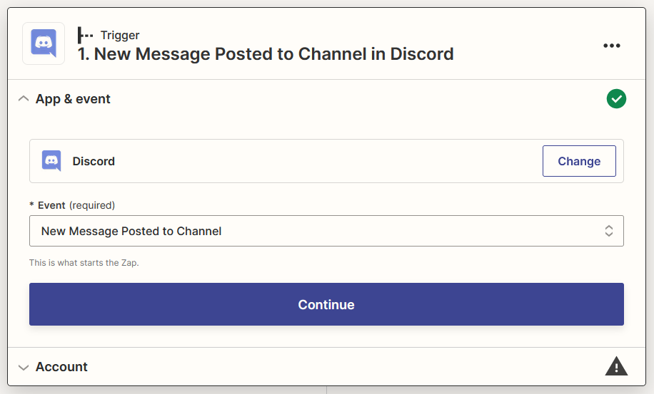<figcaption></figcaption></figure>
3.  Discord 계정에 **로그인**하세요

    <figure>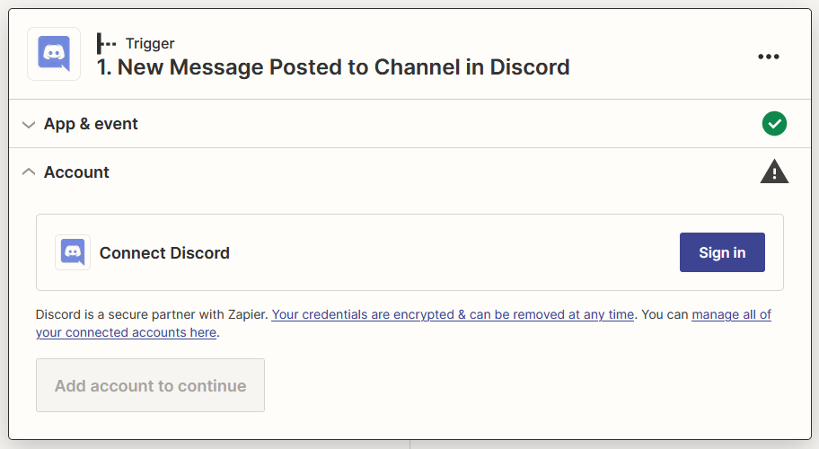<figcaption></figcaption></figure>
4.  원하는 서버에 **Zapier Bot**을 추가하세요

    <figure><figcaption></figcaption></figure>
5.  적절한 권한을 부여하고 **Authorize**를 클릭한 후 **Continue**를 클릭하세요

    <figure><figcaption></figcaption></figure>

    <figure><figcaption></figcaption></figure>
6.  Zapier Bot과 상호작용할 **선호하는 채널**을 선택한 후 **Continue**를 클릭하세요

    <figure><figcaption></figcaption></figure>
7.  8단계에서 선택한 채널에 **메시지를 보내세요**

    <figure><figcaption></figcaption></figure>
8.  **Test trigger**를 클릭하세요

    <figure>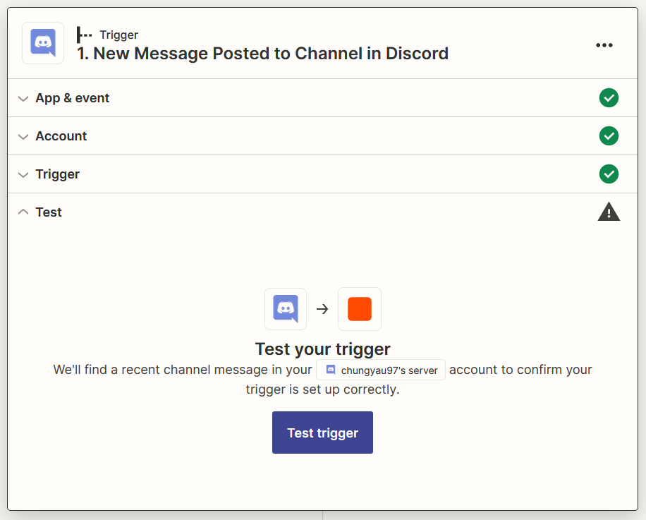<figcaption></figcaption></figure>
9.  메시지를 선택한 후 **Continue with the selected record**를 클릭하세요

    <figure>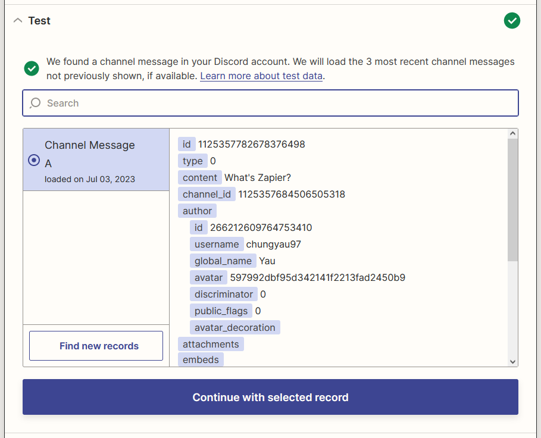<figcaption></figcaption></figure>

### Zapier Bot의 메시지 필터링

1.  **Filter**를 클릭하거나 검색하세요

    <figure><figcaption></figcaption></figure>
2.  **Zapier Bot**에서 받은 메시지가 계속되지 않도록 **Filter**를 구성한 후 **Continue**를 클릭하세요

    <figure><figcaption></figcaption></figure>

### FlowiseAI 결과 메시지 생성

1.  **+**를 클릭하고 **FlowiseAI**를 클릭하거나 검색하세요

    <figure><figcaption></figcaption></figure>
2.  **Make Prediction**을 이벤트로 선택한 후 **Continue**를 클릭하세요

    <figure><figcaption></figcaption></figure>
3.  **로그인**을 클릭하고 세부정보를 입력한 후 **Yes, Continue to FlowiseAI**를 클릭하세요

    <figure><figcaption></figcaption></figure>

    <figure><figcaption></figcaption></figure>
4.  Discord에서 **Content**와 Flow ID를 선택한 후 **Continue**를 클릭하세요

    <figure>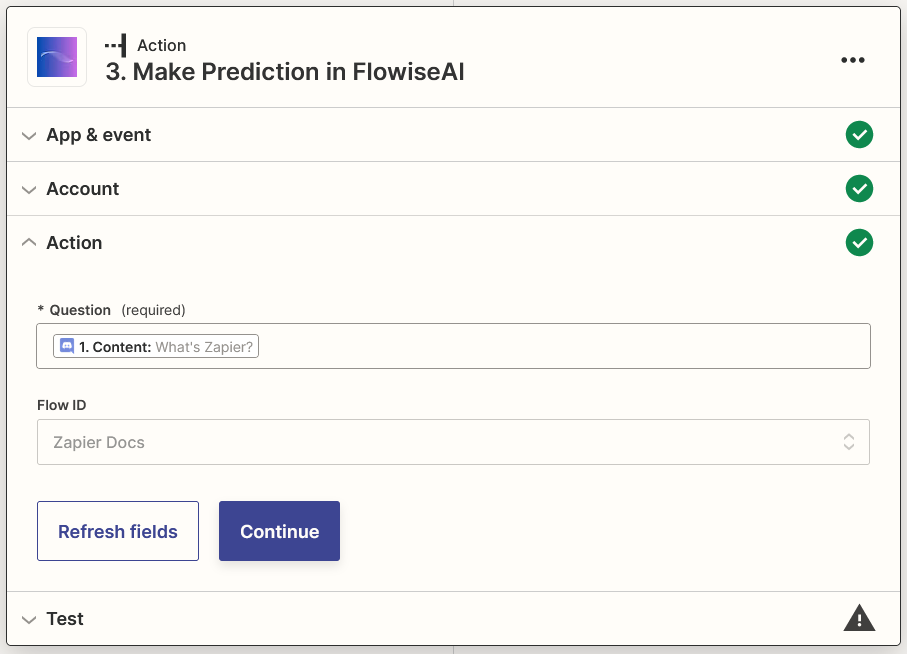<figcaption></figcaption></figure>
5.  **Test action**을 클릭하고 결과를 기다리세요

    <figure><figcaption></figcaption></figure>

### 결과 메시지 보내기

1.  **+**를 클릭하고 **Discord**를 클릭하거나 검색하세요

    <figure>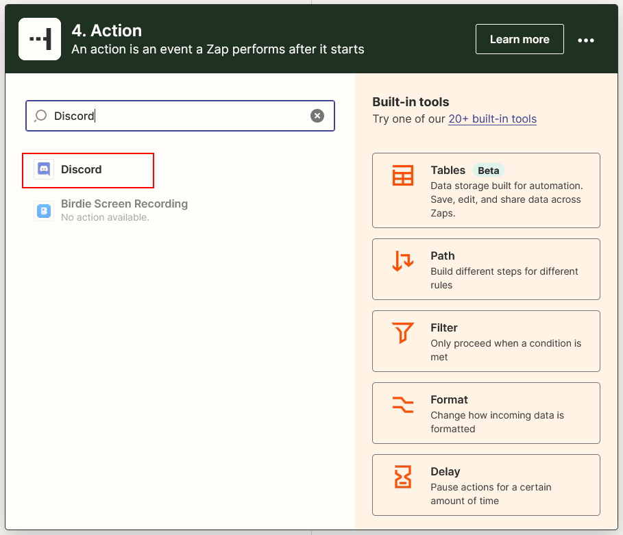<figcaption></figcaption></figure>
2.  **Send Channel Message**를 이벤트로 선택한 후 **Continue**를 클릭하세요

    <figure><figcaption></figcaption></figure>
3.  로그인한 Discord 계정을 선택한 후 **Continue**를 클릭하세요

    <figure>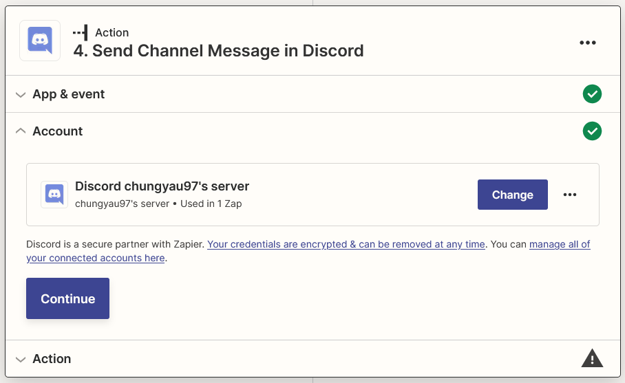<figcaption></figcaption></figure>
4.  채널에 선호하는 채널을 선택하고 메시지 텍스트에서 FlowiseAI의 **Text**와 **String Source** (사용 가능한 경우)를 선택한 후 **Continue**를 클릭하세요

    <figure><figcaption></figcaption></figure>
5.  **Test action**을 클릭하세요

    <figure><figcaption></figcaption></figure>
6.  완료되었습니다! [🎉](https://emojipedia.org/party-popper/) Discord 채널에 메시지가 도착한 것을 볼 수 있습니다

    <figure>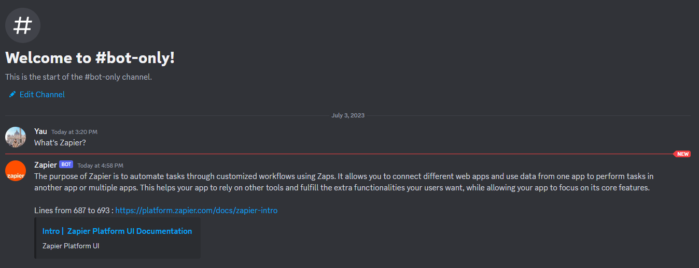<figcaption></figcaption></figure>
7.  마지막으로 Zap의 이름을 변경하고 게시하세요

    <figure>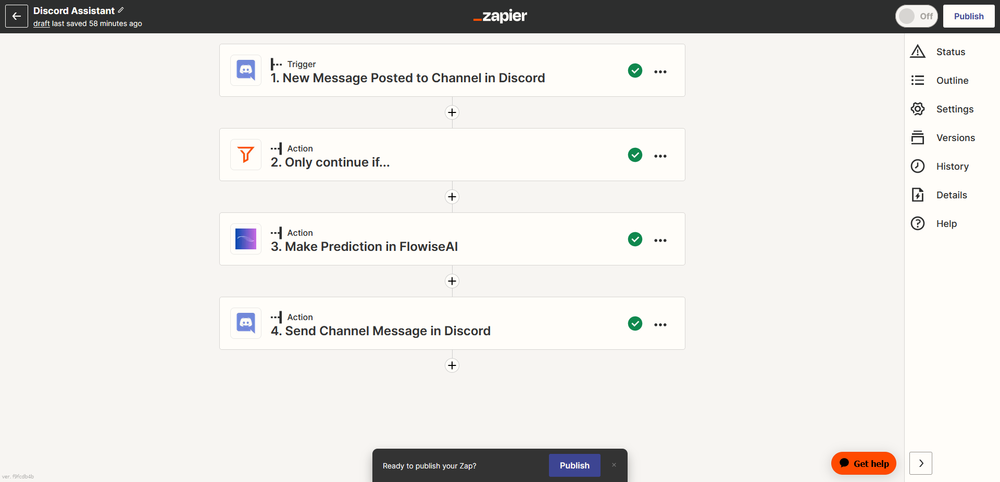<figcaption></figcaption></figure>
