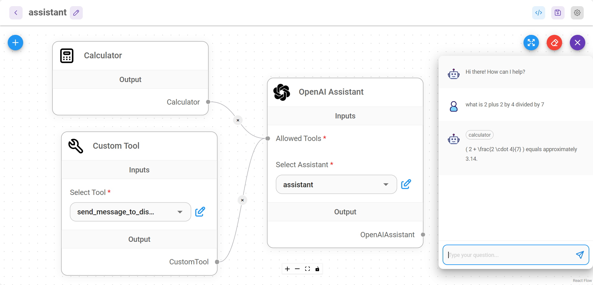

# Threads

[Threads](https://platform.openai.com/docs/assistants/how-it-works/managing-threads-and-messages)는 OpenAI Assistant를 사용할 때만 사용됩니다. Assistant와 사용자 간의 대화 세션입니다. Threads는 메시지를 저장하고 콘텐츠를 모델의 컨텍스트에 맞게 자동으로 잘라냅니다.

<figure><figcaption></figcaption></figure>

## 여러 사용자를 위한 별도의 대화

### UI & Embedded Chat

기본적으로 UI와 Embedded Chat은 여러 사용자의 대화에 대해 자동으로 threads를 분리합니다. 이는 각각의 새로운 상호작용에 대해 고유한 **`chatId`**를 생성함으로써 수행됩니다. 이 로직은 Flowise에서 내부적으로 처리됩니다.

### Prediction API

POST /`api/v1/prediction/{your-chatflowid}`, **`chatId`**를 지정합니다. 동일한 chatId에 대해 동일한 thread가 사용됩니다.

```json
{
    "question": "hello!",
    "chatId": "user1"
}
```

### Message API

* GET `/api/v1/chatmessage/{your-chatflowid}`
* DELETE `/api/v1/chatmessage/{your-chatflowid}`

**`chatId`** -를 통해 필터링할 수도 있습니다 `/api/v1/chatmessage/{your-chatflowid}?chatId={your-chatid}`

모든 대화는 UI에서도 시각화하고 관리할 수 있습니다:

<figure><figcaption></figcaption></figure>
