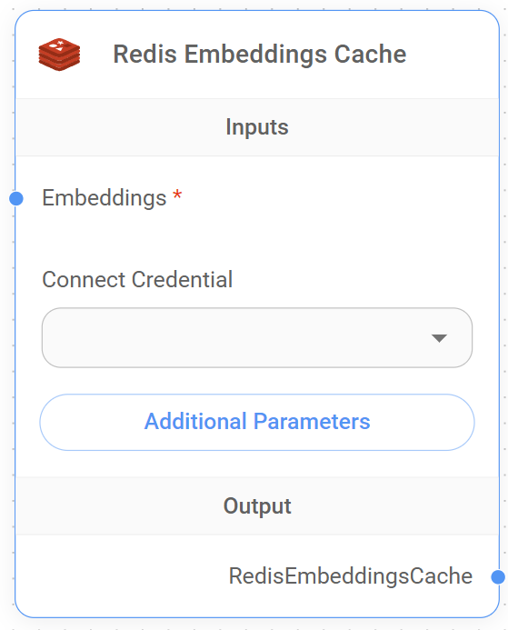

# Redis 임베딩 캐시

<figure><figcaption>
Redis 임베딩 캐시 Node
</figcaption></figure>


This section is a work in progress. We appreciate any help you can provide in completing this section. Please check our [Contribution Guide](/broken/pages/G48tdmpQ3z4CTWEspqkA) to get started.

