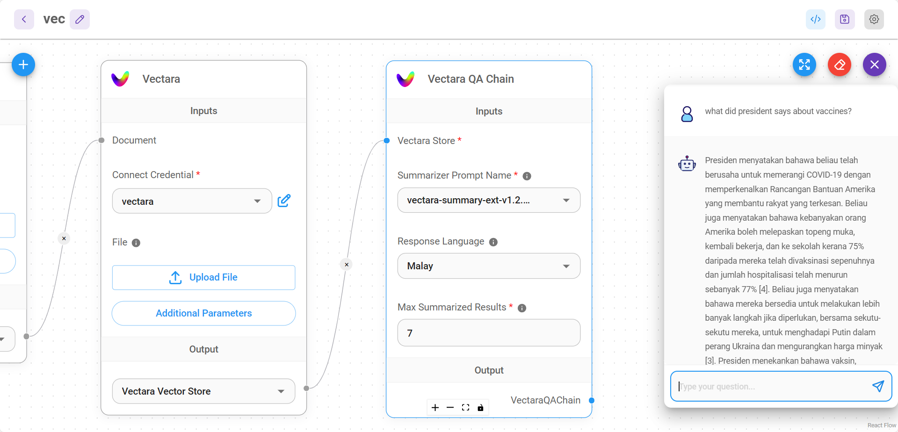

# Vectara QA Chain

Vectara를 사용하여 질문-답변 작업을 수행하기 위한 체인입니다.

<figure><figcaption></figcaption></figure>

## 정의

**검색 기반 질문-답변 체인**: Vectara 검색 구성 요소와 통합되며 입력 매개변수를 구성하고 질문-답변 작업을 수행할 수 있습니다.

## 입력 항목

* [Vectara Store](../vector-stores/vectara.md)

## 매개변수

| 이름 | 설명 |
| ---------------------- | ------------------------------------------------------------- |
| Summarizer Prompt Name | 요약을 생성하는 데 사용할 모델 |
| Response Language | 응답에 원하는 언어 |
| Max Summarized Results | 요약에 사용할 상위 결과의 수 (기본값: 7) |

## 출력

| 이름 | 설명 |
| -------------- | ----------------------------- |
| VectaraQAChain | 응답을 반환하는 최종 노드 |
