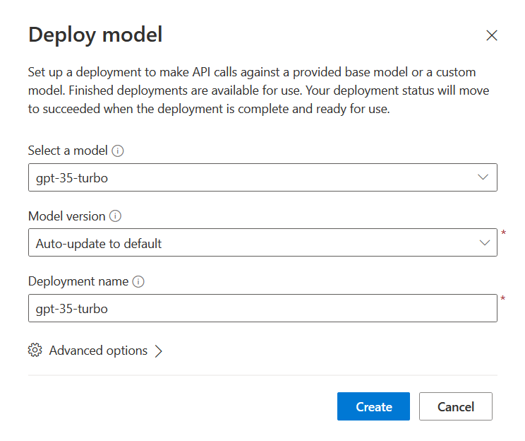
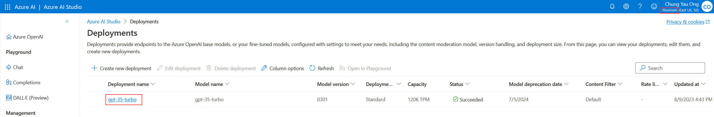
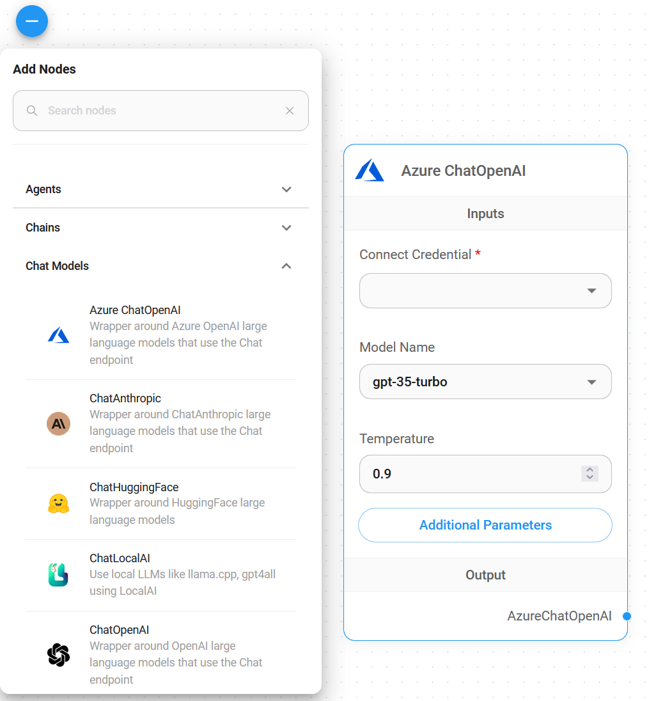
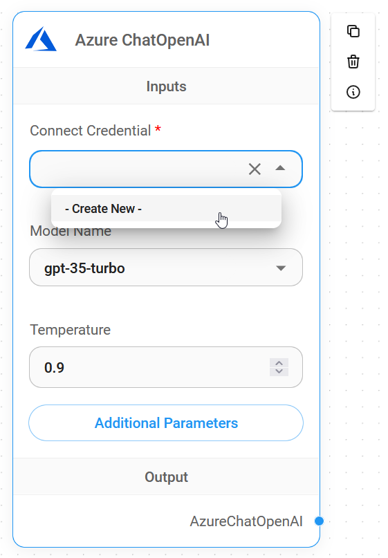
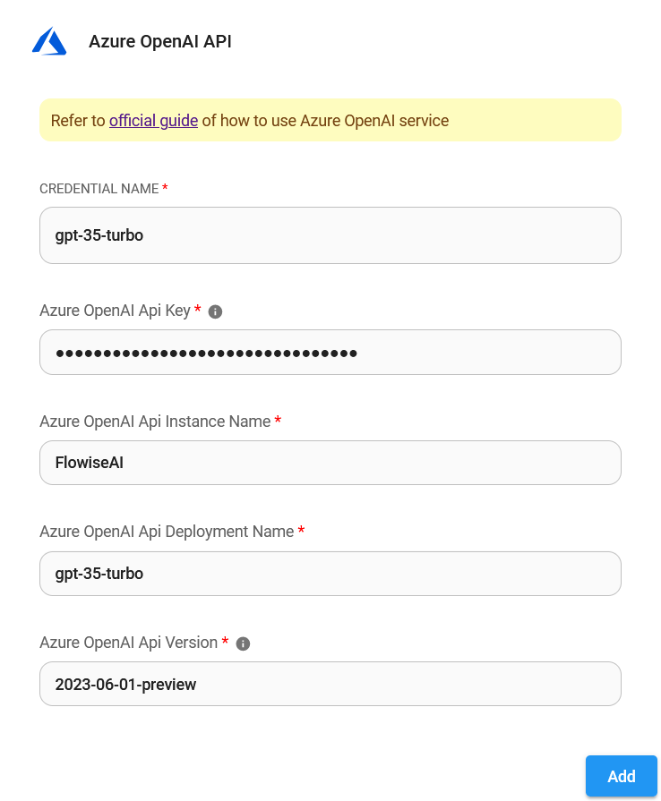

# Azure ChatOpenAI

## Prerequisite

1. [Log in](__PRESERVE_URL_2__) or [sign up](__PRESERVE_URL_3__) to Azure
2. [Create](__PRESERVE_URL_4__) your Azure OpenAI and wait for approval approximately 10 business days
3. Your API key will be available at **Azure OpenAI** > click **name\_azure\_openai** > click **Click here to manage keys**

<figure><figcaption></figcaption></figure>

## 설정

### Azure ChatOpenAI

1. Click **Go to Azure OpenaAI Studio**

<figure><figcaption></figcaption></figure>

2. Click **배포s**

<figure><figcaption></figcaption></figure>

3. Click **Create new 배포**

<figure><figcaption></figcaption></figure>

4. Select as shown below and click **Create**

<figure><figcaption></figcaption></figure>

5. Successfully created **Azure ChatOpenAI**

* 배포 name: `gpt-35-turbo`
* Instance name: `top right conner`

<figure><figcaption></figcaption></figure>

<figure><figcaption></figcaption></figure>

### Flowise

1. **채팅 모델** > drag **Azure ChatOpenAI** node

<figure><figcaption></figcaption></figure>

2. **Connect Credential** > click **Create New**

<figure><figcaption></figcaption></figure>

3. Copy & Paste each details (API Key, Instance & Deployment name, [API Version](__PRESERVE_URL_5__)) into **Azure ChatOpenAI** credential

<figure><figcaption></figcaption></figure>

4. Voila [🎉](__PRESERVE_URL_6__), you have created **Azure ChatOpenAI node** in Flowise

<figure><figcaption></figcaption></figure>

## Resources

* [LangChain JS Azure ChatOpenAI](__PRESERVE_URL_7__)
* [Azure OpenAI Service REST API reference](__PRESERVE_URL_8__)
