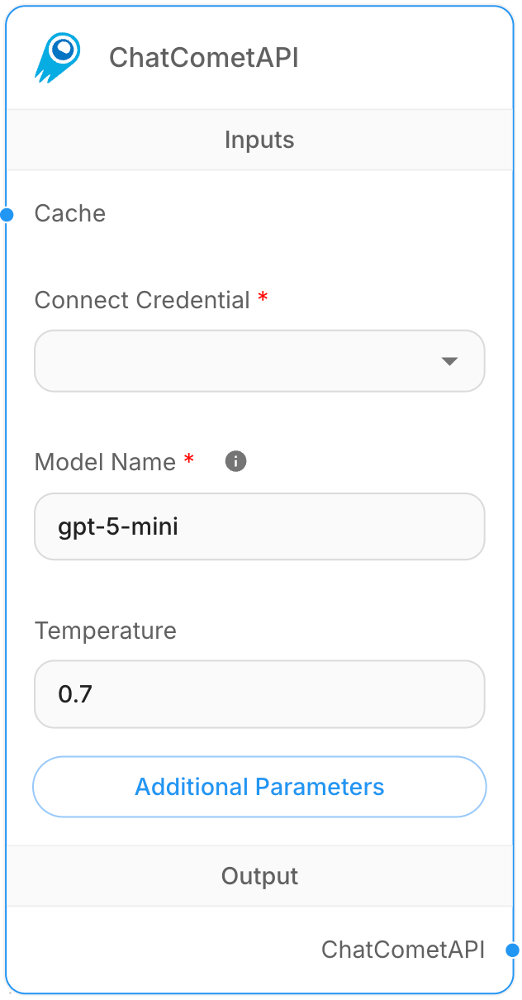

# ChatCometAPI

## 설명
CometAPI는 GPT, Claude, Gemini, Qwen, DeepSeek, Midjourney 및 기타를 포함한 500개 이상의 AI 모델에 대한 액세스를 단일 통합을 통해 제공하는 통합 API 플랫폼입니다. 다양한 모델 제공자 간에 일관된 API 형식으로 간단한 액세스를 제공합니다.

## 필수 요구사항
1. CometAPI의 공식 [문서](https://api.cometapi.com/doc)를 참조하세요.
2. [CometAPI Console](https://api.cometapi.com/console/token)에서 API 키를 가져옵니다.

## 단계별 가이드
<figure><figcaption>
ChatCometAPI Node
</figcaption></figure>

1. **Chat Models** > **ChatCometAPI** 노드를 드래그합니다.
2. CometAPI API 키로 새 자격증명을 생성합니다.
3. ChatCometAPI 노드에서 **Additional Parameters**를 클릭합니다.
4. Base Path를 `https://api.cometapi.com/v1/`로 변경합니다.