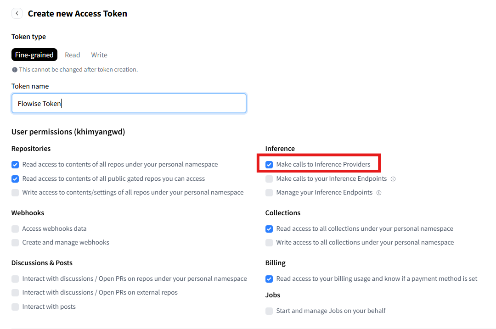
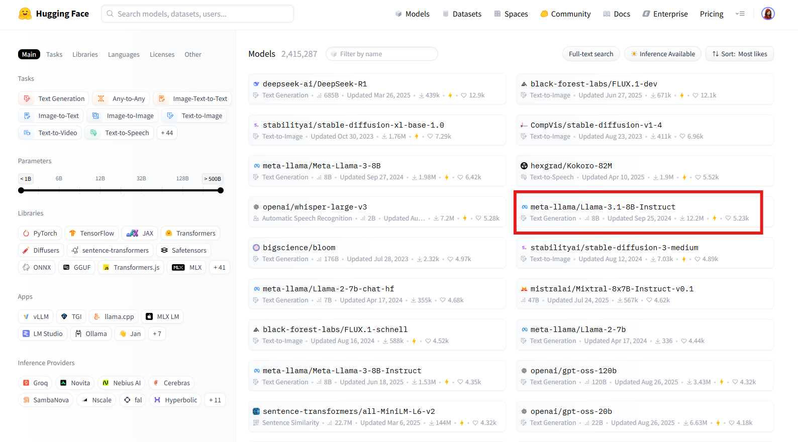
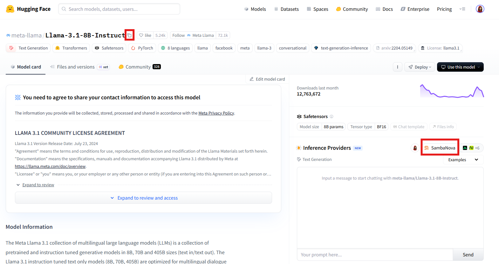
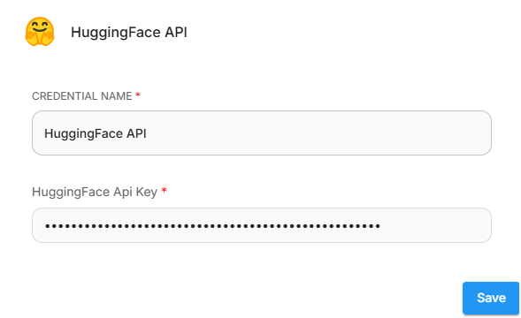
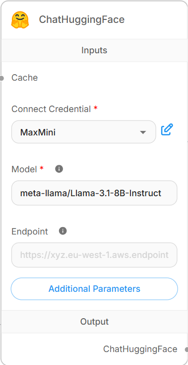
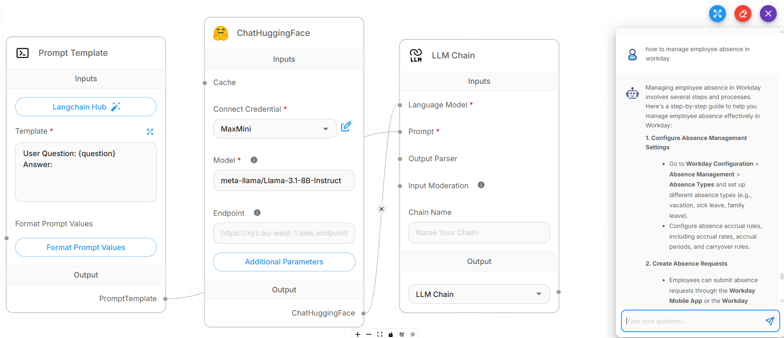

# ChatHuggingFace

## 필수 요구사항

1. [Hugging Face](https://huggingface.co)에 [로그인](https://huggingface.co/login)하거나 [가입](https://huggingface.co/join)합니다.
2. 아직 하지 않았다면 API 키를 만듭니다:
   1. Hugging Face 프로필에서 **Access Tokens** > **Create new token**을 선택합니다.
   2.  _Fine-grained_ 토큰을 만듭니다. 필요한 모든 읽기 및 쓰기 액세스를 선택합니다. 다음 중 하나를 선택했는지 확인하세요:

       * _Make calls to Inference Providers_ - Hugging Face 또는 기타 타사 제공자(예: Together AI, Sambanova 또는 Replicate)의 Serverless Inference API(이전에는 "Inference API"라고 함)와 상호작용합니다.
       * _Make calls to your Inference Endpoints_ - 자신의 서버에 배포한 전용 독립 실행형 Hugging Face 인스턴스와 상호작용합니다.

       <figure><figcaption>
Hugging Face Token Creation
</figcaption></figure>
   3. **Copy**를 클릭하고 API 토큰을 다른 위치에 저장하여 나중에 검색합니다.
3.  **Models** 탭에서 사용할 LLM 모델을 선택합니다.

    <figure><figcaption>
Hugging Face Models
</figcaption></figure>
4. 열리는 LLM 모델 페이지에서:
   1. 모델 이름 옆의 아이콘을 클릭하여 모델 이름을 클립보드에 복사하거나 나중에 검색할 수 있도록 다른 위치에 저장합니다.
   2.  모델의 기본 Inference Provider를 기록합니다.

       <figure><figcaption>
Hugging Face LLM Model Page
</figcaption></figure>
   3. 공급자가 사용자 정의 API 키가 필요한 타사 공급자인 경우, 먼저 공급자 사이트에서 API 키를 만든 다음 Hugging Face 프로필 설정에서 API 키를 복사하여 설정합니다:
      1. Hugging Face 프로필의 **Settings**를 클릭합니다.
      2. 왼쪽 패널에서 **Inference Providers**를 선택합니다.
      3. **Settings** 탭을 선택합니다.
      4. 공급자에 대해 **Set a custom API key**를 선택하고 API 키를 붙여넣습니다.

## 설정

### Flowise

시작하려면 Flowise를 배포해야 합니다. 로컬 또는 클라우드에서 Flowise를 설치하고 실행합니다. 배포를 위해 공식 Flowise 문서 또는 자습서를 따를 수 있습니다.

ChatHuggingFace 채팅 모델을 사용하여 Flowise에서 chatflow를 만들려면:

1. **Chatflows**에서 **+ Add New**를 클릭하여 새 chatflow를 만듭니다.
2. **+**를 클릭하고 **Chains** > **LLM Chain**을 드래그합니다.
3.  **+**를 클릭하고 **Chat Models** > **ChatHuggingFace**를 드래그합니다:

    *   **Connect Credential**: **Create New**를 클릭하여 새 자격증명을 만들고 **HuggingFace API Key** 필드에 Hugging Face 액세스 토큰을 입력합니다.

        <figure><figcaption>
Hugging Face Connect Credential
</figcaption></figure>
    * **Model**: 클립보드에서 모델 이름을 붙여넣습니다(Hugging Face의 모델 페이지에서 저장됨).

    <figure><figcaption>
ChatHuggingFace Node
</figcaption></figure>
4. **+**를 클릭하고 **Prompts** > **Prompt Template**을 드래그합니다:
   * Template을 확장하고 지시사항을 입력합니다. 예: "User Question: {question}".
5. **ChatHuggingFace**의 출력을 LLM Chain의 **Language Model** 입력에 연결합니다.
6. **PromptTemplate**의 출력을 LLM Chain의 **Prompt** 입력에 연결합니다.
7. chatflow를 실행하기 전에 구성을 저장합니다.
8.  완료되었습니다, Flowise에서 **ChatHuggingFace 노드**를 사용하여 chatflow를 만들었습니다.

    <figure><figcaption>
Hugging Face Chatflow
</figcaption></figure>

## 리소스

* [HuggingFace Documentation](https://huggingface.co/docs)
* [HuggingFace Forum](https://discuss.huggingface.co/)
