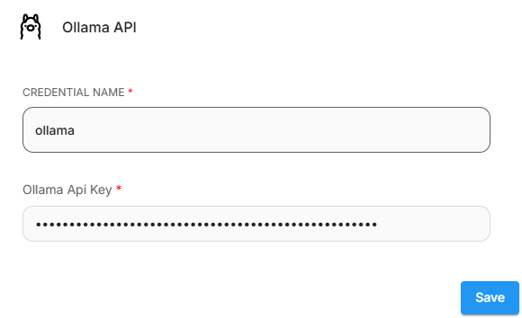

# ChatOllama

## 필수 요구사항

1. [Ollama](https://github.com/ollama/ollama)를 다운로드하거나 [Docker](https://hub.docker.com/r/ollama/ollama)에서 실행합니다.
2.  예를 들어, 다음 명령을 사용하여 llama3으로 Docker 인스턴스를 실행할 수 있습니다

    ```bash
    docker run -d -v ollama:/root/.ollama -p 11434:11434 --name ollama ollama/ollama
    docker exec -it ollama ollama run llama3
    ```

## 설정

1. **Chat Models** > **ChatOllama** 노드를 드래그합니다

<figure><figcaption></figcaption></figure>

2. Ollama에서 실행 중인 모델을 입력합니다. 예: `llama2`. 추가 매개변수를 사용할 수도 있습니다:

<figure><figcaption></figcaption></figure>

3. 완료되었습니다, 이제 Flowise에서 **ChatOllama 노드**를 사용할 수 있습니다

<figure><figcaption></figcaption></figure>

### Docker에서 실행

Flowise와 Ollama 모두를 docker에서 실행 중인 경우 ChatOllama의 Base URL을 변경해야 합니다.

Windows 및 MacOS 운영 체제의 경우 [http://host.docker.internal:8000](http://host.docker.internal:8000/)을 지정합니다. Linux 기반 시스템의 경우 host.docker.internal을 사용할 수 없으므로 기본 Docker 게이트웨이를 사용해야 합니다: [http://172.17.0.1:8000](http://172.17.0.1:8000/)

<figure><figcaption></figcaption></figure>

## Ollama Cloud

1. **ollama.com**에서 [API 키](https://ollama.com/settings/keys)를 만듭니다.
2. Flowise에서 **Create Credential**을 클릭하고 **Ollama API**를 선택한 후 API 키를 입력합니다.

<figure><figcaption></figcaption></figure>

3. 그런 다음 **Base URL**을 `https://ollama.com`으로 설정합니다  
4. Ollama Cloud에서 사용 가능한 모델을 입력합니다.

<figure><figcaption></figcaption></figure>

## 리소스

* [LangchainJS ChatOllama](https://js.langchain.com/docs/integrations/chat/ollama)
* [Ollama](https://github.com/ollama/ollama)
