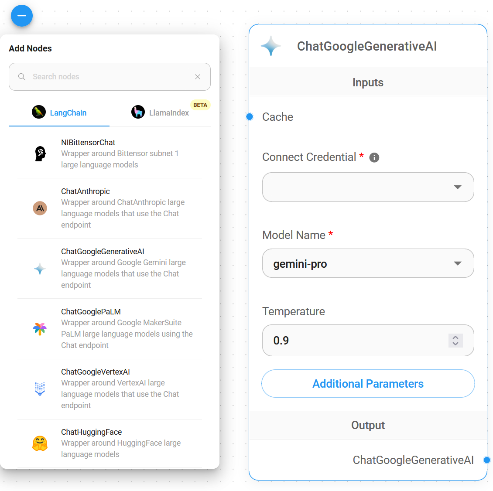
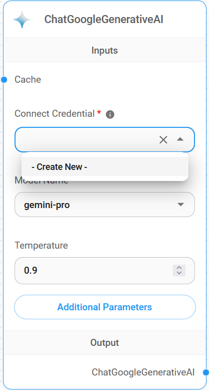
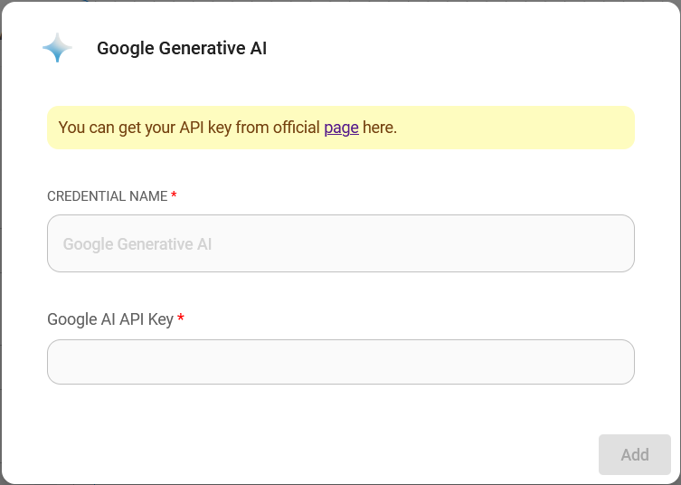
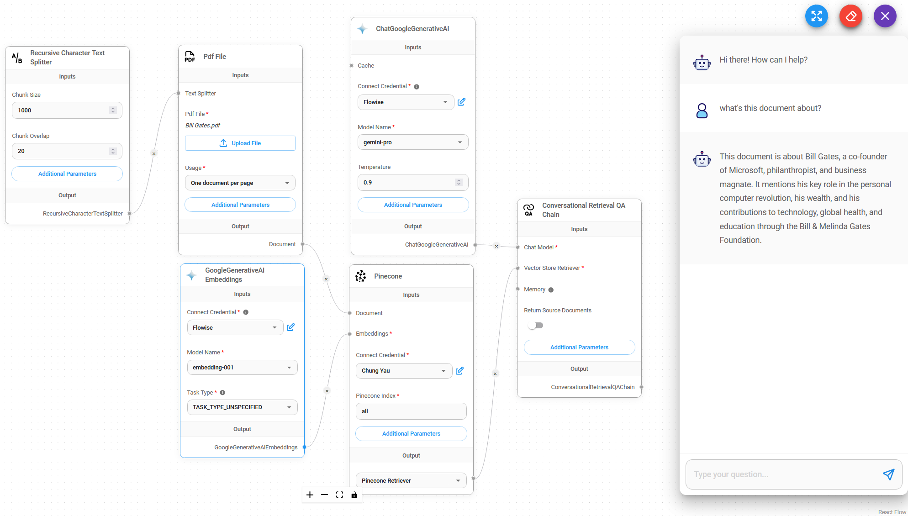
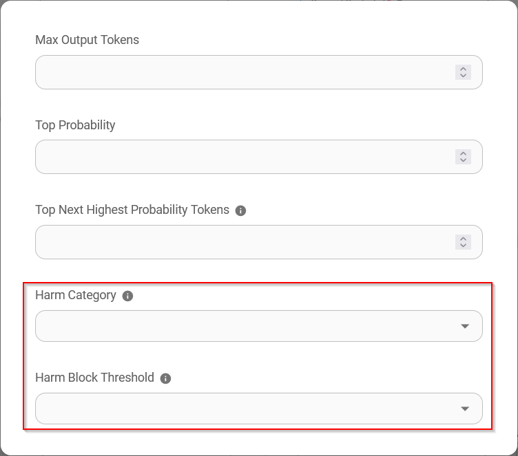
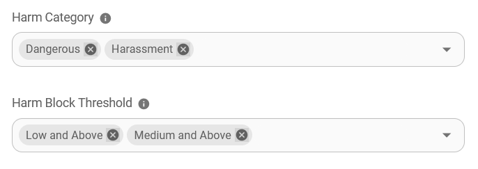

# ChatGoogleGenerativeAI

## 필수 요구사항

1. [Google](https://accounts.google.com/InteractiveLogin) 계정을 등록합니다
2. [API 키](https://aistudio.google.com/app/apikey)를 만듭니다

## 설정

1. **Chat Models** > **ChatGoogleGenerativeAI** 노드를 드래그합니다

<figure><figcaption></figcaption></figure>

2. **Connect Credential** > **Create New**를 클릭합니다

<figure><figcaption></figcaption></figure>

3. **Google AI** 자격증명을 입력합니다

<figure><figcaption></figcaption></figure>

4. 완료되었습니다, 이제 Flowise에서 **ChatGoogleGenerativeAI 노드**를 사용할 수 있습니다

<figure><figcaption></figcaption></figure>

## 안전 속성 구성

1. **Additonal Parameters**를 클릭합니다

<figure><figcaption></figcaption></figure>

* **Safety Attributes**를 구성할 때 **Harm Category** & **Harm Block Threshold**의 선택 수량은 같아야 합니다. 그렇지 않으면 `Harm Category & Harm Block Threshold are not the same length` 오류가 발생합니다

* 아래의 **Safety Attributes** 조합은 `Dangerous`가 `Low and Above`로 설정되고 `Harassment`가 `Medium and Above`로 설정되도록 합니다

<figure><figcaption></figcaption></figure>

## 리소스

* [LangChain JS ChatGoogleGenerativeAI](https://js.langchain.com/docs/integrations/chat/google_generativeai)
* [Google AI for Developers](https://ai.google.dev/)
* [Gemini API Docs](https://ai.google.dev/docs)