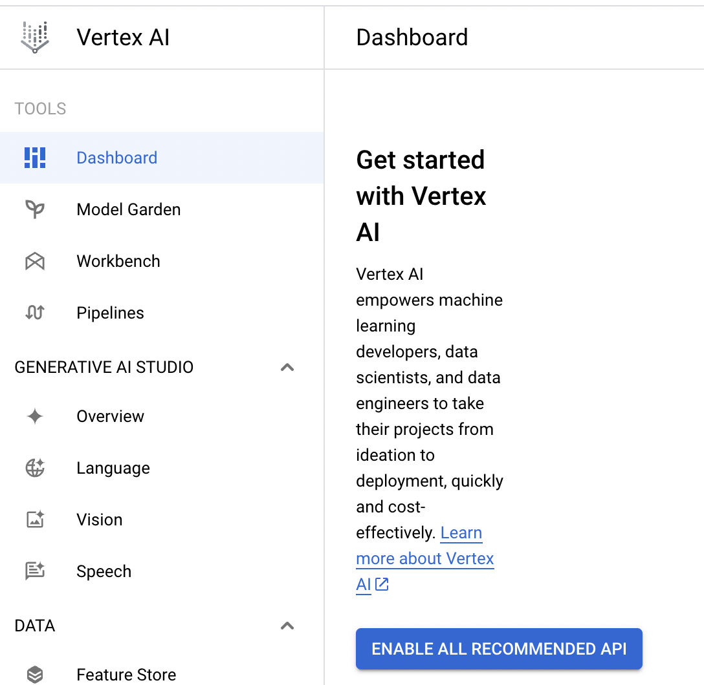
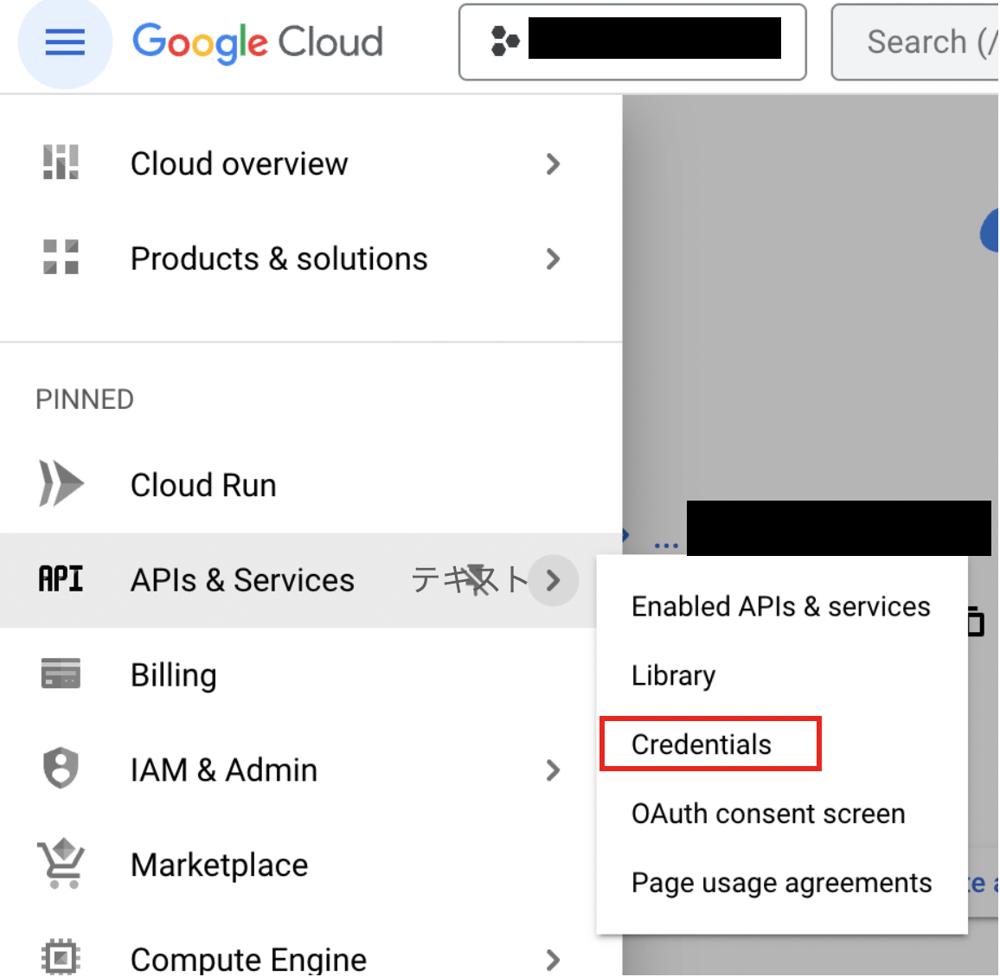
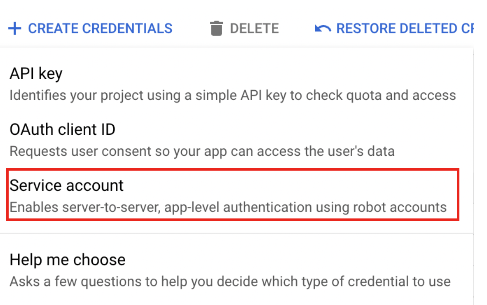
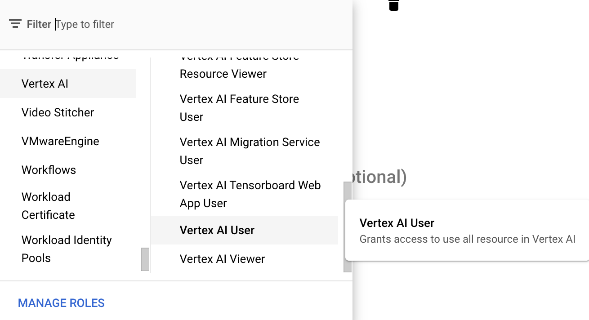
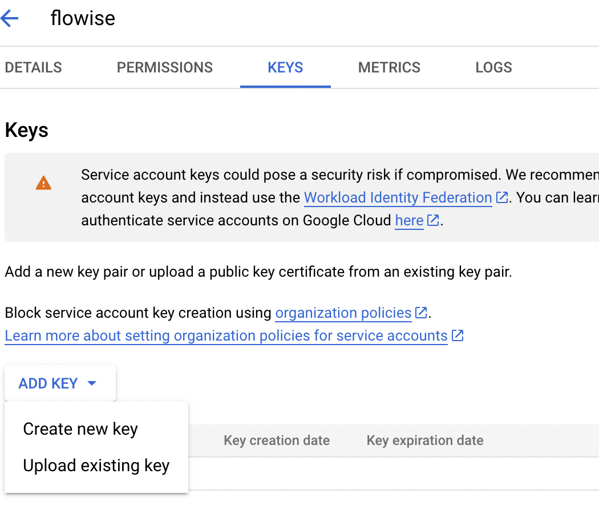
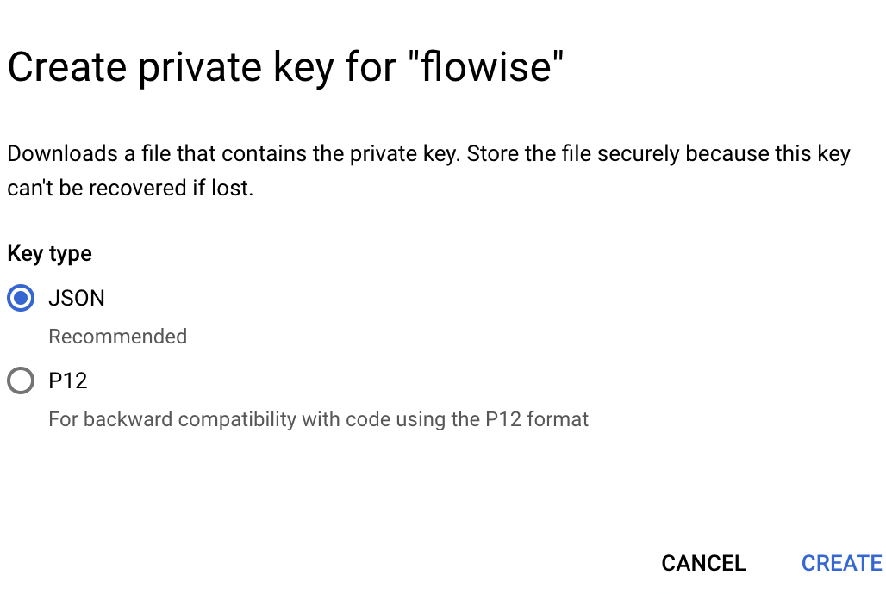
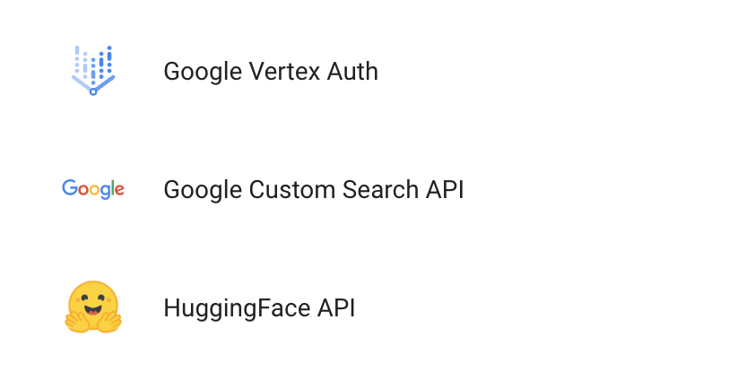
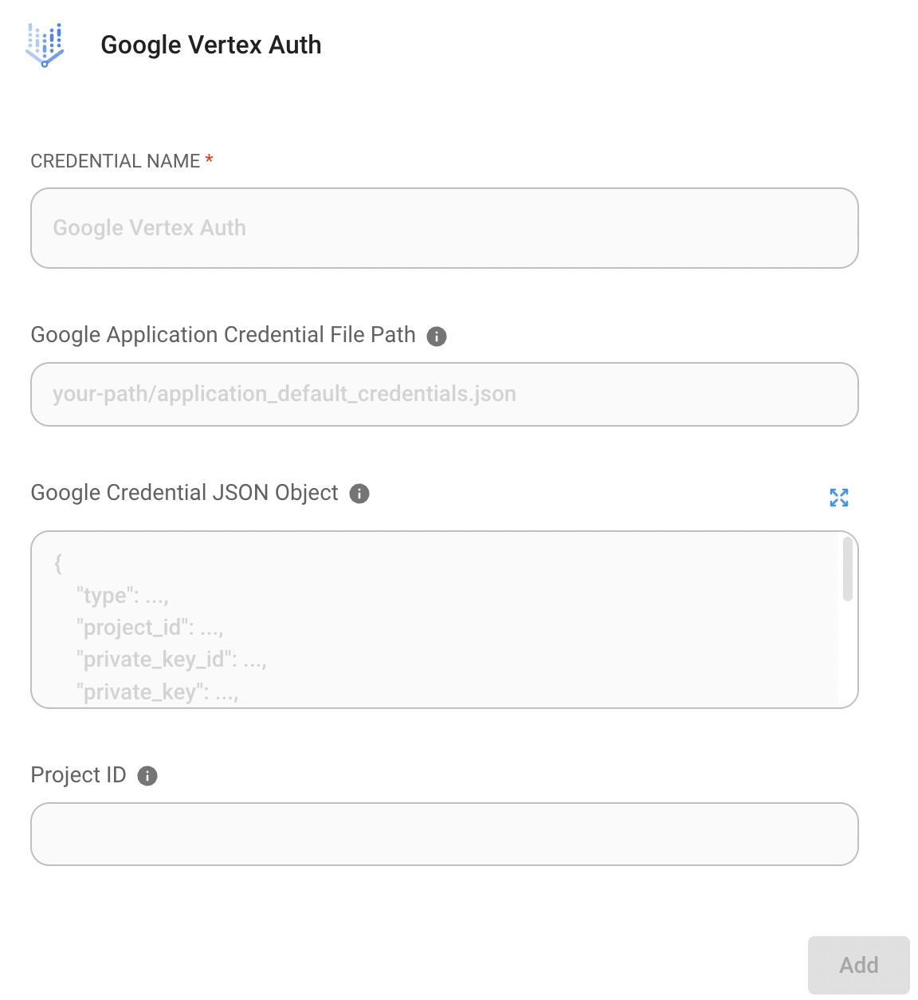

# Google VertexAI

## 필수 요구사항

1. [GCP 시작](https://cloud.google.com/docs/get-started)
2. [Google Cloud CLI](https://cloud.google.com/sdk/docs/install-sdk) 설치

## 설정

### Vertex AI API 활성화

1. GCP의 Vertex AI로 이동하여 **"ENABLE ALL RECOMMENDED API"**를 클릭합니다

<figure><figcaption></figcaption></figure>

## 자격증명 파일 만들기 _(선택 사항)_

자격증명 파일을 만드는 방법은 2가지입니다

### No. 1 : GCP CLI 사용

1. 터미널을 열고 다음 명령을 실행합니다

```bash
gcloud auth application-default login
```

2. GCP 계정에 로그인합니다
3. 자격증명 파일을 확인합니다. `~/.config/gcloud/application_default_credentials.json`에서 자격증명 파일을 찾을 수 있습니다

### No. 2 : GCP 콘솔 사용

1. GCP 콘솔로 이동하여 **"CREATE CREDENTIALS"**를 클릭합니다

<figure><figcaption></figcaption></figure>

2. 서비스 계정 만들기

<figure><figcaption></figcaption></figure>

3. Service account details 양식을 작성하고 **"CREATE AND CONTINUE"**를 클릭합니다
4. 적절한 역할(예: Vertex AI User)을 선택하고 **"DONE"**를 클릭합니다

<figure><figcaption></figcaption></figure>

5. 만든 service account를 클릭하고 **"ADD KEY" -> "Create new key"**를 클릭합니다

<figure><figcaption></figcaption></figure>

6. JSON을 선택하고 **"CREATE"**를 클릭하면 자격증명 파일을 다운로드할 수 있습니다

<figure><figcaption></figcaption></figure>

## Flowise

<figure><figcaption></figcaption></figure>

### 자격증명 파일 없음

Cloud Run과 같은 GCP 서비스를 사용 중이거나 로컬 머신에 기본 자격증명을 설치한 경우 이 자격증명을 설정할 필요가 없습니다.

### 자격증명 파일 사용

1. Flowise의 Credential 페이지로 이동하여 **"Add credential"**을 클릭합니다
2. Google Vertex Auth를 클릭합니다

<figure><figcaption></figcaption></figure>

3. 자격증명 파일을 등록합니다. 자격증명 파일을 등록하는 방법은 2가지입니다.

<figure><figcaption></figcaption></figure>

* **Option 1 : 자격증명 파일의 경로 입력**
  * 머신에 자격증명 파일이 있으면 `Google Application Credential File Path`에 자격증명 파일의 경로를 입력할 수 있습니다
* **Option 2 : 자격증명 파일의 텍스트 붙여넣기**
  * 또는 자격증명 파일의 모든 텍스트를 복사하여 `Google Credential JSON Object`에 붙여넣을 수 있습니다

4. 마지막으로 "Add" 버튼을 클릭합니다.
5. 이제 Flowise에서 자격증명과 함께 ChatGoogleVertexAI를 사용할 수 있습니다!

### 리소스

* [LangChain JS GoogleVertexAI](https://js.langchain.com/docs/api/llms_googlevertexai/classes/GoogleVertexAI)
* [Google Service accounts overview](https://cloud.google.com/iam/docs/service-account-overview?)
* [Try Google Vertex AI Palm 2 with Flowise: Without Coding to Leverage Intuition](https://tech.beatrust.com/entry/2023/08/22/Try_Google_Vertex_AI_Palm_2_with_Flowise%3A_Without_Coding_to_Leverage_Intuition)
