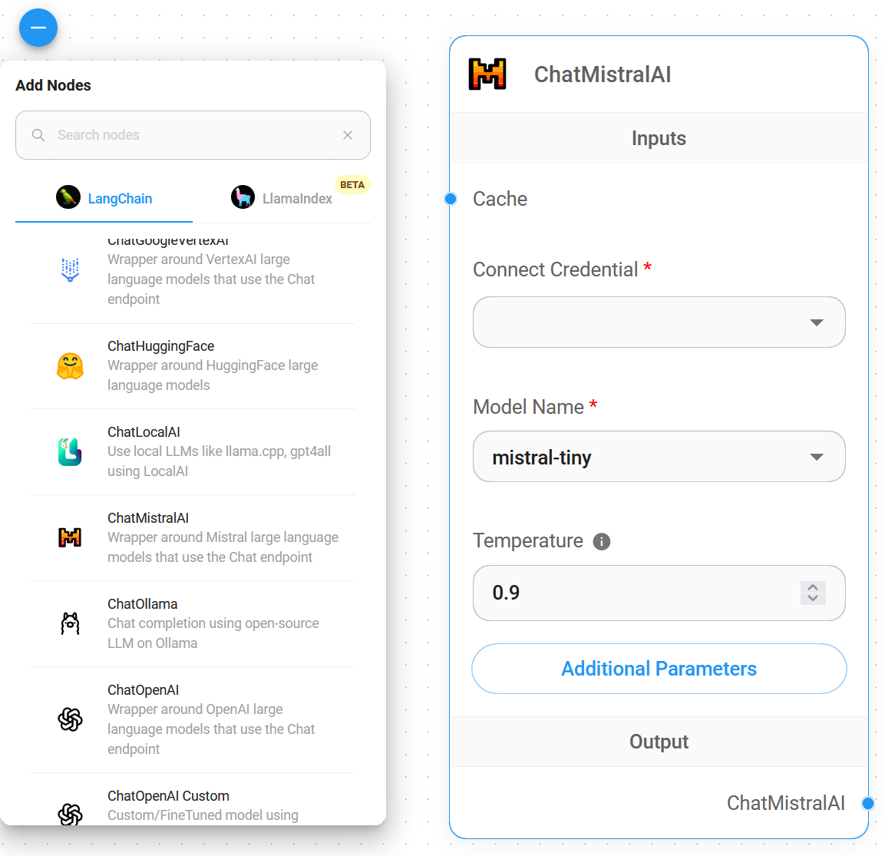
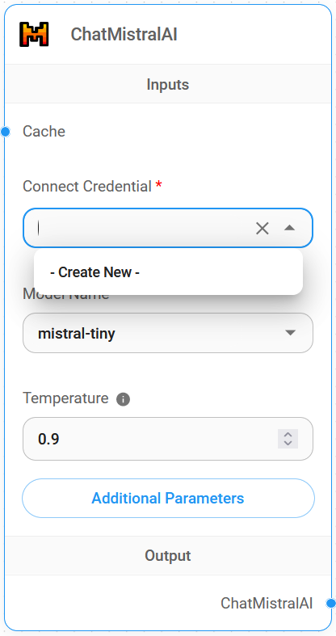
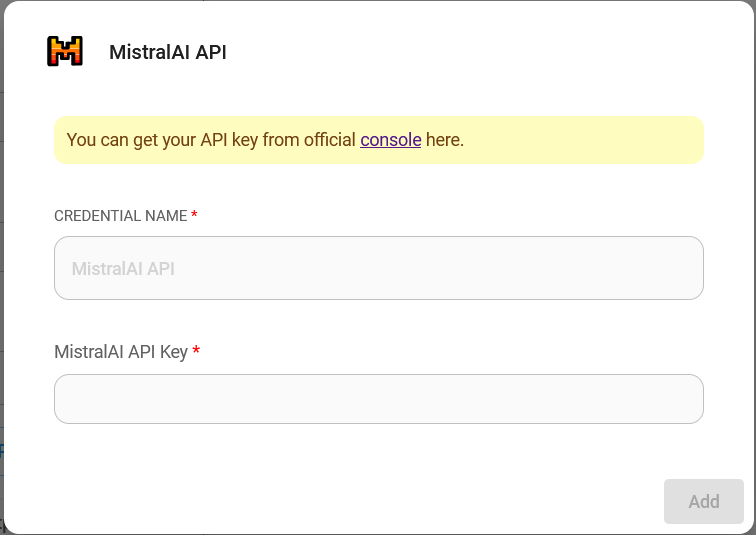
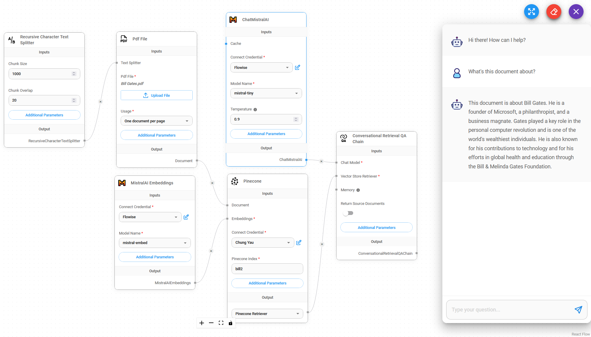

# ChatMistralAI

## 필수 요구사항

1. [Mistral AI](https://mistral.ai/) 계정을 등록합니다
2. [API 키](https://console.mistral.ai/user/api-keys/)를 만듭니다

## 설정

1. **Chat Models** > **ChatMistralAI** 노드를 드래그합니다

<figure><figcaption></figcaption></figure>

2. **Connect Credential** > **Create New**를 클릭합니다

<figure><figcaption></figcaption></figure>

3. **Mistral AI** 자격증명을 입력합니다

<figure><figcaption></figcaption></figure>

4. 완료되었습니다, 이제 Flowise에서 **ChatMistralAI 노드**를 사용할 수 있습니다

<figure><figcaption></figcaption></figure>

## 리소스

* [LangChain JS ChatMistralAI](https://js.langchain.com/docs/integrations/chat/mistral)
* [Mistral AI](https://mistral.ai/)
* [Mistral AI Docs](https://docs.mistral.ai/)