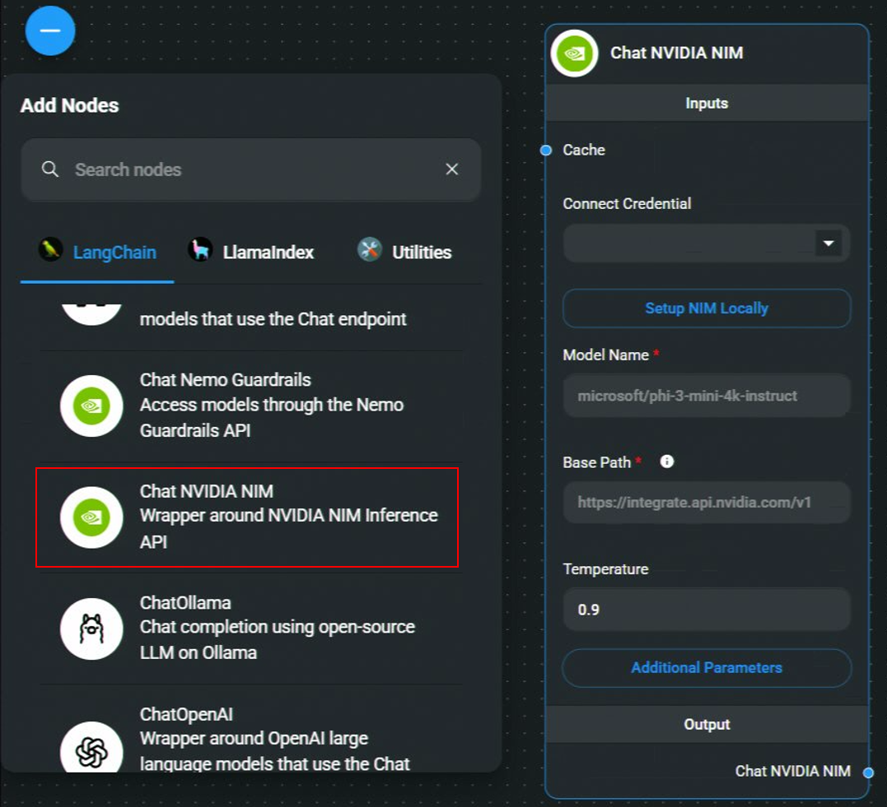
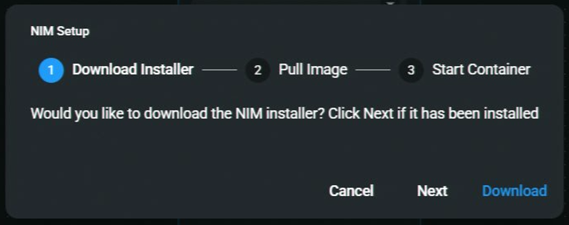
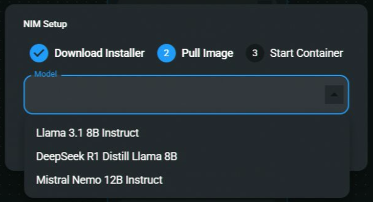
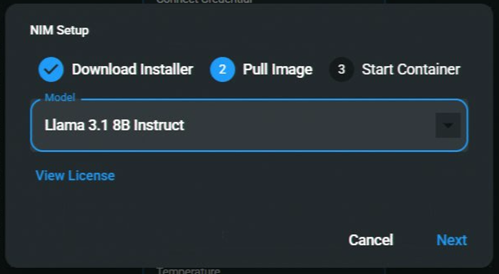
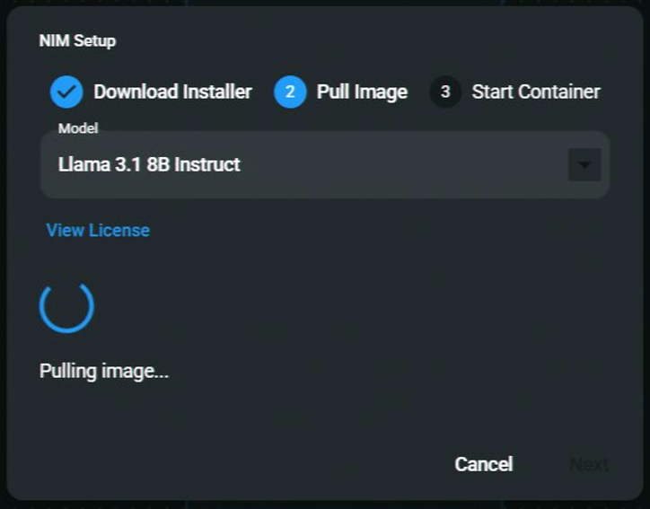
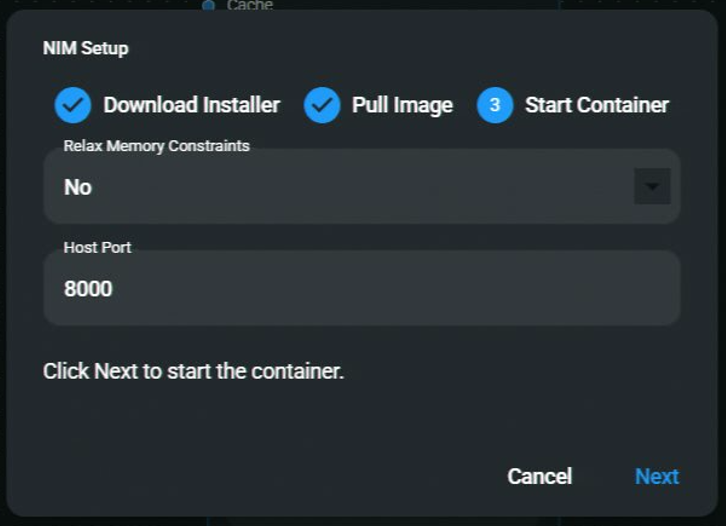
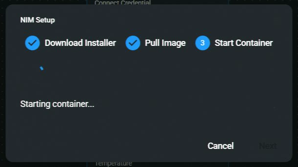
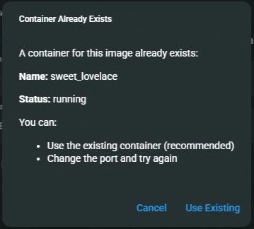
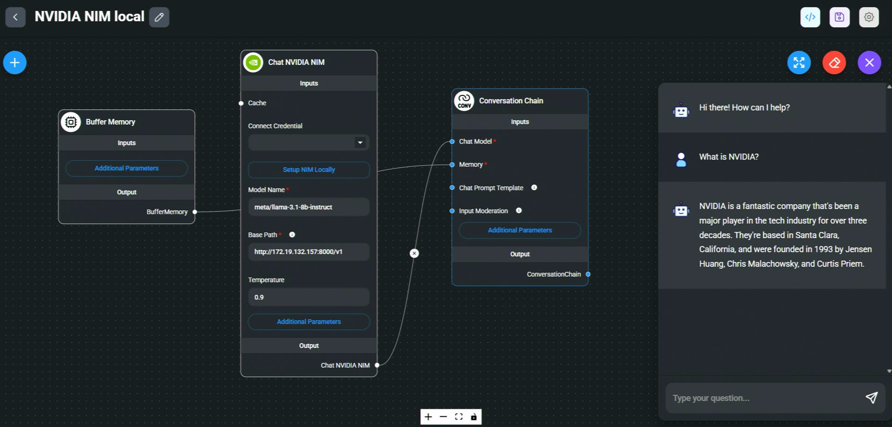

# NVIDIA NIM

## 로컬

### Flowise로 NIM을 실행할 때의 중요한 참고사항

기존 NIM 인스턴스가 이미 실행 중인 경우(예: NVIDIA의 ChatRTX), **기존 엔드포인트를 확인하지 않고** Flowise를 통해 다른 인스턴스를 시작하면 충돌이 발생할 수 있습니다. 이 문제는 동일한 NIM에서 여러 `podman run` 명령이 실행될 때 발생하여 실패로 이어집니다.

지원을 위해 다음을 참조하세요:

- **[NVIDIA Developer Forums](https://forums.developer.nvidia.com/)** – 기술 문제 및 질문용.
- **[NVIDIA Developer Discord](https://discord.gg/nvidiadeveloper)** – 커뮤니티 참여 및 [공지사항](https://discord.com/channels/1019361803752456192/1340013505834647572).

### 필수 요구사항

1. [NVIDIA NIM을 WSL2로 로컬에 설정](https://docs.nvidia.com/nim/wsl2/1.0.0/getting-started.html)합니다.

### Flowise

1. **Chat Models** > **Chat NVIDIA NIM** 노드를 드래그합니다 > **Setup NIM Locally**를 클릭합니다.

<figure><figcaption></figcaption></figure>

2. NIM이 이미 설치되어 있으면 **Next**를 클릭합니다. 그렇지 않으면 **Download**를 클릭하여 설치 프로그램을 시작합니다.

<figure><figcaption></figcaption></figure>

3. 다운로드할 모델 이미지를 선택합니다.

<figure><figcaption></figcaption></figure>

4. 선택한 후 **Next**를 클릭하여 다운로드를 진행합니다.

<figure><figcaption></figcaption></figure>

5. **Downloading Image** – 기간은 인터넷 속도에 따라 다릅니다.

<figure><figcaption></figcaption></figure>

6. [메모리 제약 완화](https://docs.nvidia.com/nim/large-language-models/1.7.0/configuration.html#environment-variables)에 대해 자세히 알아봅니다.  
   **Host Port**는 컨테이너를 로컬 머신에 매핑할 포트입니다.

<figure><figcaption></figcaption></figure>

7. **Starting the container...**

<figure><figcaption></figcaption></figure>

_참고: 선택한 모델을 실행하는 컨테이너가 이미 있으면 Flowise에서 실행 중인 컨테이너를 재사용할 것인지 묻습니다. 실행 중인 컨테이너를 재사용하거나 다른 포트로 새 컨테이너를 시작할 수 있습니다._

<figure><figcaption></figcaption></figure>

8. **Save the chatflow**

9. **완료되었습니다!** **Chat NVIDIA NIM** 노드는 이제 Flowise에서 사용할 수 있습니다!

<figure><figcaption></figcaption></figure>

## 클라우드

### 필수 요구사항

1. [NVIDIA](https://build.nvidia.com/)에 로그인하거나 가입합니다.
2. 맨 위 네비게이션 바에서 NIM을 클릭합니다:

<figure><figcaption></figcaption></figure>

3. 사용하려는 모델을 검색합니다. 로컬로 다운로드하려면 Docker를 사용합니다:

<figure><figcaption></figcaption></figure>

4. Docker 설정의 지침을 따릅니다. Docker 이미지를 가져오려면 먼저 API 키를 가져야 합니다:

<figure><figcaption></figcaption></figure>

### Flowise

1. **Chat Models** > **Chat NVIDIA NIM** 노드를 드래그합니다

<figure><figcaption></figcaption></figure>

2. NVIDIA 호스팅 엔드포인트를 사용하는 경우 API 키가 있어야 합니다. **Connect Credential** > **Create New**를 클릭합니다. 그러나 로컬 설정을 사용하는 경우 이는 선택 사항입니다.

<figure><figcaption></figcaption></figure> <figure><figcaption></figcaption></figure>

3. 모델 이름을 입력하고 완료되었습니다, **Chat NVIDIA NIM 노드**는 이제 Flowise에서 사용할 수 있습니다!

<figure><figcaption></figcaption></figure>

### 리소스

- [NVIDIA LLM Getting Started](https://docs.nvidia.com/nim/large-language-models/latest/getting-started.html)
- [NVIDIA NIM](https://build.nvidia.com/microsoft/phi-3-mini-4k?snippet_tab=Docker)
