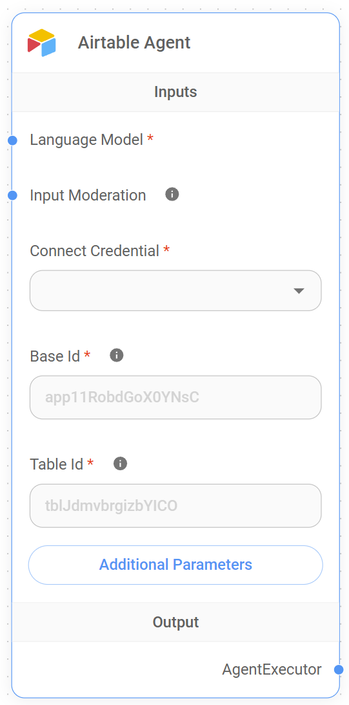

# Airtable

<figure><figcaption><p>Airtable Node</p></figcaption></figure>

Airtable은 스프레드시트의 기능과 데이터베이스를 결합한 클라우드 협업 서비스입니다. 이 모듈은 Airtable 테이블에서 데이터를 로드하고 처리하는 포괄적인 기능을 제공합니다.

이 모듈은 다음을 수행할 수 있는 정교한 Airtable document loader를 제공합니다:

* 특정 Airtable bases, 테이블, views에서 데이터 로드
* 특정 필드 필터링 및 선택
* 페이지네이션 및 대규모 데이터셋 처리
* 수식을 사용한 사용자 정의 필터링 지원
* text splitters를 사용한 데이터 처리
* 메타데이터 추출 사용자 정의

## Inputs

### 필수 매개변수

* **Base Id**: Airtable base 식별자 (예: app11RobdGoX0YNsC)
* **Table Id**: 특정 테이블 식별자 (예: tblJdmvbrgizbYICO)
* **Connect Credential**: Airtable API 자격증명

### 선택사항 매개변수

* **View Id**: 특정 view 식별자 (예: viw9UrP77Id0CE4ee)
* **Text Splitter**: 추출된 콘텐츠를 처리하는 text splitter
* **Include Only Fields**: 포함할 필드 이름 또는 ID의 쉼표 구분 목록
* **Return All**: 모든 결과를 반환할지 여부 (기본값: true)
* **Limit**: Return All이 false일 때 반환할 결과 수 (기본값: 100)
* **Filter By Formula**: 레코드를 필터링하기 위한 Airtable 수식
* **Additional Metadata**: 추가 메타데이터가 포함된 JSON 객체
* **Omit Metadata Keys**: 생략할 메타데이터 키의 쉼표 구분 목록

## Outputs

* **Document**: 메타데이터 및 pageContent를 포함하는 document 객체의 배열
* **Text**: documents의 pageContent에서 연결된 문자열

## Features

* API 기반 데이터 검색
* 필드 선택 및 필터링
* 페이지네이션 지원
* 수식 기반 필터링
* 사용자 정의 가능한 메타데이터 처리
* Text splitting 기능
* 잘못된 입력에 대한 오류 처리

## Notes

* 유효한 Airtable API 자격증명 필요
* Base ID와 Table ID는 필수
* 쉼표가 포함된 필드 이름은 대신 필드 ID 사용
* Filter 수식은 Airtable 수식 구문을 따라야 함
* 속도 제한 및 API 할당량 적용
* 전체 및 부분 데이터 검색 지원

## URL 구조 예시

다음과 같은 테이블 URL의 경우:

```
https://airtable.com/app11RobdGoX0YNsC/tblJdmvbrgizbYICO/viw9UrP77Id0CE4ee
```

* Base ID: app11RobdGoX0YNsC
* Table ID: tblJdmvbrgizbYICO
* View ID: viw9UrP77Id0CE4ee
