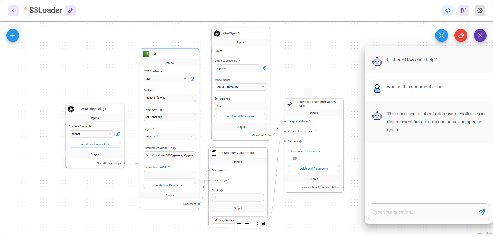

# S3 File Loader

Amazon S3 (Simple Storage Service)는 업계 최고의 확장성, 데이터 가용성, 보안 및 성능을 제공하는 객체 스토리지 서비스입니다. 이 모듈은 S3 버킷에 저장된 파일을 로드하고 처리하는 포괄적인 기능을 제공합니다.

이 모듈은 다음을 수행할 수 있는 정교한 S3 문서 로더를 제공합니다:
- AWS 자격증명을 사용하여 S3 버킷에서 파일 로드
- 여러 파일 형식 지원 (PDF, DOCX, CSV, Excel, PowerPoint, 텍스트 파일)
- 기본 제공 로더 또는 Unstructured.io API를 사용하여 파일 처리
- 텍스트 및 바이너리 파일 처리
- 메타데이터 추출 사용자 정의

## 입력

### 필수 매개변수
- **Bucket**: S3 버킷의 이름
- **Object Key**: S3 버킷의 객체에 대한 고유 식별자
- **Region**: 버킷이 위치한 AWS 지역 (기본값: us-east-1)

### 처리 옵션
- **File Processing Method**: 다음 중 선택:
  - Built In Loaders: 기본 파일 형식 프로세서 사용
  - Unstructured: 고급 처리를 위해 Unstructured.io API 사용
- **Text Splitter** (선택사항): 기본 제공 처리를 위한 텍스트 분할기
- **Additional Metadata** (선택사항): 추가 메타데이터가 포함된 JSON 객체
- **Omit Metadata Keys** (선택사항): 메타데이터에서 생략할 키

### Unstructured.io 옵션
- **Unstructured API URL**: Unstructured.io API의 엔드포인트
- **Unstructured API KEY** (선택사항): 인증용 API 키
- **Strategy**: 처리 전략 (hi_res, fast, ocr_only, auto)
- **Encoding**: 텍스트 인코딩 방법 (기본값: utf-8)
- **Skip Infer Table Types**: 테이블 추출을 건너뛸 문서 유형

## 출력

- **Document**: 메타데이터와 pageContent를 포함하는 문서 객체의 배열
- **Text**: 문서의 pageContent에서 연결된 문자열

## 기능
- AWS S3 통합
- 다중 파일 형식 지원
- 기본 제공 및 Unstructured.io 처리
- 구성 가능한 AWS 지역
- 유연한 메타데이터 처리
- 바이너리 파일 처리
- 임시 파일 관리
- MIME 유형 감지

## 지원되는 파일 유형
- PDF 문서
- Microsoft Word (DOCX)
- Microsoft Excel
- Microsoft PowerPoint
- CSV 파일
- 텍스트 파일
- Unstructured.io를 통한 추가 형식

## 참고 사항
- AWS 자격증명 필요 (IAM 역할을 사용하는 경우 선택사항)
- 일부 파일 유형에는 특정 처리 방법이 필요할 수 있습니다
- Unstructured.io API는 별도의 설정 및 자격증명이 필요합니다
- 임시 파일이 자동으로 생성 및 관리됩니다
- 지원되지 않는 파일 유형에 대한 오류 처리

## Unstructured 설정

호스팅된 API를 사용하거나 Docker를 통해 로컬로 실행할 수 있습니다.

* [Hosted API](https://unstructured-io.github.io/unstructured/api.html)
* Docker: `docker run -p 8000:8000 -d --rm --name unstructured-api quay.io/unstructured-io/unstructured-api:latest --port 8000 --host 0.0.0.0`

## S3 File Loader 설정

1\. S3 파일 로더를 캔버스에 드래그하여 놓습니다:

<figure><figcaption></figcaption></figure>

2\. AWS Credential: AWS 계정의 새 자격증명을 생성합니다. 액세스 키와 비밀 키가 필요합니다. 관련 계정에 s3 버킷 정책을 부여해야 합니다. 정책 가이드는 [여기](https://docs.aws.amazon.com/AmazonRDS/latest/AuroraUserGuide/AuroraMySQL.Integrating.Authorizing.IAM.S3CreatePolicy.html)에서 참조할 수 있습니다.

<figure><figcaption></figcaption></figure>

3. Bucket: AWS 콘솔에 로그인하고 S3로 이동합니다. 버킷 이름을 가져옵니다:&#x20;

<figure><figcaption></figcaption></figure>

4. Key: 사용하려는 객체를 클릭하고 Key 이름을 가져옵니다:

<figure><figcaption></figcaption></figure>

5. Unstructured API URL: Unstructured을 사용하는 방식 (호스팅 API 또는 Docker)에 따라 Unstructured API URL 매개변수를 변경합니다. 호스팅된 API를 사용하는 경우 API 키도 필요합니다.
6. 그 후 S3의 파일로 채팅을 시작할 수 있습니다. 문서를 청크로 분할하기 위해 텍스트 분할기를 지정할 필요가 없습니다. 이는 Unstructured에서 자동으로 처리됩니다.

<figure><figcaption></figcaption></figure>

