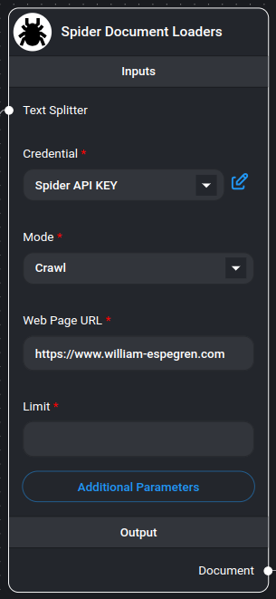
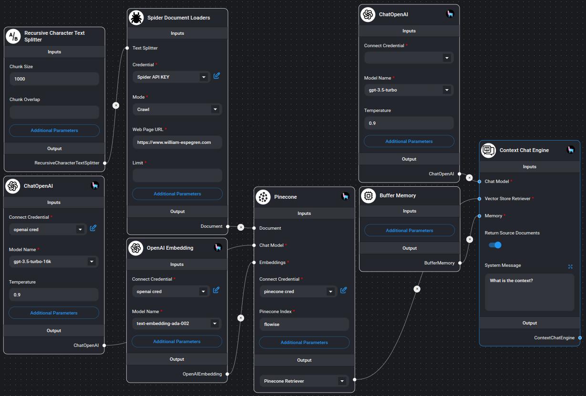

# Spider Web Scraper/Crawler

<figure><figcaption><p>Spider Web Scraper/Crawler Node</p></figcaption></figure>

[Spider](https://spider.cloud/?ref=flowise)는 LLM 준비 완료 데이터를 반환하는 가장 빠른 오픈 소스 웹 스크래퍼 및 크롤러입니다. 이 노드를 사용하려면 [Spider.cloud](https://spider.cloud/?ref=flowise)에서 API 키가 필요합니다.

## 시작하기

1. [Spider.cloud](https://spider.cloud/?ref=flowise) 웹사이트로 이동하여 무료 계정에 가입합니다.
2. [API Keys](https://spider.cloud/api-keys)로 이동하여 새 API 키를 생성합니다.
3. API 키를 복사하여 Spider 노드의 "Credential" 필드에 붙여넣습니다.

## 기능
- 두 가지 작동 모드: Scrape 및 Crawl
- 텍스트 분할 기능
- 사용자 정의 가능한 메타데이터 처리
- 유연한 매개변수 구성
- 다양한 출력 형식
- Markdown 형식 콘텐츠
- 속도 제한 처리

## 입력

### 필수 매개변수
- **Mode**: 다음 중 선택:
  - **Scrape**: 단일 페이지에서 데이터 추출
  - **Crawl**: 동일 도메인의 여러 페이지에서 데이터 추출
- **Web Page URL**: 스크래핑 또는 크롤링할 대상 URL (예: https://spider.cloud)
- **Credential**: Spider API 키

### 선택사항 매개변수
- **Text Splitter**: 추출된 콘텐츠를 처리하기 위한 텍스트 분할기
- **Limit**: 크롤링할 최대 페이지 수 (기본값: 25, 크롤 모드에서만 적용)
- **Additional Metadata**: 문서에 추가할 추가 메타데이터가 포함된 JSON 객체
- **Additional Parameters**: [Spider API 매개변수](https://spider.cloud/docs/api)가 포함된 JSON 객체
  - 예: `{ "anti_bot": true }`
  - 참고: `return_format`은 항상 "markdown"으로 설정됩니다
- **Omit Metadata Keys**: 제외할 메타데이터 키의 쉼표 구분 목록
  - 형식: `key1, key2, key3.nestedKey1`
  - *를 사용하여 모든 기본 메타데이터 제거

## 출력

- **Document**: 다음을 포함하는 문서 객체의 배열:
  - metadata: 페이지 메타데이터 및 사용자 정의 필드
  - pageContent: Markdown 형식으로 추출된 콘텐츠
- **Text**: 추출된 모든 콘텐츠의 연결된 문자열

## 문서 구조
각 문서에는 다음이 포함됩니다:
- **pageContent**: Markdown 형식의 웹페이지 주요 콘텐츠
- **metadata**:
  - source: 페이지의 URL
  - 추가 사용자 정의 메타데이터 (지정된 경우)
  - 필터링된 메타데이터 (생략된 키 기반)

## 사용 예제

### 기본 스크래핑
```json
{
  "mode": "scrape",
  "url": "https://example.com",
  "limit": 1
}
```

### 고급 크롤링
```json
{
  "mode": "crawl",
  "url": "https://example.com",
  "limit": 25,
  "additional_metadata": {
    "category": "blog",
    "source_type": "web"
  },
  "params": {
    "anti_bot": true,
    "wait_for": ".content-loaded"
  }
}
```

## 예제

<figure><figcaption><p>Spider 노드 사용 예제</p></figcaption></figure>

## 참고 사항
- 크롤러는 크롤 작업에 대해 지정된 제한을 준수합니다
- 모든 콘텐츠는 markdown 형식으로 반환됩니다
- 스크래핑 및 크롤링 작업 모두에 대해 오류 처리가 기본 제공됩니다
- 잘못된 JSON 구성은 정상적으로 처리됩니다
- 대규모 웹사이트의 메모리 효율적인 처리
- 단일 페이지 및 다중 페이지 추출 모두 지원합니다
- 자동 메타데이터 처리 및 필터링
