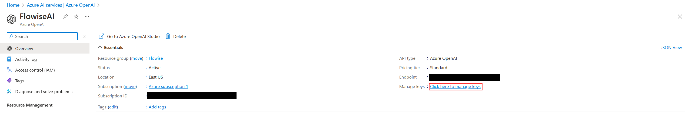
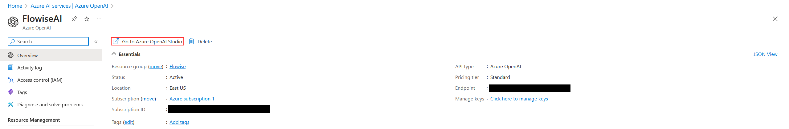
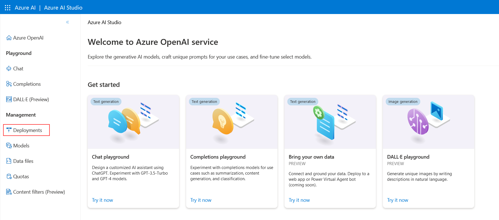
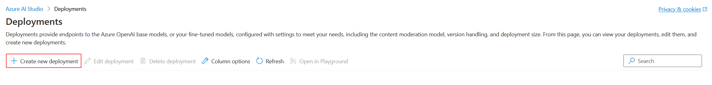
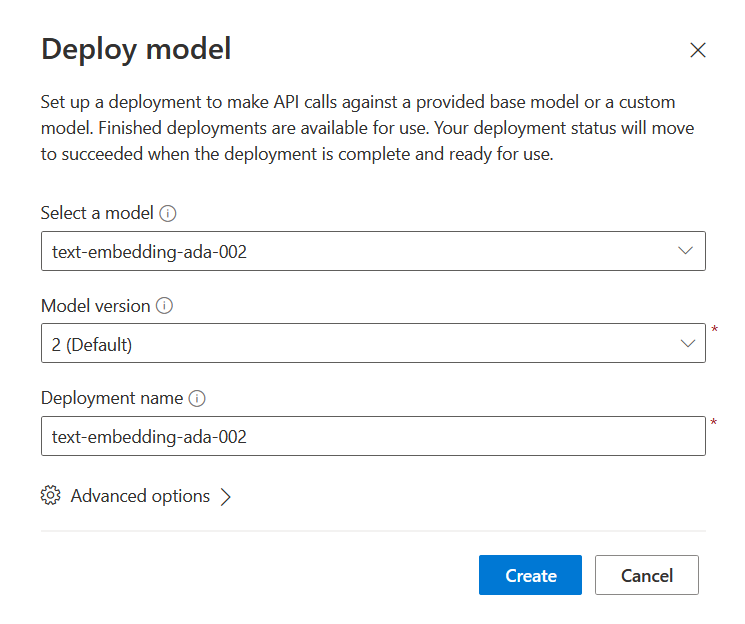
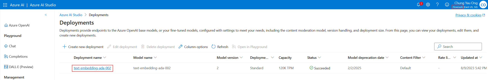
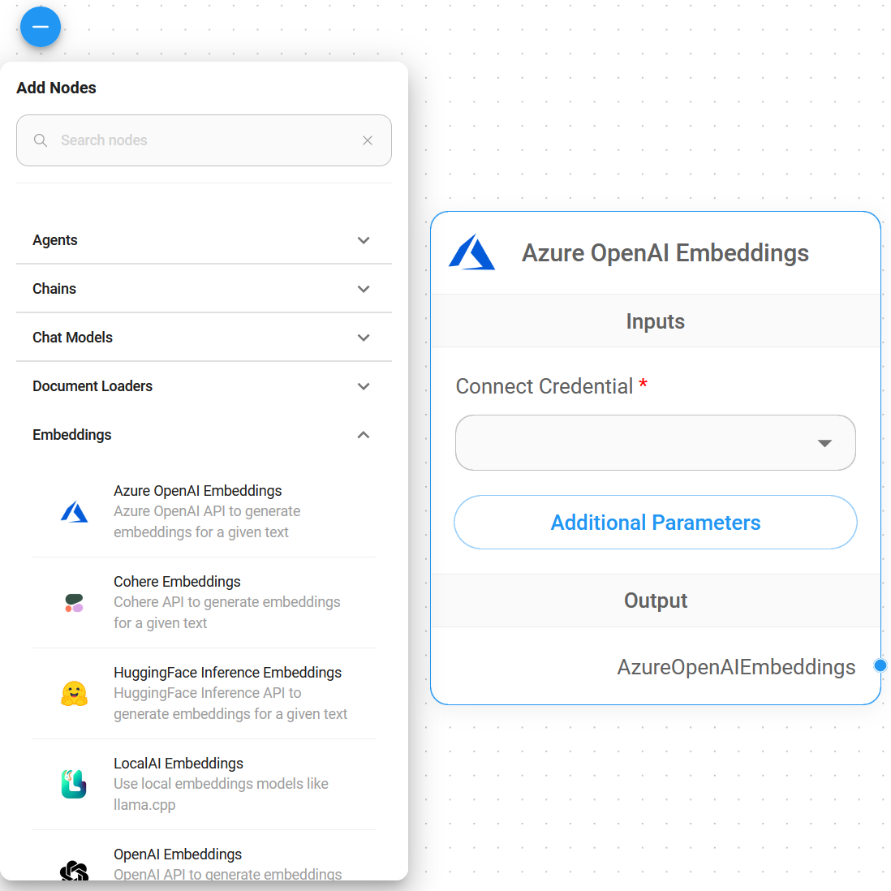
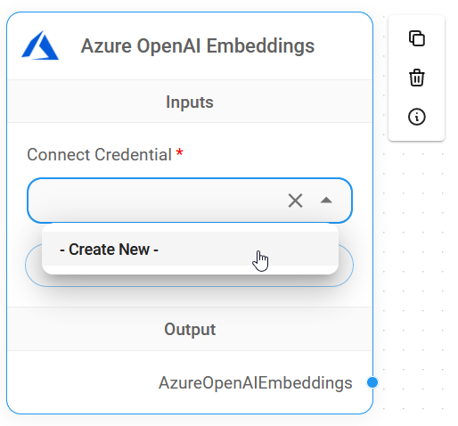
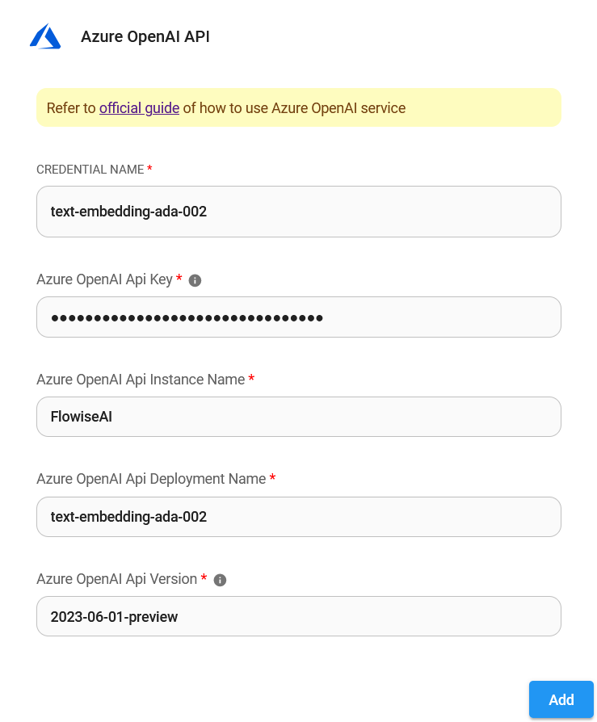
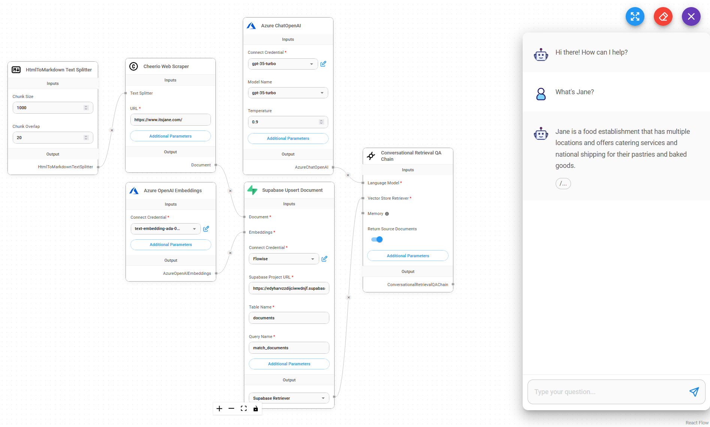

# Azure OpenAI Embeddings

## Prerequisite

1. Azure에 [로그인](https://portal.azure.com/)하거나 [가입](https://azure.microsoft.com/en-us/free/)합니다.
2. [Azure OpenAI를 생성](https://portal.azure.com/#create/Microsoft.CognitiveServicesOpenAI)하고 약 10 business days를 기다립니다.
3. API 키는 **Azure OpenAI** > **name_azure_openai** 클릭 > **Click here to manage keys** 클릭에서 사용 가능합니다.

<figure><figcaption></figcaption></figure>

## Setup

### Azure OpenAI Embeddings

1. **Go to Azure OpenaAI Studio** 클릭

<figure><figcaption></figcaption></figure>

2. **Deployments** 클릭

<figure><figcaption></figcaption></figure>

3. **Create new deployment** 클릭

<figure><figcaption></figcaption></figure>

4. 아래와 같이 선택하고 **Create** 클릭

<figure><figcaption></figcaption></figure>

5. **Azure OpenAI Embeddings** 성공적으로 생성됨

* Deployment name: `text-embedding-ada-002`
* Instance name: `top right conner`

<figure><figcaption></figcaption></figure>

### Flowise

1. **Embeddings** > **Azure OpenAI Embeddings** node 드래그

<figure><figcaption></figcaption></figure>

2. **Connect Credential** > **Create New** 클릭

<figure><figcaption></figcaption></figure>

3. 각 세부 정보(API Key, Instance & Deployment name, [API Version](https://learn.microsoft.com/en-us/azure/ai-services/openai/reference#chat-completions))를 복사 및 **Azure OpenAI Embeddings** credential에 붙여넣습니다.

<figure><figcaption></figcaption></figure>

4. 완료됨 [🎉](https://emojipedia.org/party-popper/), Flowise에서 **Azure OpenAI Embeddings node**를 생성했습니다.

<figure><figcaption></figcaption></figure>

## Resources

* [LangChain JS Azure OpenAI Embeddings](https://js.langchain.com/docs/modules/data_connection/text_embedding/integrations/azure_openai)
* [Azure OpenAI Service REST API reference](https://learn.microsoft.com/en-us/azure/ai-services/openai/reference)
