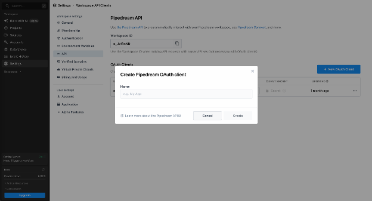
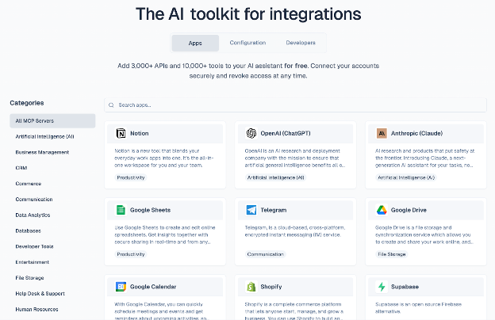
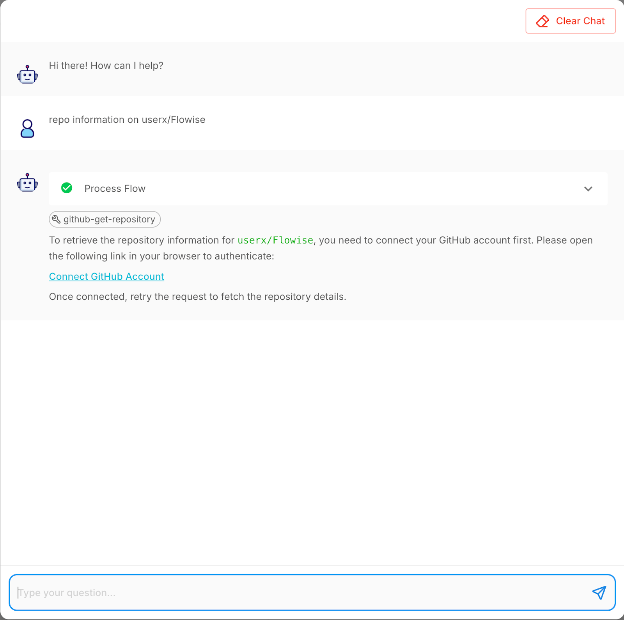
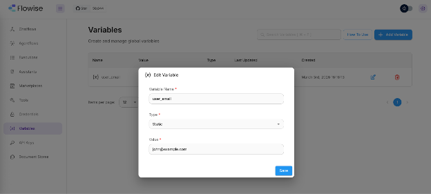

# Pipedream MCP

**Pipedream MCP** Node는 [Pipedream Connect](https://pipedream.com/docs/connect/mcp/developers)를 통해 Flowise Agent를 3,000개 이상의 API 및 10,000개 이상의 사전 구축된 Tool에 연결합니다. Agent는 Slack 메시지를 보내고, GitHub Issue를 생성하고, Google Sheets를 업데이트하고, Notion 페이지를 관리하는 등 모든 작업을 표준화된 MCP (Model Context Protocol) 인터페이스와 완전히 관리되는 OAuth를 사용하여 수행할 수 있습니다.

***

## 1. 사전 필수 사항

Pipedream MCP Node를 사용하기 전에 다음이 필요합니다:

* **Pipedream 계정**: [pipedream.com](https://pipedream.com)에서 가입하세요 (무료 계층에서는 최대 1,000개의 연결된 계정을 지원합니다).
* **Pipedream Connect 프로젝트**: Pipedream 대시보드 또는 CLI (`pd init connect`)를 통해 생성합니다.
* **OAuth 클라이언트**: Pipedream 워크스페이스의 [API 설정](https://pipedream.com/settings/api) 내에서 생성됩니다. 이렇게 하면 **Client ID**와 **Client Secret**을 얻을 수 있습니다.

***

## 2. Pipedream 자격증명 설정

### 2.1 Pipedream에서 OAuth 클라이언트 생성

1. [pipedream.com/settings/api](https://pipedream.com/settings/api)로 이동합니다.
2. **New OAuth Client**를 클릭합니다.
3. 클라이언트 이름을 지정 (예: `Flowise Agent`)하고 **Create**을 클릭합니다.
4. **즉시 Client Secret을 복사하세요.** 다시 표시되지 않습니다.
5. 목록에서 **Client ID**를 복사합니다.

<figure><figcaption></figcaption></figure>

### 2.2 프로젝트 ID 찾기

1. 대시보드에서 Pipedream 프로젝트를 엽니다.
2. Project ID는 프로젝트 설정에서 볼 수 있습니다 (형식: `proj_xxxxxxx`).

<figure><figcaption></figcaption></figure>

### 2.3 Flowise에 자격증명 추가

1. Flowise에서 사이드바의 **Credentials**로 이동합니다.
2. **Add Credential**을 클릭하고 **Pipedream Connect**를 검색합니다.
3. 다음 필드를 채웁니다:

| 필드              | 설명                                                                     | 예시          |
| ----------------- | --------------------------------------------------------------------------- | ------------- |
| **Client ID**     | Pipedream의 OAuth Client ID                                          | `wBSGhxxxx`   |
| **Client Secret** | OAuth Client Secret (안전하게 저장됨)                                   | `••••••••`    |
| **Project ID**    | Pipedream Connect 프로젝트 ID                                           | `proj_xyz789` |
| **OAuth Scopes**  | _(선택사항)_ 공백으로 구분된 Scope. 비워두면 기본값은 `connect:*`입니다. | `connect:*`   |

4. **Save**를 클릭합니다.

<figure><figcaption></figcaption></figure>

**팁:** 프로덕션 환경의 경우 필요한 가장 좁은 Scope를 사용하세요. 사용 가능한 Scope은 [Pipedream 인증 문서](https://pipedream.com/docs/connect/api-reference/authentication)를 참조하세요.

***

## 3. Pipedream MCP Node 추가

1. Flowise 캔버스에서 Agent Flow를 엽니다.
2. **Agent** Node를 추가합니다.
3. **Tools (MCP)** 범주에서 **Pipedream MCP**를 선택합니다.
4. Node를 구성합니다 (다음 섹션 참조).

<figure><figcaption></figcaption></figure>

***

## 4. Node 구성 참조

| 매개변수              | 유형                     | 필수 | 설명                                                                                                                                                                                                                                  |
| ---------------------- | ------------------------ | -------- | -------------------------------------------------------------------------------------------------------------------------------------------------------------------------------------------------------------------------------------------- |
| **Connect Credential** | 자격증명 선택자      | 예      | 2단계에서 생성한 Pipedream Connect 자격증명을 선택합니다.                                                                                                                                                                               |
| **Environment**        | 드롭다운                 | 예      | `Development` 또는 `Production`. 연결된 계정과 Tool 호출이 실행되는 Pipedream 환경을 제어합니다. 테스트에는 `Development`를 사용하세요.                                                                                       |
| **App Slug**           | 텍스트                     | 예      | Pipedream 앱의 고유 식별자 (예: `slack`, `gmail`, `notion`, `linear`). [mcp.pipedream.com](https://mcp.pipedream.com)에서 사용 가능한 모든 앱을 찾아보세요. **쉼표 구분**으로 여러 앱 지원 (예: `slack,notion`). |
| **User ID**            | 텍스트 (변수 수락) | 예      | 최종 사용자의 고유 식별자. Flowise 변수 `{{$vars.user_email}}`과 Flow 변수 `{{$flow.sessionId}}`를 지원합니다. [섹션 7](pipedream-mcp-user-guide.md#7-using-variables-for-user-id) 참조.                               |
| **Tool Mode**          | 드롭다운                 | 예      | 현재 `Tools only` 모드를 지원하며, 앱의 사전 구축된 작업을 Agent에 개별 Tool로 노출합니다.                                                                                                                            |
| **Available Actions**  | 다중 선택 (비동기)     | 예      | App Slug과 User ID를 입력한 후 **새로고침** 버튼을 클릭하여 지정된 앱의 사용 가능한 작업 목록을 로드합니다. Agent에 노출할 특정 작업을 선택합니다.                                            |

<figure><figcaption></figcaption></figure>

***

## 5. 작업 선택

유효한 **App Slug**과 **User ID**를 제공한 후 **Available Actions** 옆의 새로고침 아이콘을 클릭합니다. Node는 Pipedream의 원격 MCP 서버에 연결하고 지정된 앱의 사용 가능한 모든 Tool을 검색합니다.

각 작업은 다음과 함께 나열됩니다:

* **Name:** Tool 식별자 (대문자로 표시), 예: `GITHUB-GET-REPOSITORY`
* **Description:** Tool이 수행하는 작업, 예: _"특정 저장소에 대한 정보 가져오기"_

Agent에 필요한 작업만 선택합니다. 더 적은 Tool은 LLM이 더 나은 결정을 내리고 Token 사용을 줄이는 데 도움이 됩니다.

<figure><figcaption></figcaption></figure>

### App Slug 찾기

**app slug**은 Pipedream의 URL에 표시되는 소문자 이름입니다. 예를 들어:

* `pipedream.com/apps/slack` → slug는 `slack`
* `pipedream.com/apps/google-sheets` → slug는 `google-sheets`
* `pipedream.com/apps/notion` → slug는 `notion`

[mcp.pipedream.com](https://mcp.pipedream.com) 또는 [pipedream.com/explore](https://pipedream.com/explore)에서 전체 카탈로그를 찾아보세요.

<figure><figcaption></figcaption></figure>

***

## 6. 계정 연결 흐름

Agent가 해당 앱에 대해 계정을 연결하지 않은 사용자를 위해 Pipedream Tool을 호출하면 Pipedream은 **Connect URL**을 반환합니다. Pipedream MCP Node는 이를 자동으로 감지하고 사용자에게 Connect URL을 제공합니다. Connect URL은 Pipedream 호스팅 페이지를 열어서 사용자가 앱을 승인할 수 있게 합니다 (예: OAuth를 통해 Slack에 로그인). 링크는 특정 사용자로 범위가 지정되며 4시간 후 만료됩니다.

**주요 사항:**

* Connect URL은 Chat UI에서 클릭 가능한 링크로 렌더링됩니다.
* 사용자가 계정을 연결하면 이후 Tool 호출이 정상적으로 실행됩니다.
* 사용자 자격증명은 Pipedream의 서버에 암호화되어 저장되며 LLM에 노출되지 않습니다.

<figure><figcaption></figcaption></figure>

***

## 7. User ID에 변수 사용

**User ID** 필드는 Pipedream Connect에서 최종 사용자를 식별합니다. 이는 각 사용자가 자신의 계정을 연결하는 다중 사용자 시나리오에서 매우 중요합니다.

### 지원되는 변수 유형

| 변수 문법        | 소스                      | 해결 시점           |
| ---------------------- | --------------------------- | --------------------- |
| `{{$vars.user_email}}` | Flowise 워크스페이스 변수 | 디자인 타임 + 런타임 |
| `{{$flow.sessionId}}`  | Flow 컨텍스트 (세션)      | 런타임만          |

### 워크스페이스 변수

1. Flowise에서 사이드바의 **Variables**로 이동합니다.
2. 변수를 생성합니다 (예: `user_email` 값 `john@example.com`).
3. Pipedream MCP Node에서 **User ID**를 `{{$vars.user_email}}`로 설정합니다.

<figure><figcaption></figcaption></figure>

### Flow 변수

`{{$flow.sessionId}}`를 사용하여 Chat 세션당 Pipedream 계정을 자동으로 범위 지정합니다. 이는 각 세션이 다른 사용자를 나타낼 때 유용합니다.

**중요:** `{{$flow.sessionId}}`와 같은 Flow 변수는 런타임에만 해결됩니다. 편집기에서 Available Actions의 "새로고침"을 클릭할 때 Node는 작업 나열이 계속 작동하도록 폴백 미리보기 사용자 ID (`flowise_preview_user`)를 사용합니다.

### 정적 User ID

단일 사용자 또는 테스트 시나리오의 경우 `test-user-1` 또는 `admin@mycompany.com`과 같은 일반 문자열을 입력할 수도 있습니다.

**허용 문자:** 문자, 숫자, `.` `_` `@` `+` `-` (최대 250자).

***

## 8. 보안 모범 사례

| 실행                               | 세부 정보                                                                                                               |
| -------------------------------------- | --------------------------------------------------------------------------------------------------------------------- |
| **"인간 입력 필요" 활성화**       | 파괴적이거나 쓰기 작업 (메시지 전송, 데이터 삭제)의 경우 Agent Node에서 인간 승인을 활성화합니다.          |
| **좁은 OAuth Scope 사용**            | Pipedream 자격증명에서 필요한 Scope만 지정하세요.                                                       |
| **사용자별 ID 사용**                   | 항상 최종 사용자당 고유한 User ID를 사용하세요. 이렇게 하면 Pipedream이 자격증명을 개별 사용자로 범위 지정합니다.              |
| **프로덕션에서 프로덕션 환경 사용** | 배포할 때 `Development`에서 `Production`으로 전환하세요. Pipedream은 환경별로 별도의 자격증명 저장소를 유지합니다. |
| **최소 작업 선택**             | Agent에 필요한 작업만 노출하세요. 더 적은 Tool은 공격 표면을 줄이고 LLM 정확도를 개선합니다.             |
| **Client Secret 보호**         | Client Secret을 클라이언트 측 코드 또는 버전 제어에 노출하지 마세요. Flowise는 암호화된 상태로 저장합니다.                   |

***

## 9. 외부 참고 자료

| 리소스                                 | 링크                                                                                                                       |
| ---------------------------------------- | -------------------------------------------------------------------------------------------------------------------------- |
| Pipedream MCP 개발자 문서             | [pipedream.com/docs/connect/mcp/developers](https://pipedream.com/docs/connect/mcp/developers)                             |
| 사용 가능한 MCP 앱 & Tool 찾아보기        | [mcp.pipedream.com](https://mcp.pipedream.com)                                                                             |
| Pipedream 작업 탐색                | [pipedream.com/explore](https://pipedream.com/explore)                                                                     |
| Pipedream Connect 개요               | [pipedream.com/docs/connect/mcp](https://pipedream.com/docs/connect/mcp)                                                   |
| OAuth / 인증 문서              | [pipedream.com/docs/connect/api-reference/authentication](https://pipedream.com/docs/connect/api-reference/authentication) |
| 앱 검색                            | [pipedream.com/docs/connect/app-discovery](https://pipedream.com/docs/connect/app-discovery)                               |
| Connect 빠른 시작 (CLI)                 | [pipedream.com/docs/connect/quickstart](https://pipedream.com/docs/connect/quickstart)                                     |
| Pipedream 보안 & 개인정보 보호             | [pipedream.com/docs/privacy-and-security](https://pipedream.com/docs/privacy-and-security)                                 |
| MCP Tool 모드 (Sub-agent / Full-config) | [pipedream.com/docs/connect/mcp/tool-modes](https://pipedream.com/docs/connect/mcp/tool-modes)                             |
