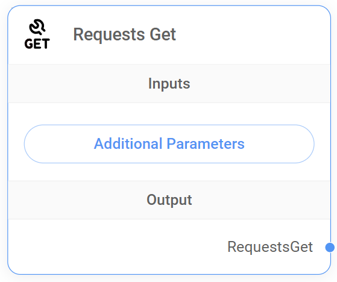

---

description: Execute HTTP GET requests.

---

# Request GET

<figure><figcaption>
Request GET Node
</figcaption></figure>


This section is a work in progress. We appreciate any help you can provide in completing this section. Please check our [Contribution 가이드](/broken/pages/G48tdmpQ3z4CTWEspqkA) to get started.

