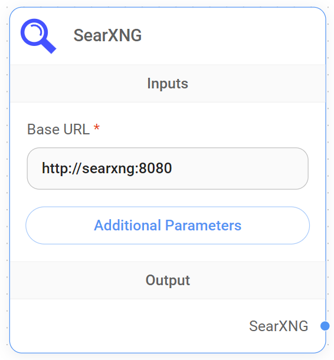

# SearXNG

<figure><figcaption><p>SearXNG Node</p></figcaption></figure>

### SearXNG 설정

[공식 문서](https://docs.searxng.org/admin/installation.html)를 따라 SearXNG를 로컬에 설정합니다. 이 경우 Docker Compose를 사용하여 설정합니다.

[searxng-docker](https://github.com/searxng/searxng-docker) 저장소로 이동하여 설정 지침을 따릅니다.

`server.limiter`를 `false`로 설정하고 `json`이 `search.formats`에 포함되어 있는지 확인합니다. 이 매개변수는 `searxng/settings.yml`에서 정의할 수 있습니다:

```yaml
server:
  limiter: false
general:
  debug: true
search:
  formats:
    - html
    - json
```

`docker-compose up -d`를 실행하여 컨테이너를 시작합니다. 웹 브라우저를 열고 **http://localhost:8080/search**로 이동하면 SearXNG 페이지를 볼 수 있습니다.

### Flowise에서 사용하기

SearXNG 노드를 캔버스로 드래그 앤 드롭합니다. Base URL을 **http://localhost:8080**으로 채웁니다. 필요한 경우 다른 검색 매개변수를 지정할 수도 있습니다. LLM이 검색 쿼리 질문에 사용할 항목을 자동으로 파악합니다.

<figure><figcaption></figcaption></figure>
