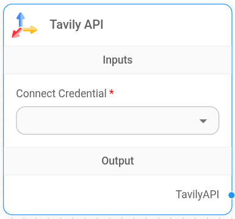
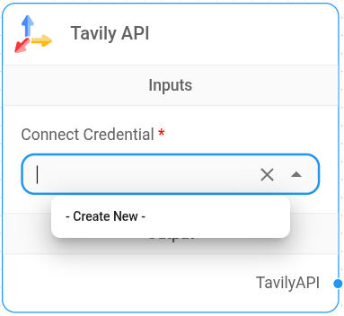
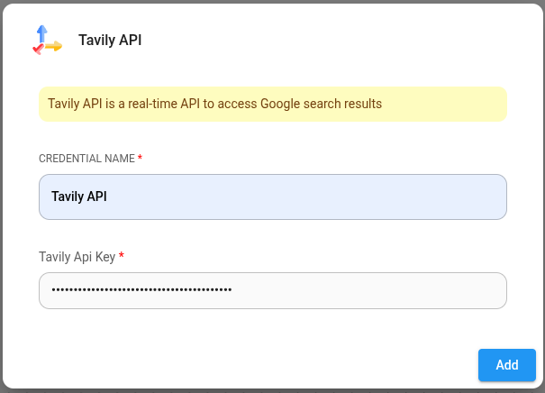

# TavilyAI

<figure><figcaption>
Tavily Node
</figcaption></figure>

## 설정

1. Tavily API 노드를 추가하려면 노드 추가 버튼을 클릭하고 **LangChain** > **Tools** > **Tavily API**로 이동합니다.

2. Tavily에 대한 자격증명을 생성합니다. Tavily API 키를 획득하는 방법에 대한 [공식 가이드](https://docs.tavily.com/guides/quickstart)를 참조하세요.

<figure><figcaption></figcaption></figure>

<figure><figcaption></figcaption></figure>

3. 이제 이 노드를 Tool 입력을 수용하는 모든 노드에 연결하여 실시간 검색 결과를 얻을 수 있습니다.
