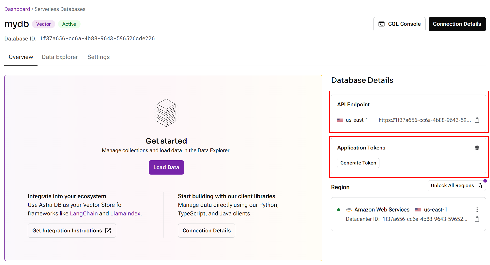

# AstraDB

## 설정

1. [AstraDB](https://astra.datastax.com/)에서 계정을 등록합니다.
2. 포털에 로그인합니다. 데이터베이스를 생성합니다.

<figure><figcaption></figcaption></figure>

3. Serverless (Vector)를 선택하고 데이터베이스 이름, Provider, Region을 입력합니다.

<figure><figcaption></figcaption></figure>

4. 데이터베이스가 설정된 후 API Endpoint를 가져오고 Application Token을 생성합니다.

<figure><figcaption></figcaption></figure>

5. 새 collection을 생성하고 원하는 차원(dimension)과 유사도 메트릭(similarity metric)을 선택합니다:

<figure><figcaption></figcaption></figure>

6. Flowise 캔버스로 돌아가 Astra 노드를 드래그 앤 드롭합니다. 자격증명 드롭다운에서 **새로 생성**을 클릭합니다:

<figure><figcaption></figcaption></figure>

7. API Endpoint와 Application Token을 지정합니다:

<figure><figcaption></figcaption></figure>

8. 이제 AstraDB에 데이터를 upsert할 수 있습니다.

<figure><figcaption></figcaption></figure>

9. Astra 포털로 돌아가 collection으로 이동하면 upsert된 모든 데이터를 볼 수 있습니다:

<figure><figcaption></figcaption></figure>

10. 쿼리를 시작합니다!

<figure><figcaption></figcaption></figure>
