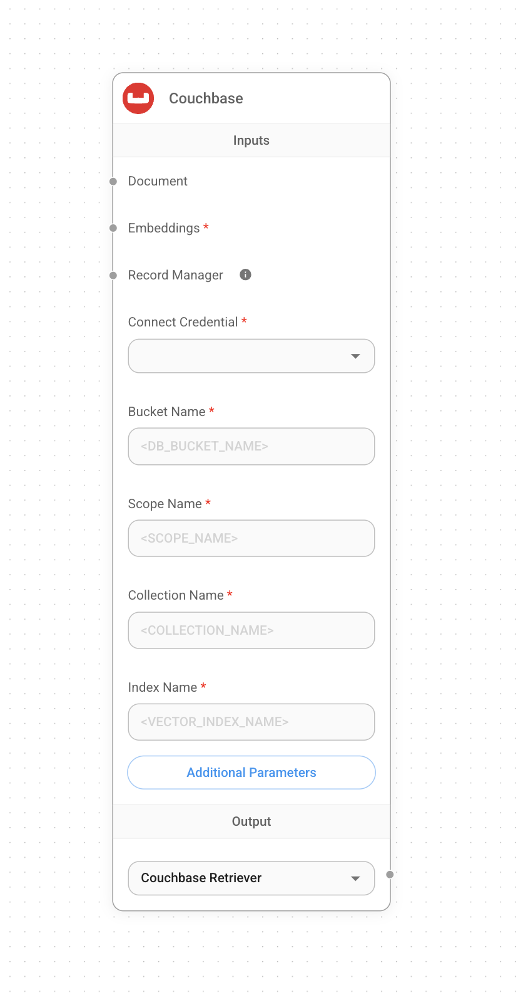
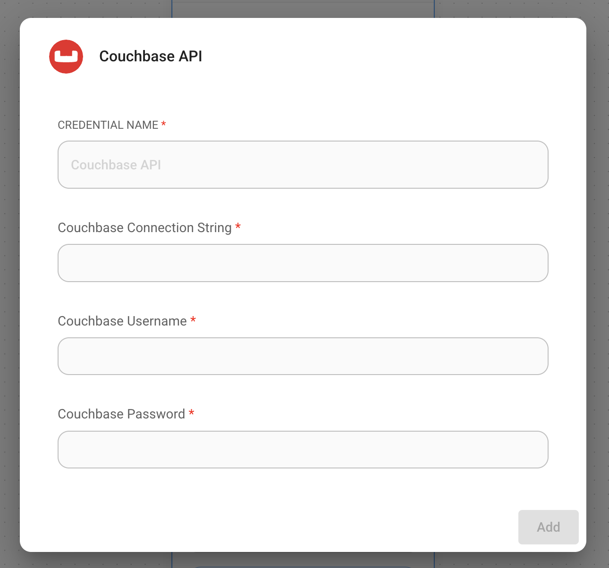
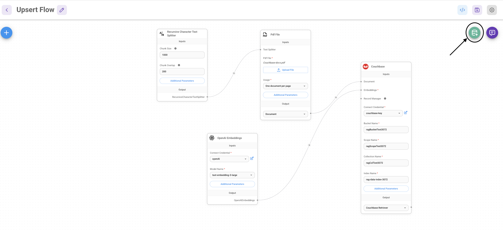
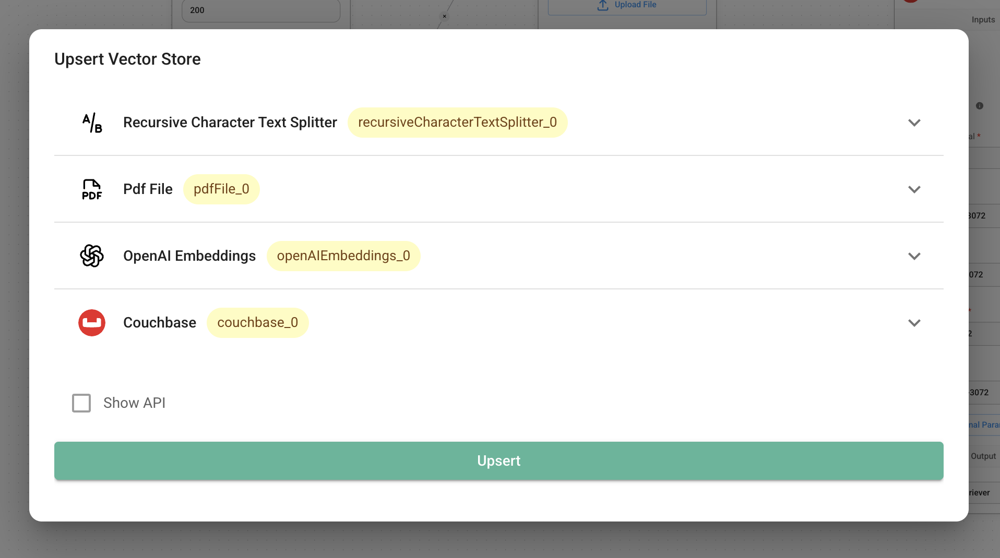

# Couchbase

## 사전 요구사항

### 요구사항

1. **7.6+** 버전의 Couchbase Cluster (자체 관리 또는 Capella)에 [Search Service](https://docs.couchbase.com/server/current/search/search.html)가 있어야 합니다.
2.  Capella 설정: Capella 클러스터에 연결하는 방법에 대해 자세히 알아보려면 [지침](https://docs.couchbase.com/cloud/get-started/connect.html?_gl=1*1yhpmel*_gcl_au*MTMzNDE3NTQxLjE3MzY5MjA5MzQ.)을 따르세요.

    구체적으로 다음을 수행해야 합니다:

    * 클러스터에 접근하기 위해 [데이터베이스 자격증명](https://docs.couchbase.com/cloud/clusters/manage-database-users.html?_gl=1*19zk7vq*_gcl_au*MTMzNDE3NTQxLjE3MzY5MjA5MzQ.)을 생성합니다.
    * 애플리케이션이 실행되는 IP에서 Cluster로의 [접근을 허용](https://docs.couchbase.com/cloud/clusters/allow-ip-address.html?_gl=1*19zk7vq*_gcl_au*MTMzNDE3NTQxLjE3MzY5MjA5MzQ.)합니다.

    자체 관리 설정:

    * 최신 Couchbase Database Server Instance를 설치하기 위해 [Couchbase 설치 옵션](https://developer.couchbase.com/tutorial-couchbase-installation-options)을 따르세요. Search Service를 추가해야 합니다.
3. Couchbase의 Full Text Service에서 Search Index 생성합니다.

### Search Index 가져오기

#### [Couchbase Capella](https://docs.couchbase.com/cloud/search/import-search-index.html)

Capella에서 Search Index를 가져오는 단계:

* Index 정의를 `index.json`이라는 새 파일로 복사합니다.
* 문서의 지침에 따라 Capella에서 파일을 가져옵니다.
* Create Index를 클릭하여 Index 생성을 완료합니다.

#### [Couchbase Server](https://docs.couchbase.com/server/current/search/import-search-index.html)

Couchbase Server의 경우:

* Search → Add Index → Import로 이동합니다.
* 제공된 Index 정의를 Import 화면에 복사합니다.
* Create Index를 클릭하여 Index 생성을 완료합니다.

[Couchbase Capella](https://docs.couchbase.com/cloud/vector-search/create-vector-search-index-ui.html?_gl=1*1rglcpj*_gcl_au*MTMzNDE3NTQxLjE3MzY5MjA5MzQ.)와 [Couchbase 자체 관리 Server](https://docs.couchbase.com/server/current/vector-search/create-vector-search-index-ui.html?_gl=1*t7aeet*_gcl_au*MTMzNDE3NTQxLjE3MzY5MjA5MzQ.)의 Search UI를 사용하여 Vector Index를 생성할 수도 있습니다.

### Index 정의

여기서는 문서에 `vector-index`를 생성합니다. Vector 필드는 1536 차원의 `embedding`으로 설정되고, 텍스트 필드는 `text`로 설정됩니다. 또한 다양한 문서 구조를 처리하기 위해 문서의 `metadata` 아래에 있는 모든 필드를 동적 매핑으로 인덱싱하고 저장합니다. 유사도 메트릭은 `dot_product`로 설정됩니다. 이러한 매개변수에 변경이 있으면 Index를 적절히 조정하세요.

```json
{
  "name": "vector-index",
  "type": "fulltext-index",
  "params": {
    "doc_config": {
      "docid_prefix_delim": "",
      "docid_regexp": "",
      "mode": "scope.collection.type_field",
      "type_field": "type"
    },
    "mapping": {
      "default_analyzer": "standard",
      "default_datetime_parser": "dateTimeOptional",
      "default_field": "_all",
      "default_mapping": {
        "dynamic": true,
        "enabled": false
      },
      "default_type": "_default",
      "docvalues_dynamic": false,
      "index_dynamic": true,
      "store_dynamic": false,
      "type_field": "_type",
      "types": {
        "_default._default": {
          "dynamic": true,
          "enabled": true,
          "properties": {
            "embedding": {
              "enabled": true,
              "dynamic": false,
              "fields": [
                {
                  "dims": 1536,
                  "index": true,
                  "name": "embedding",
                  "similarity": "dot_product",
                  "type": "vector",
                  "vector_index_optimized_for": "recall"
                }
              ]
            },
            "metadata": {
              "dynamic": true,
              "enabled": true
            },
            "text": {
              "enabled": true,
              "dynamic": false,
              "fields": [
                {
                  "index": true,
                  "name": "text",
                  "store": true,
                  "type": "text"
                }
              ]
            }
          }
        }
      }
    },
    "store": {
      "indexType": "scorch",
      "segmentVersion": 16
    }
  },
  "sourceType": "gocbcore",
  "sourceName": "pdf-chat",
  "sourceParams": {},
  "planParams": {
    "maxPartitionsPerPIndex": 64,
    "indexPartitions": 16,
    "numReplicas": 0
  }
}

```

## 설정

1. 캔버스에 새 **Couchbase** 노드를 추가하고 Bucket Name, Scope Name, Collection Name, Index Name을 입력합니다.

<figure><figcaption></figcaption></figure>

2. 새 자격증명을 추가하고 매개변수를 입력합니다:
   * Couchbase Connection String
   * Cluster Username
   * Cluster Password

<figure><figcaption></figcaption></figure>

3. 캔버스에 추가 노드를 추가하고 upsert 프로세스를 시작합니다.
   * **Document**는 [**Document Loader**](../document-loaders/) 카테고리의 모든 노드와 연결할 수 있습니다.
   * **Embeddings**은 [**Embeddings** ](../embeddings/)카테고리의 모든 노드와 연결할 수 있습니다.

<figure><figcaption></figcaption></figure>

<figure><figcaption></figcaption></figure>

5. Couchbase UI에서 데이터가 성공적으로 upsert되었는지 확인합니다!

## 리소스

* LangChain Couchbase Vectorstore 통합
  * [Python](https://python.langchain.com/docs/integrations/vectorstores/couchbase/)
  * [NodeJS](https://js.langchain.com/docs/integrations/vectorstores/couchbase/)
* [Couchbase 문서](https://docs.couchbase.com/home/index.html)를 참조하여 Couchbase에 대해 알아봅니다.
