# Elastic

## 사전 요구사항

1. [공식 Docker 이미지](https://www.elastic.co/guide/en/elasticsearch/reference/current/docker.html)를 사용하여 시작하거나 Elastic의 공식 클라우드 서비스인 [Elastic Cloud](https://www.elastic.co/cloud/)를 사용할 수 있습니다. 이 가이드에서는 클라우드 버전을 사용합니다.
2. Elastic Cloud에 계정을 [등록](https://cloud.elastic.co/registration)하거나 기존 계정으로 [로그인](https://cloud.elastic.co/login)합니다.

<figure>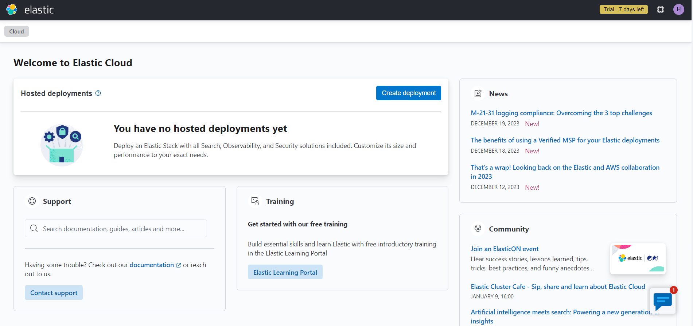<figcaption></figcaption></figure>

3. **Create deployment**를 클릭합니다. 그런 다음 배포 이름을 지정하고 Provider를 선택합니다.

<figure>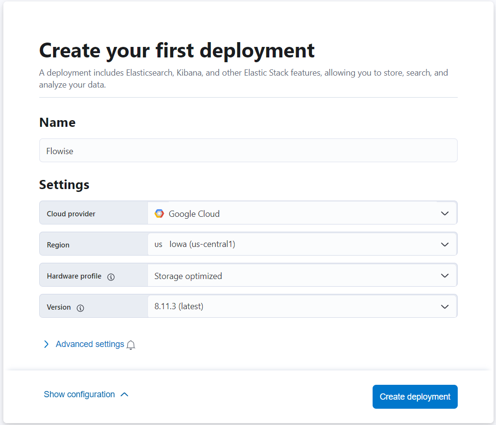<figcaption></figcaption></figure>

4. 배포가 완료되면 아래와 같이 설정 가이드를 볼 수 있습니다. **Set up vector search** 옵션을 클릭합니다.

<figure>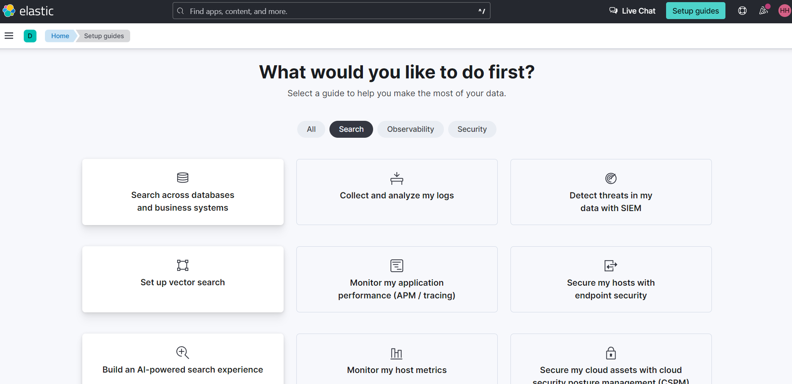<figcaption></figcaption></figure>

5. 이제 **Vector Search**에 대한 **Getting started** 페이지를 볼 수 있습니다.

<figure>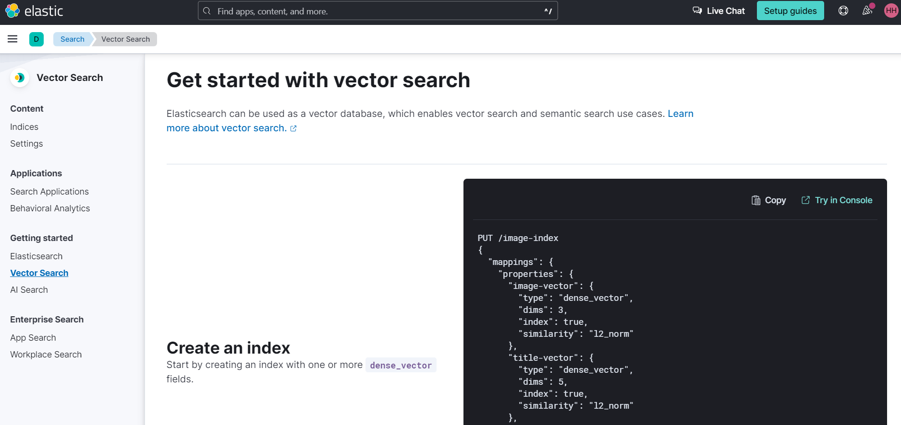<figcaption></figcaption></figure>

6. 왼쪽 사이드바에서 **Indices**를 클릭합니다. 그런 다음 **Create a new index**를 클릭합니다.

<figure>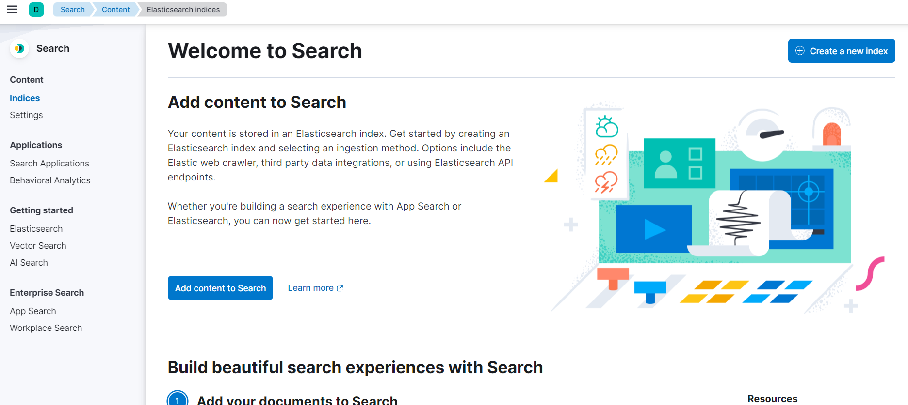<figcaption></figcaption></figure>

7. **API** 수집 방법을 선택합니다.

<figure>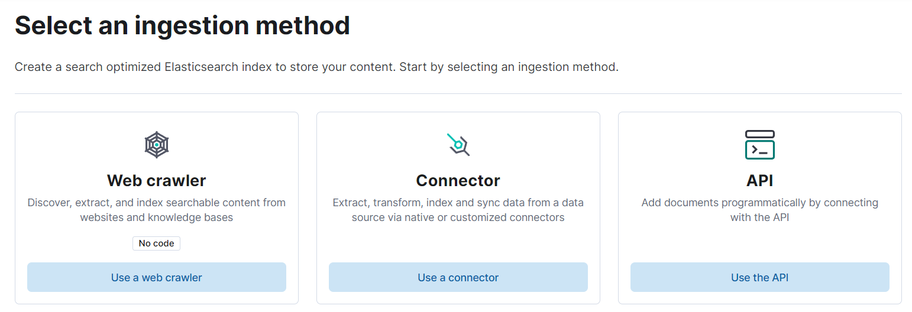<figcaption></figcaption></figure>

8. 검색 Index 이름을 입력한 후 **Create Index**를 클릭합니다.

<figure>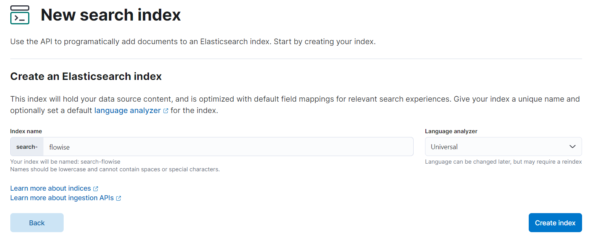<figcaption></figcaption></figure>

9. Index가 생성된 후 새 API 키를 생성하고 생성된 API 키와 URL을 메모합니다.

<figure>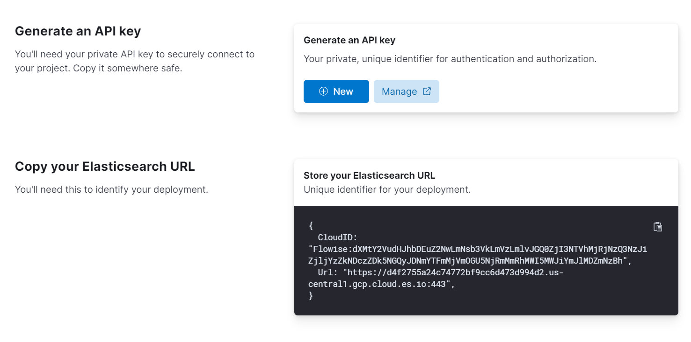<figcaption></figcaption></figure>

## Flowise 설정

1. 캔버스에 새 **Elasticsearch** 노드를 추가하고 **Index Name**을 입력합니다.

<figure>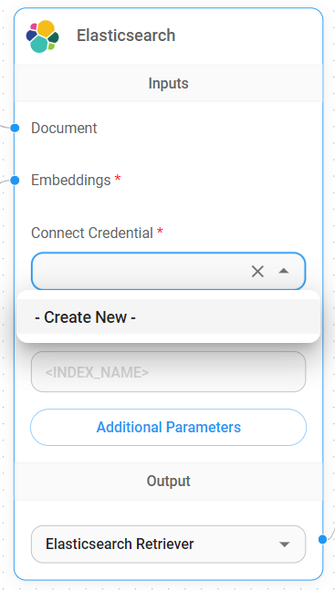<figcaption></figcaption></figure>

2. **Elasticsearch API**를 통해 새 자격증명을 추가합니다.

<figure>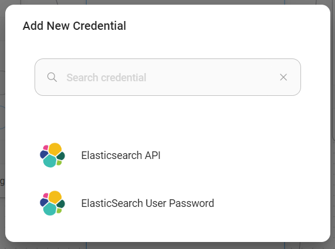<figcaption></figcaption></figure>

3. Elasticsearch에서 URL과 API Key를 가져와 필드를 입력합니다.

<figure>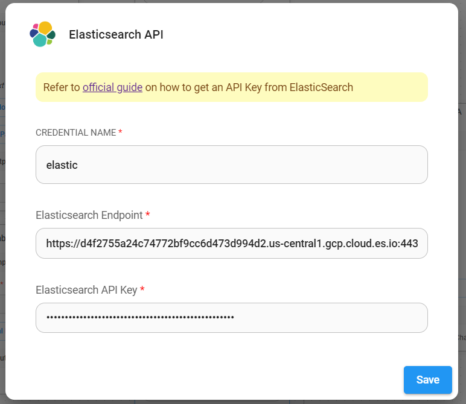<figcaption></figcaption></figure>

4. 자격증명이 성공적으로 생성된 후 데이터를 upsert할 수 있습니다.

<figure><figcaption></figcaption></figure>

<figure>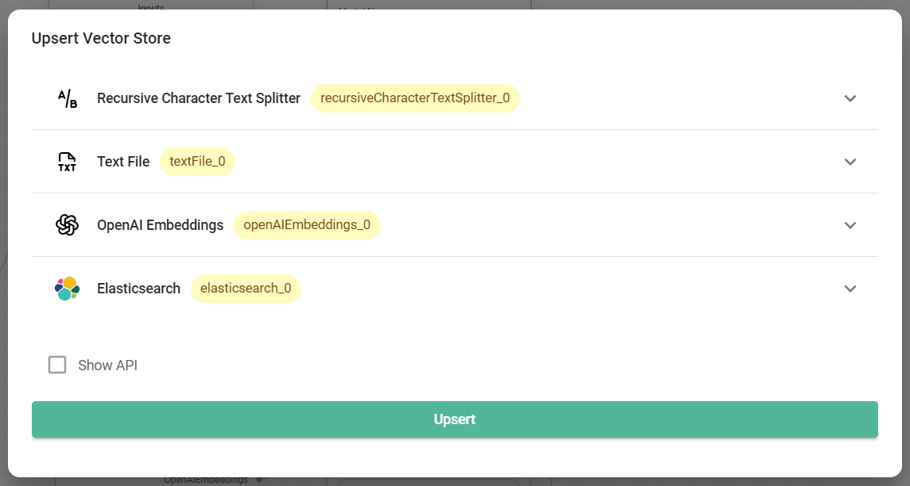<figcaption></figcaption></figure>

5. 데이터가 성공적으로 upsert된 후 Elastic 대시보드에서 확인할 수 있습니다:

<figure><figcaption></figcaption></figure>

6. 완료! 이제 채팅에서 질문을 시작할 수 있습니다.

<figure><figcaption></figcaption></figure>

## 리소스

* [LangChain JS Elastic](https://js.langchain.com/docs/integrations/vectorstores/elasticsearch)
* [Vector Search (kNN) 구현 가이드 - API 에디션](https://www.elastic.co/search-labs/blog/articles/vector-search-implementation-guide-api-edition)
