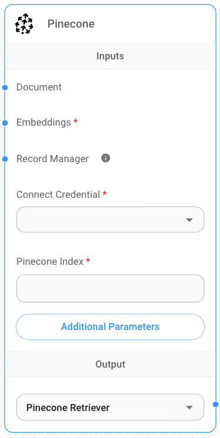
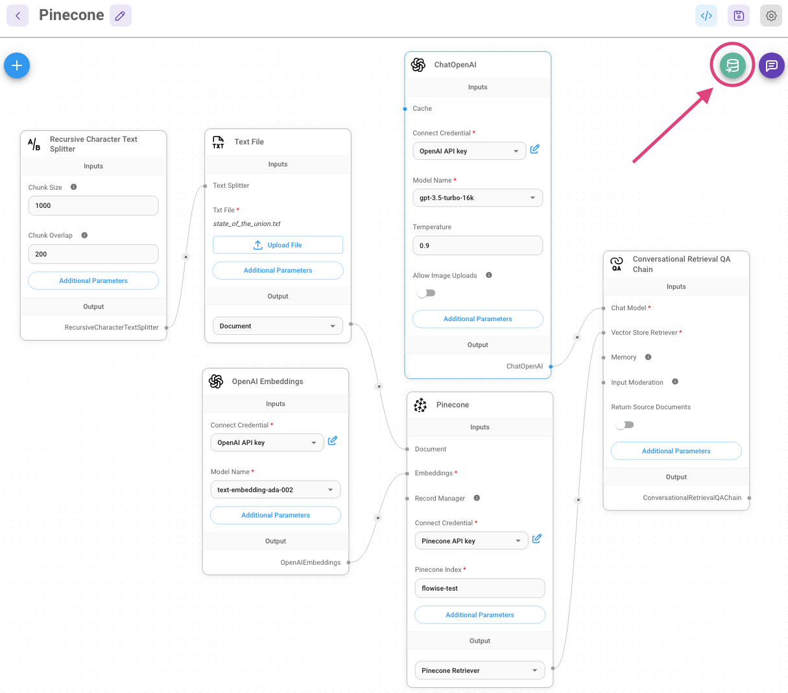
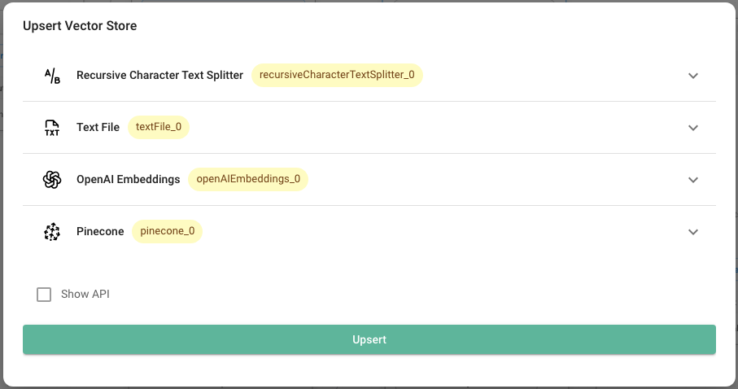

# Pinecone

## 사전 준비 사항

1. [Pinecone](https://app.pinecone.io/)에 계정을 등록합니다
2. **Create index**를 클릭합니다

<figure><figcaption></figcaption></figure>

3. 필수 필드를 입력합니다:
   - **Index Name**, 생성할 index의 이름입니다. (예: "flowise-test")
   - **Dimensions**, index에 삽입할 vector의 크기입니다. (예: 1536)

<figure><figcaption></figcaption></figure>

4. **Create Index**를 클릭합니다

## 설정

1.  **API Key**를 가져오거나 생성합니다

<figure><figcaption></figcaption></figure>

2.  새 **Pinecone** node를 canvas에 추가하고 매개변수를 입력합니다:
    - Pinecone Index
    - Pinecone namespace (선택 사항)

<figure><figcaption></figcaption></figure>

3. 새 Pinecone credential 생성 -> **API Key** 입력

<figure><figcaption></figcaption></figure>

4. canvas에 추가 node를 추가하고 upsert 프로세스를 시작합니다
   - **Document**는 [**Document Loader**](../document-loaders/) 카테고리 아래의 모든 node와 연결할 수 있습니다
   - **Embeddings**는 [**Embeddings** ](../embeddings/)카테고리 아래의 모든 node와 연결할 수 있습니다

<figure><figcaption></figcaption></figure>

<figure><figcaption></figcaption></figure>

5. [Pinecone dashboard](https://app.pinecone.io)에서 데이터가 성공적으로 upsert되었는지 확인합니다:

<figure><figcaption></figcaption></figure>

6.

## 리소스

- LangChain Pinecone vectorstore integration
  - [Python](https://python.langchain.com/v0.2/docs/integrations/providers/pinecone/)
  - [NodeJS](https://js.langchain.com/v0.2/docs/integrations/vectorstores/pinecone)
- [Pinecone LangChain integration](https://docs.pinecone.io/integrations/langchain)
- [Pinecone Flowise integration](https://docs.pinecone.io/integrations/flowise)
- [Pinecone official clients](https://docs.pinecone.io/reference/pinecone-clients)