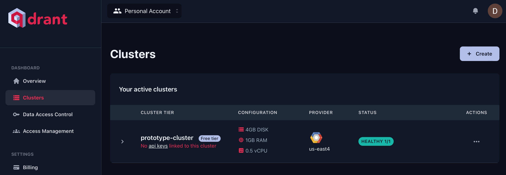
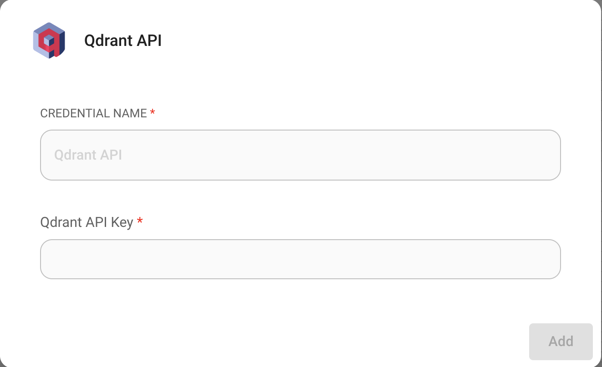
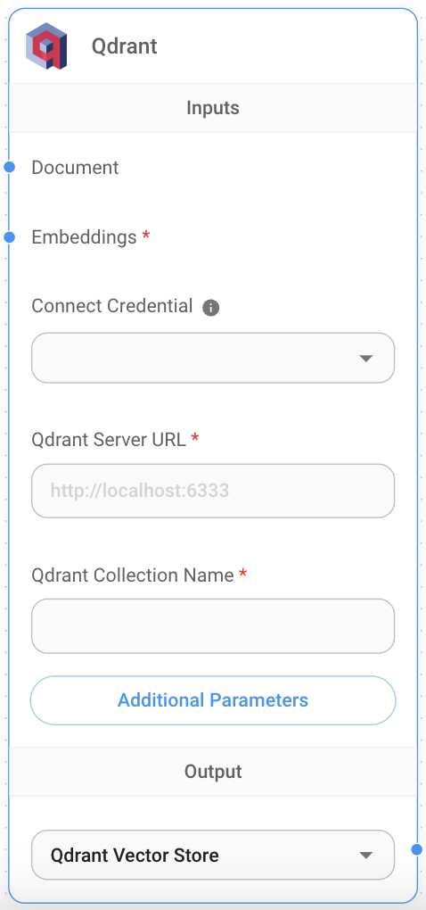

# Qdrant

## 사전 요구사항

[로컬에서 실행 중인 Qdrant 인스턴스](https://qdrant.tech/documentation/quick-start/) 또는 Qdrant 클라우드 인스턴스가 필요합니다.

Qdrant 클라우드 인스턴스를 얻으려면:

1. [Cloud Dashboard](https://cloud.qdrant.io/overview)의 Clusters 섹션으로 이동합니다.
2. **Clusters**를 선택한 다음 **+ Create**를 클릭합니다.

<figure><figcaption></figcaption></figure>

3. 클러스터 구성과 리전을 선택합니다.
4. **Create**를 눌러 클러스터를 프로비저닝합니다.

## 설정

1. [Cloud Dashboard](https://cloud.qdrant.io/overview)의 **Data Access Control** 섹션에서 **API Key**를 가져오거나 생성합니다.
2. canvas에 새로운 **Qdrant** node를 추가합니다.
3. API Key를 사용하여 새로운 Qdrant credential을 생성합니다.

<figure><figcaption></figcaption></figure>

4. **Qdrant** node에 필요한 정보를 입력합니다:
   * Qdrant 서버 URL
   * Collection 이름

<figure><figcaption></figcaption></figure>

5. **Document** 입력은 [**Document Loader**](../document-loaders/) 카테고리 아래의 모든 node와 연결할 수 있습니다.
6. **Embeddings** 입력은 [**Embeddings**](../embeddings/) 카테고리 아래의 모든 node와 연결할 수 있습니다.

## 필터링

서로 다른 document들을 upsert했고, 각각이 metadata 키 `{source}` 아래에 고유한 값으로 지정되어 있다고 가정해 봅시다.

<div align="left">

<figure><figcaption></figcaption></figure>

 

<figure><figcaption></figcaption></figure>

</div>

그런 다음 그것으로 필터링하려고 합니다. Qdrant는 필터링과 관련하여 다음 [구문](https://qdrant.tech/documentation/concepts/filtering/#nested-key)을 지원합니다:

**UI**

<figure><figcaption></figcaption></figure>

**API**```json
"overrideConfig": {
    "qdrantFilter": {
        "should": [
            {
                "key": "metadata.source",
                "match": {
                    "value": "apple"
                }
            }
        ]
    }
}
```## 리소스

* [Qdrant documentation](https://qdrant.tech/documentation/)
* [LangChain JS Qdrant](https://js.langchain.com/docs/integrations/vectorstores/qdrant)
* [Qdrant Filter](https://qdrant.tech/documentation/concepts/filtering/#nested-key)