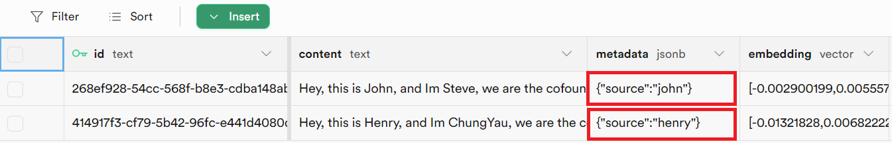

# Supabase

## 사전 준비

1. [Supabase](https://supabase.com/)에 계정을 등록합니다
2. **New project**를 클릭합니다

<figure><figcaption></figcaption></figure>

3. 필수 필드를 입력합니다

| 필드 이름                  | 설명                                              |
| ------------------------- | ------------------------------------------------- |
| **Name**                  | 생성할 프로젝트의 이름. (예: Flowise)              |
| **Database** **Password** | postgres 데이터베이스의 비밀번호                  |

<figure><figcaption></figcaption></figure>

4. **Create new project**를 클릭하고 프로젝트 설정이 완료될 때까지 기다립니다
5. **SQL Editor**를 클릭합니다

<figure><figcaption></figcaption></figure>

6. **New query**를 클릭합니다

<figure><figcaption></figcaption></figure>

7. 아래 SQL 쿼리를 복사하여 붙여넣고 `Ctrl + Enter`를 누르거나 **RUN**을 클릭하여 실행합니다. 테이블 이름과 함수 이름을 기록해 두세요.

* **테이블 이름**: `documents`
* **쿼리 이름**: `match_documents`

```plsql
-- Enable the pgvector extension to work with embedding vectors
create extension vector;

-- Create a table to store your documents
create table documents (
  id bigserial primary key,
  content text, -- corresponds to Document.pageContent
  metadata jsonb, -- corresponds to Document.metadata
  embedding vector(1536) -- 1536 works for OpenAI embeddings, change if needed
);

-- Create a function to search for documents
create function match_documents (
  query_embedding vector(1536),
  match_count int DEFAULT null,
  filter jsonb DEFAULT '{}'
) returns table (
  id bigint,
  content text,
  metadata jsonb,
  similarity float
)
language plpgsql
as $$
#variable_conflict use_column
begin
  return query
  select
    id,
    content,
    metadata,
    1 - (documents.embedding <=> query_embedding) as similarity
  from documents
  where metadata @> filter
  order by documents.embedding <=> query_embedding
  limit match_count;
end;
$$;

```

일부 경우에는 [Record Manager](../record-managers.md)를 사용하여 upsert를 추적하고 중복을 방지할 수 있습니다. Record Manager는 각 embeddings에 대해 임의의 UUID를 생성하므로, id 컬럼 엔티티를 text로 변경해야 합니다:

```sql
-- Enable the pgvector extension to work with embedding vectors
create extension vector;

-- Create a table to store your documents
create table documents (
  id text primary key, -- CHANGE TO TEXT
  content text,
  metadata jsonb,
  embedding vector(1536)
);

-- Create a function to search for documents
create function match_documents (
  query_embedding vector(1536),
  match_count int DEFAULT null,
  filter jsonb DEFAULT '{}'
) returns table (
  id text, -- CHANGE TO TEXT
  content text,
  metadata jsonb,
  similarity float
)
language plpgsql
as $$
#variable_conflict use_column
begin
  return query
  select
    id,
    content,
    metadata,
    1 - (documents.embedding <=> query_embedding) as similarity
  from documents
  where metadata @> filter
  order by documents.embedding <=> query_embedding
  limit match_count;
end;
$$;

```

<figure><figcaption></figcaption></figure>

## 설정

1. **Project Settings**를 클릭합니다

<figure><figcaption></figcaption></figure>

2. **Project URL & API Key**를 가져옵니다

<figure><figcaption></figcaption></figure>

3. 각 세부 정보(_API Key, URL, Table Name, Query Name_)를 복사하여 **Supabase** node에 붙여넣습니다

<figure><figcaption></figcaption></figure>

4. **Document**는 [**Document Loader**](../document-loaders/) 카테고리 아래의 모든 node와 연결할 수 있습니다
5. **Embeddings**는 [**Embeddings** ](../embeddings/)카테고리 아래의 모든 node와 연결할 수 있습니다

## 필터링

각각 metadata 키 `{source}` 아래에 고유한 값으로 지정된 서로 다른 문서를 upsert했다고 가정해 봅시다

<figure><figcaption></figcaption></figure>

metadata 필터링을 사용하여 특정 metadata를 쿼리할 수 있습니다:

**UI**

<figure><figcaption></figcaption></figure>

**API**

```json
"overrideConfig": {
    "supabaseMetadataFilter": {
        "source": "henry"
    }
}
```

## 리소스

* [LangChain JS Supabase](https://js.langchain.com/docs/modules/indexes/vector_stores/integrations/supabase)
* [Supabase 블로그 게시물](https://supabase.com/blog/openai-embeddings-postgres-vector)
* [Metadata 필터링](https://js.langchain.com/docs/integrations/vectorstores/supabase#metadata-filtering)