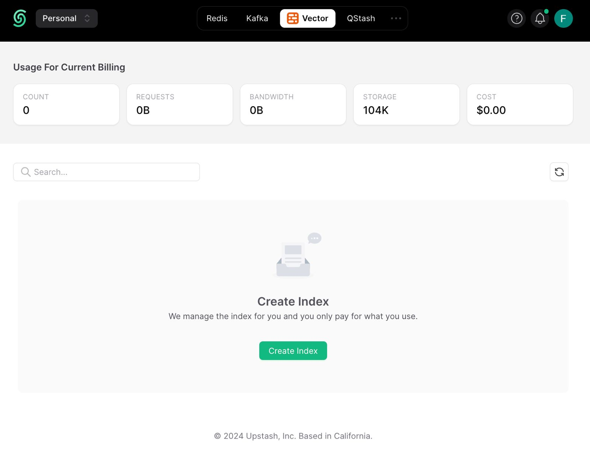
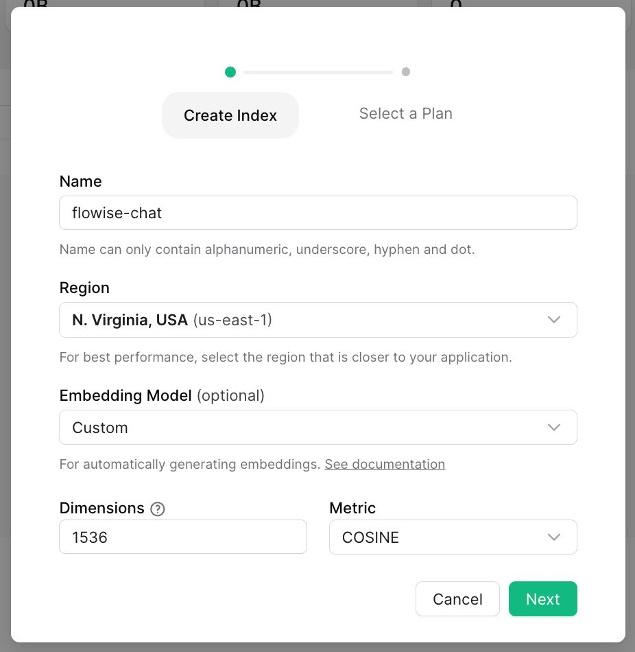
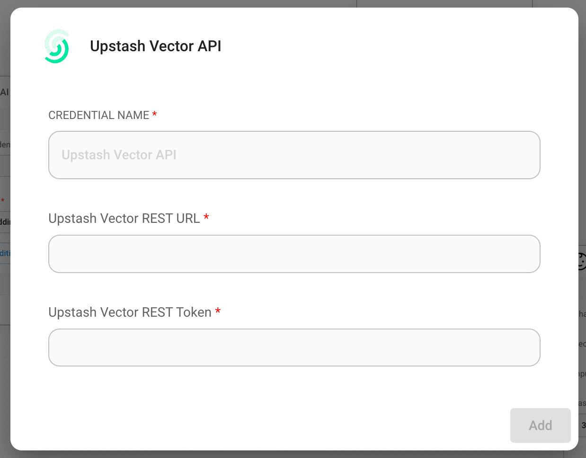
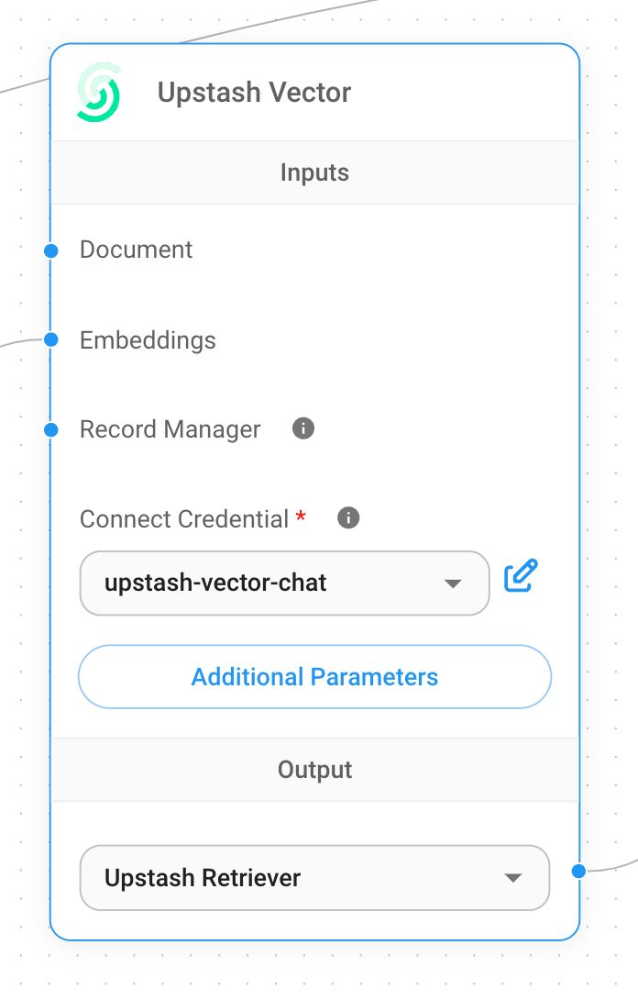
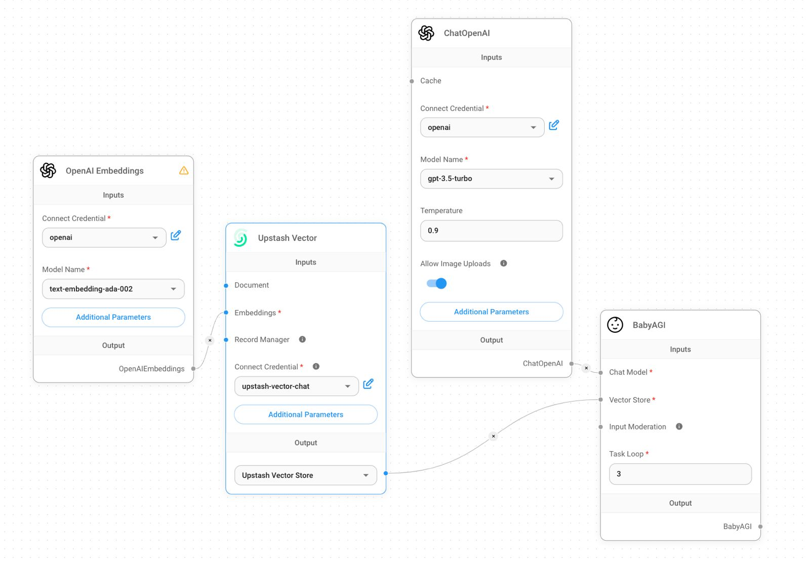
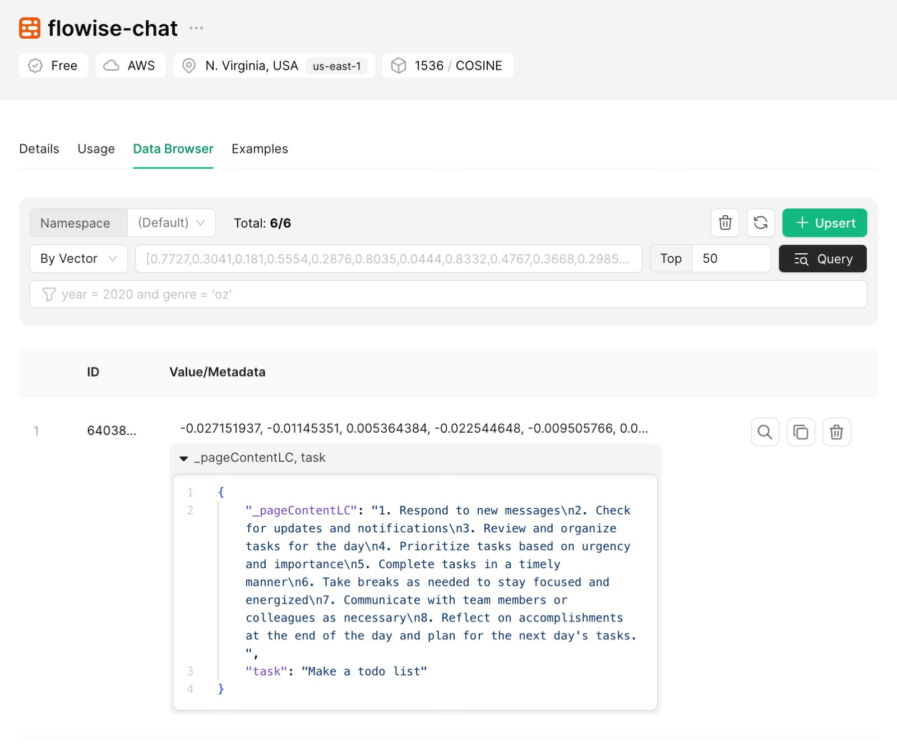

# Upstash Vector

## 사전 준비 사항

1. [Upstash Console](https://console.upstash.com)에 가입하거나 로그인합니다
2.  Vector 페이지로 이동한 후 **Create Index**를 클릭합니다

    <figure><figcaption></figcaption></figure>
3.  필요한 설정을 진행하고 index를 생성합니다.

    1. **Index Name**, 생성할 index의 이름입니다. (예: "flowise-upstash-demo")
    2. **Dimensions**, index에 삽입될 vector의 크기입니다. (예: 1536)
    3. **Embedding Model**, [Upstash Embeddings](https://upstash.com/docs/vector/features/embeddingmodels)에서 사용할 model입니다. 이는 선택 사항입니다. 활성화하면 embeddings model을 제공할 필요가 없습니다.

    <figure><figcaption></figcaption></figure>

## 설정

1. index credential을 가져옵니다

<figure><figcaption></figcaption></figure>

1. 새로운 Upstash Vector credential을 생성하고 입력합니다
   1. console의 UPSTASH\_VECTOR\_REST\_URL에서 가져온 Upstash Vector REST URL
   2. console의 UPSTASH\_VECTOR\_REST\_TOKEN에서 가져온 Upstash Vector Rest Token

<figure><figcaption></figcaption></figure>

1. canvas에 새로운 **Upstash Vector** node를 추가합니다

<figure><figcaption></figcaption></figure>

1. canvas에 추가 node를 더하고 upsert 과정을 시작합니다
   * **Document**는 [**Document Loader**](../document-loaders/) 카테고리 아래의 모든 node와 연결할 수 있습니다
   * **Embeddings**는 [**Embeddings** ](../embeddings/)카테고리 아래의 모든 node와 연결할 수 있습니다

<figure><figcaption></figcaption></figure>

1. 데이터가 성공적으로 업데이트되었는지 [Upstash dashboard](https://console.upstash.com)에서 확인합니다:

<figure><figcaption></figcaption></figure>