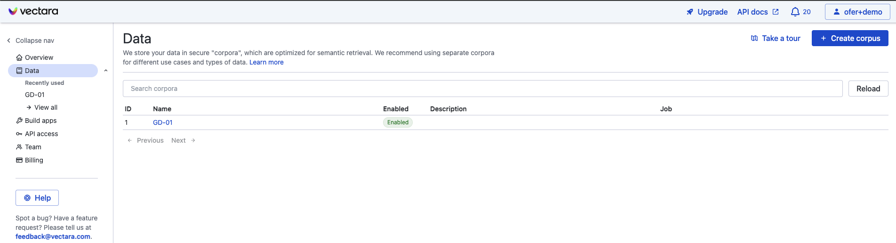
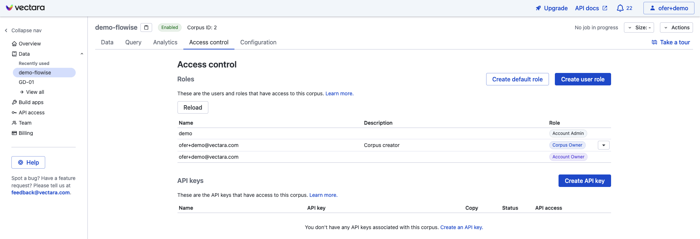
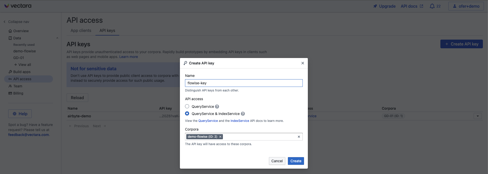
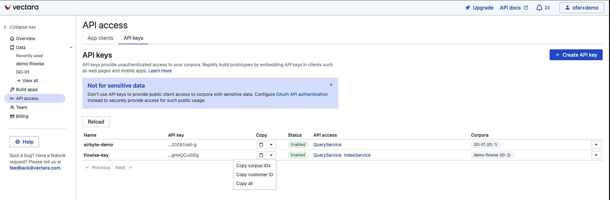
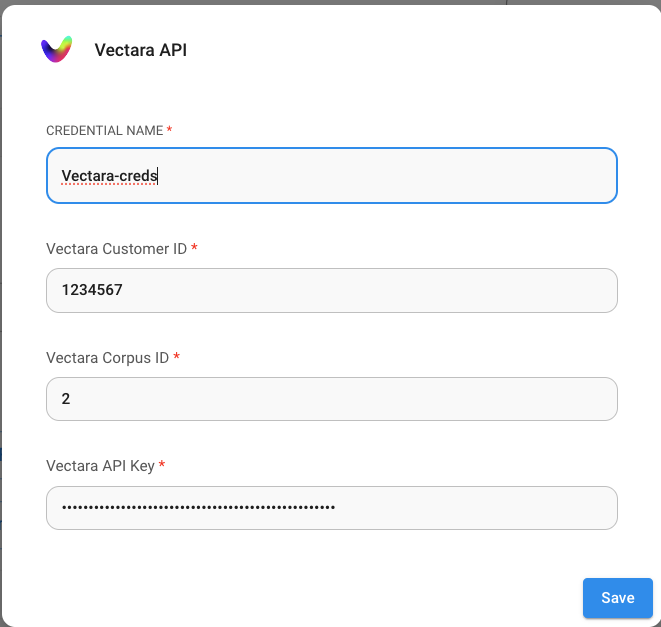
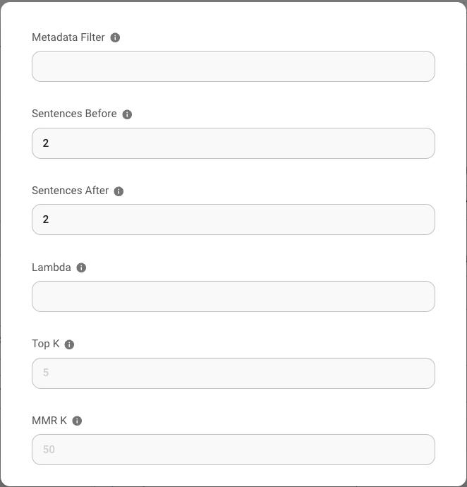

# Vectara

## 빠른 시작 튜토리얼



## 사전 준비 사항

1. [Vectara](https://vectara.com/integrations/flowise) 계정을 등록합니다
2. **Create Corpus**를 클릭합니다

<figure><figcaption></figcaption></figure>

생성할 corpus의 이름을 지정하고 **Create Corpus**를 클릭한 다음 corpus 설정이 완료될 때까지 기다립니다.

## 설정

1. corpus 화면에서 **"Access Control"** 탭을 클릭합니다

<figure><figcaption></figcaption></figure>

2. **"Create API Key"** 버튼을 클릭하고 API key의 이름을 선택한 다음 **QueryService & IndexService** 옵션을 선택합니다

<figure><figcaption></figcaption></figure>

3. **Create**를 클릭하여 API key를 생성합니다
4. 새 API key의 "copy" 아래에 있는 아래쪽 화살표를 클릭하여 **Corpus ID, API Key, Customer ID**를 가져옵니다:

<figure><figcaption></figcaption></figure>

5. Flowise canvas로 돌아가서 chatflow를 생성합니다. Credentials 드롭다운에서 **Create New**를 클릭하고 Vectara credentials를 입력합니다.

<figure><figcaption></figcaption></figure>

6. 즐기세요!

## Vectara Query 매개변수

Vectara query 매개변수를 더 세밀하게 제어하려면 "**Additional Parameters**"를 클릭한 다음 다음 매개변수를 기본값에서 변경할 수 있습니다:

* Metadata Filter: Vectara는 메타데이터 필터링을 지원합니다. [필터링](https://docs.vectara.com/docs/common-use-cases/filtering-by-metadata/filter-overview)을 사용하려면 필터링하려는 메타데이터 필드가 Vectara corpus에 정의되어 있는지 확인하세요.
* "Sentences before"와 "Sentences after": Vectara 검색 엔진에서 일치하는 텍스트 앞/뒤로 몇 개의 문장을 결과로 반환할지 제어합니다
* Lambda: Vectara에서 [하이브리드 검색](https://docs.vectara.com/docs/learn/hybrid-search)의 동작을 정의합니다
* Top-K: query에 대해 Vectara에서 반환할 결과 수
* MMR-K: [MMR](https://docs.vectara.com/docs/api-reference/search-apis/reranking#maximal-marginal-relevance-mmr-reranker)(max marginal relevance)에 사용할 결과 수

<figure><figcaption></figcaption></figure>

## 리소스

* [LangChain JS Vectara 블로그 게시물](https://blog.langchain.dev/langchain-vectara-better-together/)
* [Vectara의 Langchain Integration을 사용해야 하는 5가지 이유 블로그 게시물](https://vectara.com/5-reasons-to-use-vectaras-langchain-integration/)
* [Vectara의 Max Marginal Relevance](https://vectara.com/blog/get-diverse-results-and-comprehensive-summaries-with-vectaras-mmr-reranker/)
* [Vectara Boomerang embedding Model 블로그 게시물](https://vectara.com/introducing-boomerang-vectaras-new-and-improved-retrieval-model/)
* [Vectara의 HHEM으로 환각 감지하기](https://vectara.com/blog/cut-the-bull-detecting-hallucinations-in-large-language-models/)