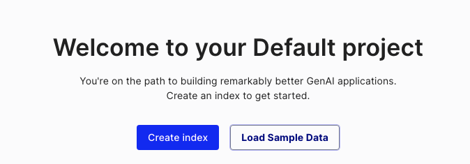
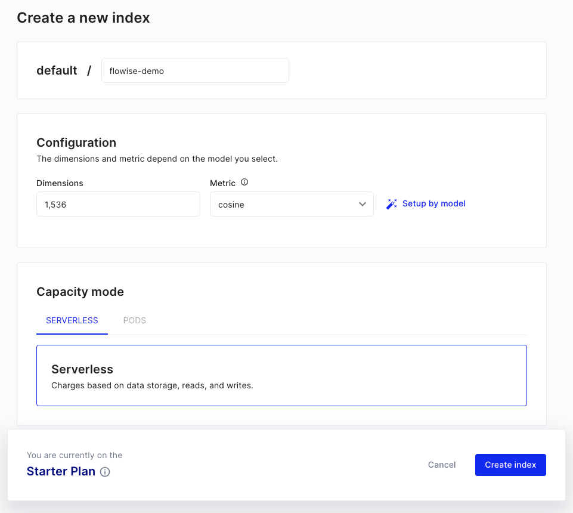
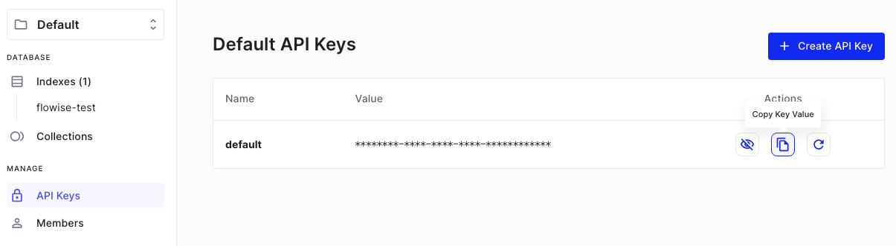
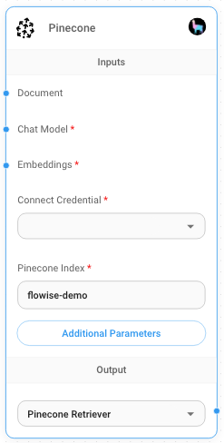
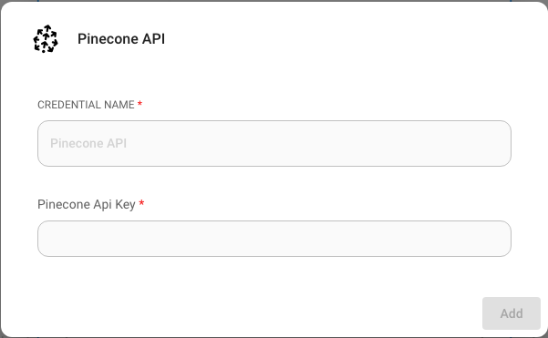
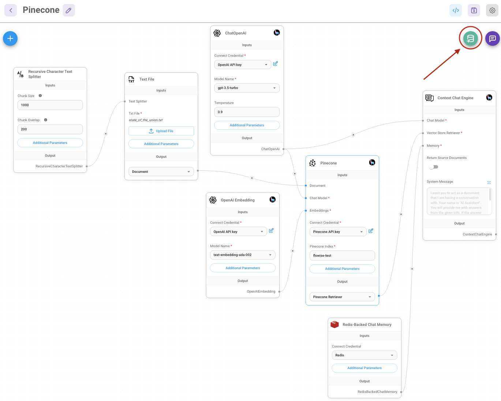
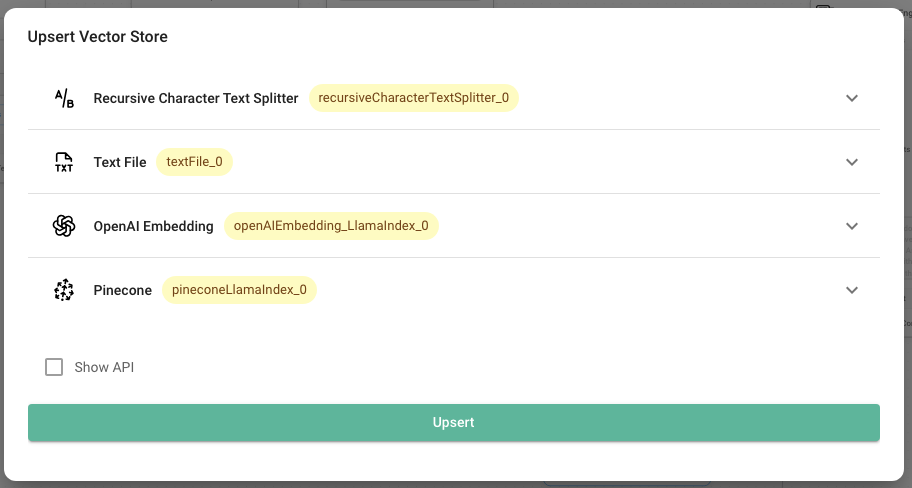
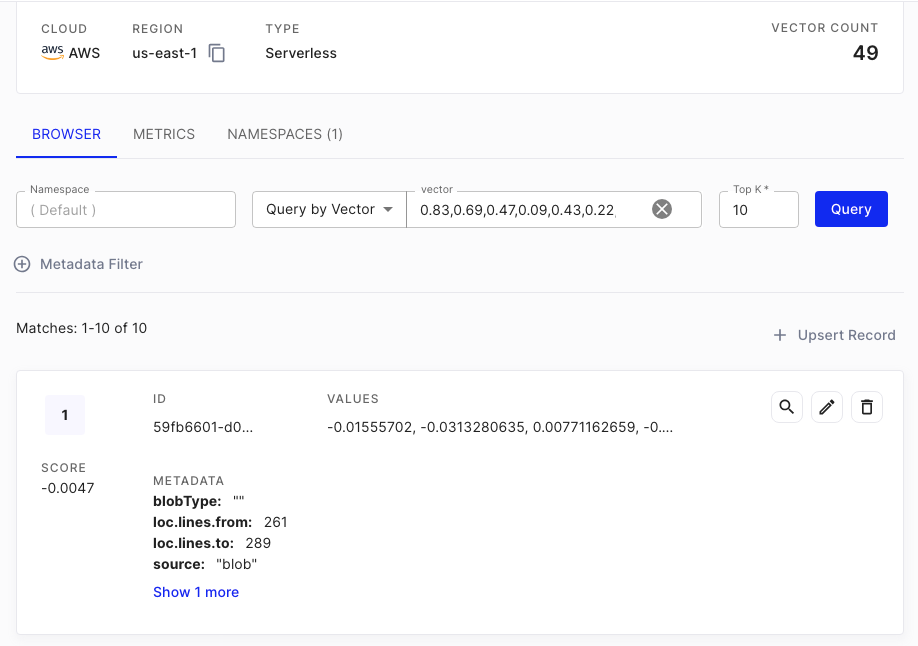

# Pinecone

## 전제 조건

1. Register an account for [Pinecone](https://app.pinecone.io/)
2. Click **Create index**

<figure><figcaption></figcaption></figure>

3. Fill in required fields:
   * **인덱스 Name**, name of the index to be created. (e.g. "flowise-test")
   * **Dimensions**, size of the vectors to be inserted in the index. (e.g. 1536)

<figure><figcaption></figcaption></figure>

4. Click **Create 인덱스**

## 설정

1. Get/Create your **API 키**

<figure><figcaption></figcaption></figure>

2. 추가 a new **Pinecone** node to canvas and fill in the parameters:
   * Pinecone 인덱스
   * Pinecone namespace (optional)

<figure><figcaption>
Pinecone 노드
</figcaption></figure>

3. Create new Pinecone credential -> Fill in **API 키**

<figure><figcaption></figcaption></figure>

4. 추가 additional nodes to canvas and start the upsert process
   *   **Document** can be connected with any node under [**Document Loader**](../../langchain/document-loaders/) category

       

Document loaders and text splitters for LlamaIndex are not yet available, but using one of the ones available under LangChain will still allow querying with LlamaIndex as normal.

\- \*\*Embeddings\*\* can be connected with any node under \[\*\*Embeddings\*\* ]\(../embeddings/)category

<figure><figcaption></figcaption></figure>

<figure><figcaption></figcaption></figure>

5. Verify on [Pinecone dashboard](https://app.pinecone.io) that data has been successfully upserted:

<figure><figcaption></figcaption></figure>
