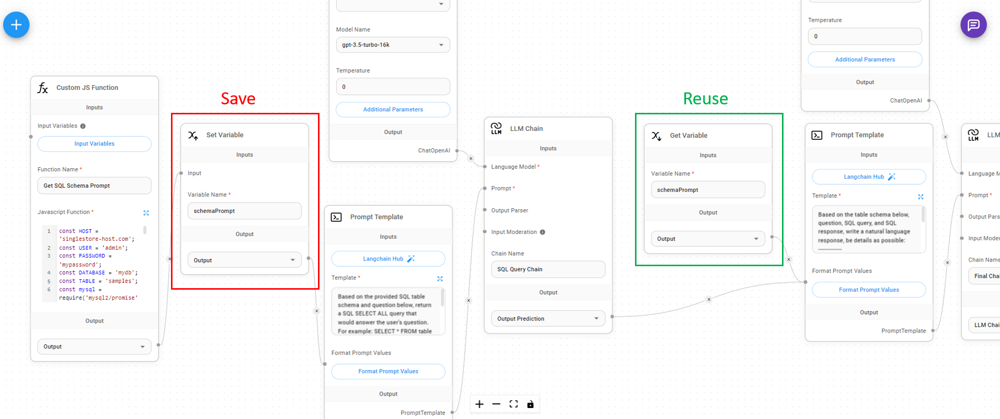

# 집합/Get 변수

If you are running a Custom 함수, or LLM 체인, you might want to reuse the result in other nodes without having to recompute/rerun the same thing again. You can save the output result as a variable, and reuse it for other nodes that is further down the flow path.

<figure><figcaption></figcaption></figure>

### 집합 변수

Taking inputs from any node that outputs `string, number, boolean, json, array,` we can assign a variable name to it.

<figure><figcaption></figcaption></figure>

### Get 변수

You can get the variable value from the variable name at a later stage:

<figure><figcaption></figcaption></figure>
