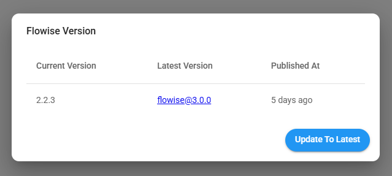

# Cloud 마이그레이션

이 가이드는 Cloud V1에서 V2로 마이그레이션하는 데 도움이 됩니다.

Cloud V1에서는 앱의 URL이 <mark style="color:blue;">**https://\<your-instance-name>.app.flowiseai.com**</mark> 형태입니다.

Cloud V2에서는 앱의 URL이 <mark style="color:blue;">**https://cloud.flowiseai.com**</mark>입니다.

Cloud V2는 왜 필요한가요? 우리는 클라우드를 처음부터 다시 작성했으며, 5배의 속도 향상, 여러 워크스페이스 지원, 조직 멤버십, 그리고 가장 중요하게는 [프로덕션 준비 완료 아키텍처](../configuration/running-in-production.md)로 매우 확장 가능합니다.

1. [https://flowiseai.com/auth/login](https://flowiseai.com/auth/login)을 통해 Cloud V1에 로그인합니다.
2. 대시보드에서 우측 상단 모서리를 확인합니다:

<figure><figcaption></figcaption></figure>

3. **버전 선택을 클릭한 후 최신 버전으로 업데이트합니다.**

<figure><figcaption></figcaption></figure>

4. 내보내기를 선택하고, 내보낼 데이터를 선택합니다:

<figure><figcaption></figcaption></figure>

5. 내보낸 JSON 파일을 저장합니다.
6. Cloud V2로 이동합니다 [https://cloud.flowiseai.com](https://cloud.flowiseai.com/)
7. Cloud V2 계정은 Cloud V1의 기존 계정과 동기화되지 않으므로 다시 등록하거나 Google/Github으로 로그인해야 합니다.

<figure><figcaption></figcaption></figure>

8. 로그인 후 대시보드 우측 상단에서 가져오기를 클릭하고 내보낸 JSON 파일을 업로드합니다.

<figure><figcaption></figcaption></figure>

9. 새 사용자는 기본적으로 **무료 플랜**에 있으며 Flow와 어시스턴트(각각) 2개로 제한됩니다. 내보낸 데이터가 그보다 많으면 JSON 파일을 가져올 때 오류가 발생합니다. 그래서 우리는 무제한의 Flow와 어시스턴트가 있는 **Starter 플랜**에서 <mark style="color:orange;">**첫 달 무료**</mark>를 제공합니다!

<figure><figcaption></figcaption></figure>

10. **시작하기** 버튼을 클릭하고 선호하는 결제 방법을 추가합니다:

<figure><figcaption></figcaption></figure>

<figure><figcaption></figcaption></figure>

11. 결제 방법을 추가한 후 Flowise로 돌아가서 선택한 플랜에서 시작하기를 클릭하고 변경 사항을 확인합니다:

<figure><figcaption></figcaption></figure>

12. 모든 것이 순조롭게 진행되면 Starter 플랜에서 무제한 Flow와 어시스턴트를 사용할 수 있어야 합니다! 축하합니다 :tada: 무료 플랜 제한으로 인해 이전에 실패했던 경우 JSON 파일을 다시 가져오세요.


내보낸 데이터의 모든 ID는 동일하게 유지되므로 API의 ID를 업데이트할 걱정을 하지 않아도 됩니다. [https://cloud.flowiseai.com/api/v1/prediction/69fb1055-ghj324-ghj-0a4ytrerf](https://cloud.flowiseai.com/api/v1/prediction/69fb1055-ghj324-ghj-0a4ytrerf)와 같은 URL만 업데이트하면 됩니다.



자격증명은 내보내지지 않습니다. 새 자격증명을 만들고 Flow 및 어시스턴트에서 사용해야 합니다.


13. 모든 것이 예상대로 작동하는지 확인한 후 이제 Cloud V1 구독을 취소할 수 있습니다.
14. 왼쪽 패널에서 계정 설정을 클릭하고 아래로 스크롤하면 **이전 구독 취소**가 표시됩니다:

<figure><figcaption></figcaption></figure>

15. Cloud V1에 가입할 때 사용했던 이전 이메일을 입력하고 **지침 보내기**를 클릭합니다.
16. 구독을 취소하는 이메일을 받게 됩니다:

<figure><figcaption></figcaption></figure>

17. **구독 관리** 버튼을 클릭하면 Cloud V1 구독을 취소할 수 있는 포털로 이동합니다. Cloud V1 앱은 다음 청구 주기에 종료됩니다.

<figure><figcaption></figcaption></figure>

마이그레이션 과정 중 불편을 드린 점 진심으로 사과드립니다. 도움이 필요하시면 support@flowiseai.com으로 연락하세요.
