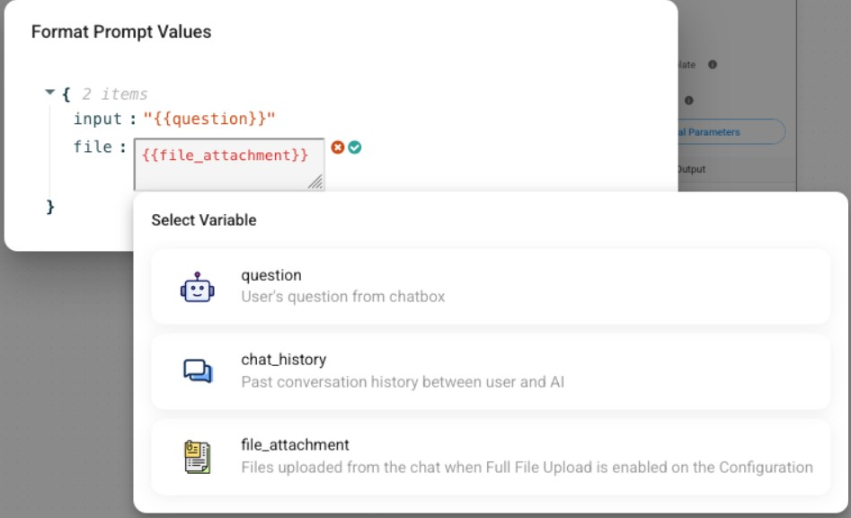

# 업로드

플로우와이즈는 채팅에서 이미지, 오디오 및 기타 파일을 업로드할 수 있습니다. 이 섹션에서는 이러한 기능을 활성화하고 사용하는 방법을 배웁니다.

## 이미지

특정 채팅 모델에서는 이미지를 입력할 수 있습니다. LLM이 이미지 입력을 지원하는지 확인하려면 항상 LLM의 공식 설명서를 참조하세요.

* [ChatOpenAI](../integrations/llamaindex/chat-models/chatopenai.md)
* [AzureChatOpenAI](../integrations/llamaindex/chat-models/azurechatopenai.md)
* [ChatAnthropic](../integrations/langchain/chat-models/chatanthropic.md)
* [AWSChatBedrock](../integrations/langchain/chat-models/aws-chatbedrock.md)
* [ChatGoogleGenerativeAI](../integrations/langchain/chat-models/google-ai.md)
* [ChatOllama](../integrations/llamaindex/chat-models/chatollama.md)
* [Google Vertex AI](../integrations/langchain/llms/googlevertex-ai.md)


이미지 처리는 챗플로우의 특정 체인/에이전트에서만 작동합니다.

[LLMChain](../integrations/langchain/chains/llm-chain.md), [Conversation Chain](../integrations/langchain/chains/conversation-chain.md), [ReAct Agent](../integrations/langchain/agents/react-agent-chat.md), [Conversational Agent](../integrations/langchain/agents/conversational-agent.md), [Tool Agent](../integrations/langchain/agents/tool-agent.md)


**이미지 업로드 허용**을 활성화하면 채팅 인터페이스에서 이미지를 업로드할 수 있습니다.

<div align="center"><figure><figcaption></figcaption></figure> <figure><figcaption></figcaption></figure></div>

API를 사용하여 이미지를 업로드하려면:



```python
import requests
API_URL = "http://localhost:3000/api/v1/prediction/<chatflowid>"

def query(payload):
    response = requests.post(API_URL, json=payload)
    return response.json()
    
output = query({
    "question": "Can you describe the image?",
    "uploads": [
        {
            "data": "data:image/png;base64,iVBORw0KGgdM2uN0", # base64 string or url
            "type": "file", # file | url
            "name": "Flowise.png",
            "mime": "image/png"
        }
    ]
})
```



```javascript
async function query(data) {
    const response = await fetch(
        "http://localhost:3000/api/v1/prediction/<chatflowid>",
        {
            method: "POST",
            headers: {
                "Content-Type": "application/json"
            },
            body: JSON.stringify(data)
        }
    );
    const result = await response.json();
    return result;
}

query({
    "question": "Can you describe the image?",
    "uploads": [
        {
            "data": "data:image/png;base64,iVBORw0KGgdM2uN0", //base64 string or url
            "type": "file", // file | url
            "name": "Flowise.png",
            "mime": "image/png"
        }
    ]
}).then((response) => {
    console.log(response);
});
```



## 오디오

챗플로우 설정에서 음성-텍스트 변환 모듈을 선택할 수 있습니다. 지원되는 통합은 다음과 같습니다.

* OpenAI
* AssemblyAI
* [LocalAI](../integrations/langchain/chat-models/chatlocalai.md)

이 기능이 활성화되면 사용자는 마이크에 직접 말할 수 있으며, 음성이 텍스트로 변환됩니다.

<div align="left"><figure><figcaption></figcaption></figure> <figure><figcaption></figcaption></figure></div>

API를 사용하여 오디오를 업로드하려면:



```python
import requests
API_URL = "http://localhost:3000/api/v1/prediction/<chatflowid>"

def query(payload):
    response = requests.post(API_URL, json=payload)
    return response.json()
    
output = query({
    "uploads": [
        {
            "data": "data:audio/webm;codecs=opus;base64,GkXf", # base64 string
            "type": "audio",
            "name": "audio.wav",
            "mime": "audio/webm"
        }
    ]
})
```



```javascript
async function query(data) {
    const response = await fetch(
        "http://localhost:3000/api/v1/prediction/<chatflowid>",
        {
            method: "POST",
            headers: {
                "Content-Type": "application/json"
            },
            body: JSON.stringify(data)
        }
    );
    const result = await response.json();
    return result;
}

query({
    "uploads": [
        {
            "data": "data:audio/webm;codecs=opus;base64,GkXf", // base64 string
            "type": "audio",
            "name": "audio.wav",
            "mime": "audio/webm"
        }
    ]
}).then((response) => {
    console.log(response);
});
```



## 파일

파일을 두 가지 방식으로 업로드할 수 있습니다.

* 검색 증강 생성(RAG) 파일 업로드
* 전체 파일 업로드

두 옵션이 모두 활성화된 경우 전체 파일 업로드가 우선합니다.

### RAG 파일 업로드

업로드된 파일을 벡터 저장소에 즉시 업서트할 수 있습니다. 파일 업로드를 활성화하려면 다음 필수 조건을 충족해야 합니다.

* 파일 업로드를 지원하는 벡터 저장소를 챗플로우에 포함해야 합니다.
  * [Pinecone](../integrations/langchain/vector-stores/pinecone.md)
  * [Milvus](../integrations/langchain/vector-stores/milvus.md)
  * [Postgres](../integrations/langchain/vector-stores/postgres.md)
  * [Qdrant](../integrations/langchain/vector-stores/qdrant.md)
  * [Upstash](../integrations/langchain/vector-stores/upstash-vector.md)
* 챣플로우에 여러 벡터 저장소가 있는 경우 한 번에 한 벡터 저장소만 파일 업로드를 켤 수 있습니다.
* 벡터 저장소의 문서 입력에 최소한 하나의 문서 로더 노드를 연결해야 합니다.
* 지원되는 문서 로더:
  * [CSV File](../integrations/langchain/document-loaders/csv-file.md)
  * [Docx File](../integrations/langchain/document-loaders/docx-file.md)
  * [Json File](../integrations/langchain/document-loaders/json-file.md)
  * [Json Lines File](/broken/pages/5Yx4z3cCteIRfL5w2Ihp)
  * [PDF File](../integrations/langchain/document-loaders/pdf-file.md)
  * [Text File](../integrations/langchain/document-loaders/text-file.md)
  * [Unstructured File](../integrations/langchain/document-loaders/unstructured-file-loader.md)

<figure><figcaption></figcaption></figure>

채팅에서 하나 이상의 파일을 업로드할 수 있습니다.

<div align="left"><figure><figcaption></figcaption></figure> <figure><figcaption></figcaption></figure></div>

동작 방식은 다음과 같습니다.

1. 업로드된 파일의 메타데이터가 chatId로 업데이트됩니다.
2. 이는 파일을 chatId와 연결합니다.
3. 쿼리 시 **OR** 필터가 적용됩니다.

* 메타데이터에 `flowise_chatId`가 포함되어 있고 값이 현재 채팅 세션 ID입니다.
* 메타데이터에 `flowise_chatId`가 포함되지 않습니다.

Pinecone에 업서트된 벡터 임베딩의 예:

<figure><figcaption></figcaption></figure>

API를 사용하려면 다음 두 단계를 따르세요.

1. [Vector Upsert API](/broken/pages/F2AfRpI7qYixNiBWpmIe#vector-upsert-api)를 `formData`와 `chatId`와 함께 사용합니다.



```python
import requests

API_URL = "http://localhost:3000/api/v1/vector/upsert/<chatflowid>"

# Use form data to upload files
form_data = {
    "files": ("state_of_the_union.txt", open("state_of_the_union.txt", "rb"))
}

body_data = {
    "chatId": "some-session-id"
}

def query(form_data):
    response = requests.post(API_URL, files=form_data, data=body_data)
    print(response)
    return response.json()

output = query(form_data)
print(output)
```



```javascript
// Use FormData to upload files
let formData = new FormData();
formData.append("files", input.files[0]);
formData.append("chatId", "some-session-id");

async function query(formData) {
    const response = await fetch(
        "http://localhost:3000/api/v1/vector/upsert/<chatflowid>",
        {
            method: "POST",
            body: formData
        }
    );
    const result = await response.json();
    return result;
}

query(formData).then((response) => {
    console.log(response);
});
```



2. [Prediction API](/broken/pages/F2AfRpI7qYixNiBWpmIe#prediction)를 `uploads`과 1단계의 `chatId`와 함께 사용합니다.



```python
import requests
API_URL = "http://localhost:3000/api/v1/prediction/<chatflowid>"

def query(payload):
    response = requests.post(API_URL, json=payload)
    return response.json()
    
output = query({
    "question": "What is the speech about?",
    "chatId": "same-session-id-from-step-1",
    "uploads": [
        {
            "data": "data:text/plain;base64,TWFkYWwcy4=",
            "type": "file:rag",
            "name": "state_of_the_union.txt",
            "mime": "text/plain"
        }
    ]
})
```



```javascript
async function query(data) {
    const response = await fetch(
        "http://localhost:3000/api/v1/prediction/<chatflowid>",
        {
            method: "POST",
            headers: {
                "Content-Type": "application/json"
            },
            body: JSON.stringify(data)
        }
    );
    const result = await response.json();
    return result;
}

query({
    "question": "What is the speech about?",
    "chatId": "same-session-id-from-step-1",
    "uploads": [
        {
            "data": "data:text/plain;base64,TWFkYWwcy4=",
            "type": "file:rag",
            "name": "state_of_the_union.txt",
            "mime": "text/plain"
        }
    ]
}).then((response) => {
    console.log(response);
});
```



### 전체 파일 업로드

RAG 파일 업로드를 사용하면 스프레드시트나 표와 같은 구조화된 데이터를 처리할 수 없으며 전체 컨텍스트 부족으로 인해 전체 요약을 수행할 수 없습니다. 경우에 따라 더 긴 컨텍스트 윈도우를 가진 Gemini와 Claude와 같은 모델, 특히 전체 파일 내용을 프롬프트에 직접 포함하려고 할 수 있습니다. [이 논문](https://arxiv.org/html/2407.16833v1)은 RAG와 더 긴 컨텍스트 윈도우를 비교하는 많은 논문 중 하나입니다.

전체 파일 업로드를 활성화하려면 **챗플로우 설정**으로 이동하여 **파일 업로드** 탭을 열고 스위치를 클릭합니다.

<figure><figcaption></figcaption></figure>

채팅에서 **파일 첨부** 버튼이 보이며, 여기서 하나 이상의 파일을 업로드할 수 있습니다. 내부적으로 [파일 로더](../integrations/langchain/document-loaders/file-loader.md)는 각 파일을 처리하고 텍스트로 변환합니다.

<figure><figcaption></figcaption></figure>

챣플로우에서 Chat Prompt Template 노드를 사용하는 경우 **Format Prompt Values**에서 입력을 만들어야 파일 데이터를 전달할 수 있습니다. 지정된 입력 이름(예: {file})이 **Human Message** 필드에 포함되어야 합니다.

<figure><figcaption></figcaption></figure>

To upload files with the API:



```python
import requests
API_URL = "http://localhost:3000/api/v1/prediction/<chatflowid>"

def query(payload):
    response = requests.post(API_URL, json=payload)
    return response.json()
    
output = query({
    "question": "What is the data about?",
    "chatId": "some-session-id",
    "uploads": [
        {
            "data": "data:text/plain;base64,TWFkYWwcy4=",
            "type": "file:full",
            "name": "state_of_the_union.txt",
            "mime": "text/plain"
        }
    ]
})
```



```javascript
async function query(data) {
    const response = await fetch(
        "http://localhost:3000/api/v1/prediction/<chatflowid>",
        {
            method: "POST",
            headers: {
                "Content-Type": "application/json"
            },
            body: JSON.stringify(data)
        }
    );
    const result = await response.json();
    return result;
}

query({
    "question": "What is the data about?",
    "chatId": "some-session-id",
    "uploads": [
        {
            "data": "data:text/plain;base64,TWFkYWwcy4=",
            "type": "file:full",
            "name": "state_of_the_union.txt",
            "mime": "text/plain"
        }
    ]
}).then((response) => {
    console.log(response);
});
```



예제에서 볼 수 있듯이 업로드에는 base64 문자열이 필요합니다. 파일의 base64 문자열을 얻으려면 [Create Attachments API](../api-reference/attachments.md)를 사용합니다.

### 전체 업로드와 RAG 업로드의 차이점

전체 파일 업로드와 RAG(Retrieval-Augmented Generation) 파일 업로드는 서로 다른 목적을 제공합니다.

* **전체 파일 업로드**: 이 방법은 전체 파일을 문자열로 구문 분석하여 LLM(대규모 언어 모델)에 보냅니다. 문서를 요약하거나 주요 정보를 추출하는 데 유용합니다. 그러나 매우 큰 파일의 경우 토큰 제한으로 인해 모델이 부정확한 결과 또는 "환각"을 생성할 수 있습니다.
* **RAG 파일 업로드**: LLM에 전체 텍스트를 보내지 않아 토큰 비용을 줄이려는 경우 권장됩니다. 이 접근 방식은 문서에 대한 Q&A 작업에 적합하지만 전체 문서 컨텍스트가 없어 요약에는 이상적이지 않습니다. 업서트 프로세스로 인해 이 접근 방식은 시간이 더 걸릴 수 있습니다.
