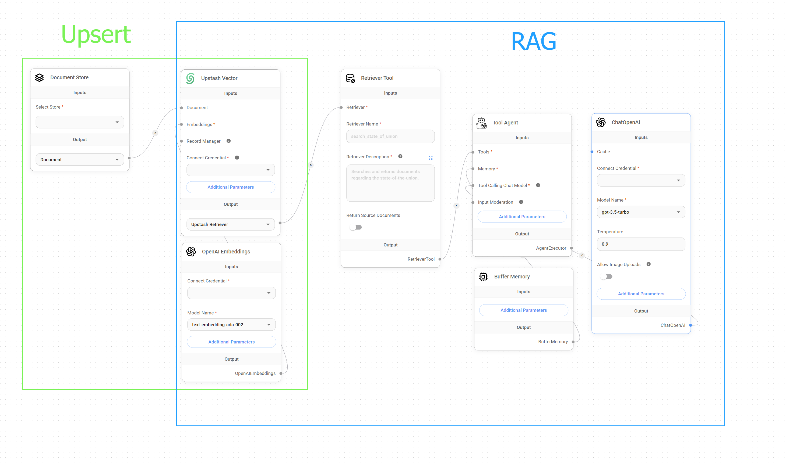
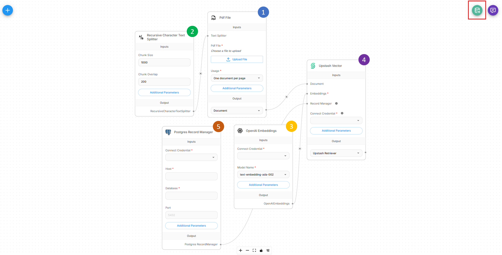

# Upsertion

Upsert는 문서를 벡터 저장소에 업로드하고 처리하는 프로세스를 나타내며, Retrieval Augmented Generation (RAG) 시스템의 기초를 형성합니다.

벡터 저장소에 데이터를 업서트하는 두 가지 기본 방법이 있습니다.

* [Document Stores (권장)](document-stores.md)
* Chatflow Upsert

Document Stores 사용을 강력히 권장합니다. 왜냐하면 RAG 파이프라인을 지원하는 통합 인터페이스를 제공하기 때문입니다. 다양한 소스에서 데이터 검색, 청킹 전략, 벡터 데이터베이스로의 업서팅, 업데이트된 데이터와의 동기화를 지원합니다.

이 가이드에서는 다른 방법인 Chatflow Upsert를 다룹니다. 이것은 Document Stores 이전의 이전 방법입니다.

자세한 내용은 [Vector Upsert Endpoint API 참조](../api-reference/vector-upsert.md)를 참조하세요.

## 업서팅 프로세스 이해

Chatflow를 사용하면 업서팅과 RAG 쿼리 프로세스를 모두 수행할 수 있는 플로우를 생성할 수 있습니다. 두 프로세스 모두 독립적으로 실행할 수 있습니다.

<figure><figcaption><p>Upsert vs. RAG</p></figcaption></figure>

## 설정

업서팅 프로세스가 작동하려면 5개의 다른 노드가 있는 **업서팅 플로우**를 생성해야 합니다.

1. Document Loader
2. Text Splitter
3. Embedding 모델
4. Vector Store
5. Record Manager (선택 사항)

모든 요소는 [Document Stores](document-stores.md)에서 다루었으므로, 자세한 내용은 해당 링크를 참조하세요.

플로우가 올바르게 설정되면 사용자가 업서팅 프로세스를 시작할 수 있는 녹색 버튼이 우측 상단에 나타납니다.

<figure><figcaption></figcaption></figure>

<figure><figcaption></figcaption></figure>

업서팅 프로세스는 API를 통해서도 수행할 수 있습니다.

<figure><figcaption></figcaption></figure>

## Base URL 및 인증

**Base URL**: `http://localhost:3000` (또는 Flowise 인스턴스 URL)

**Endpoint**: `POST /api/v1/vector/upsert/:id`

**인증**: [Flows 인증](../configuration/authorization/chatflow-level.md) 참조

## 요청 방법

API는 챗플로우 구성에 따라 두 가지 다른 요청 방법을 지원합니다.

#### 1. Form Data (파일 업로드)

챗플로우에 파일 업로드 기능이 있는 Document Loaders가 포함되어 있을 때 사용합니다.

#### 2. JSON Body (파일 업로드 없음)

파일 업로드가 필요하지 않은 Document Loaders를 사용하는 챗플로우에서 사용합니다 (예: 웹 스크래퍼, 데이터베이스 커넥터).


파일, 메타데이터 등 노드 구성을 재정의하려면 해당 옵션을 명시적으로 활성화해야 합니다.


<figure><figcaption></figcaption></figure>

### 파일 업로드가 있는 Document Loaders

#### 지원되는 문서 유형

| Document Loader   | 파일 형식  |
| ----------------- | ---------- |
| CSV File          | `.csv`     |
| Docx/Word File    | `.docx`    |
| JSON File         | `.json`    |
| JSON Lines File   | `.jsonl`   |
| PDF File          | `.pdf`     |
| Text File         | `.txt`     |
| Excel File        | `.xlsx`    |
| Powerpoint File   | `.pptx`    |
| File Loader       | 여러 개    |
| Unstructured File | 여러 개    |


**중요**: 파일 형식이 Document Loader 구성과 일치하는지 확인하세요. 최대 유연성을 위해 여러 파일 형식을 지원하는 File Loader 사용을 고려하세요.


#### 요청 형식 (Form Data)

파일을 업로드할 때 JSON 대신 `multipart/form-data`를 사용하세요.

#### 예제



```python
import requests
import os

def upsert_document(chatflow_id, file_path, config=None):
    """
    벡터 저장소에 단일 문서를 업서트합니다.
    
    인수:
        chatflow_id (str): 벡터 업서팅을 위해 구성된 챗플로우 ID
        file_path (str): 업로드할 파일의 경로
        return_source_docs (bool): 응답에서 소스 문서를 반환할지 여부
        config (dict): 선택 사항 구성 재정의
    
    반환:
        dict: 업서팅 결과를 포함하는 API 응답
    """
    url = f"http://localhost:3000/api/v1/vector/upsert/{chatflow_id}"
    
    # 파일 데이터 준비
    files = {
        'files': (os.path.basename(file_path), open(file_path, 'rb'))
    }
    
    # form 데이터 준비
    data = {}
    
    # 제공된 경우 구성 재정의 추가
    if config:
        data['overrideConfig'] = str(config).replace("'", '"')  # JSON 문자열로 변환
    
    try:
        response = requests.post(url, files=files, data=data)
        response.raise_for_status()
        
        return response.json()
        
    except requests.exceptions.RequestException as e:
        print(f"Upload failed: {e}")
        return None
    finally:
        # 항상 파일 닫기
        files['files'][1].close()

# 사용 예제
result = upsert_document(
    chatflow_id="your-chatflow-id",
    file_path="documents/knowledge_base.pdf",
    config={
        "chunkSize": 1000,
        "chunkOverlap": 200
    }
)

if result:
    print(f"Successfully upserted {result.get('numAdded', 0)} chunks")
    if result.get('sourceDocuments'):
        print(f"Source documents: {len(result['sourceDocuments'])}")
else:
    print("Upload failed")
```



```javascript
class VectorUploader {
    constructor(baseUrl = 'http://localhost:3000') {
        this.baseUrl = baseUrl;
    }
    
    async upsertDocument(chatflowId, file, config = {}) {
        /**
         * 브라우저에서 벡터 저장소에 파일을 업로드합니다
         * @param {string} chatflowId - 챗플로우 ID
         * @param {File} file - 입력 요소의 파일 객체
         * @param {Object} config - 선택 사항 구성
         */
        
        const formData = new FormData();
        formData.append('files', file);
        
        if (config.overrideConfig) {
            formData.append('overrideConfig', JSON.stringify(config.overrideConfig));
        }
        
        try {
            const response = await fetch(`${this.baseUrl}/api/v1/vector/upsert/${chatflowId}`, {
                method: 'POST',
                body: formData
            });
            
            if (!response.ok) {
                throw new Error(`HTTP error! status: ${response.status}`);
            }
            
            const result = await response.json();
            return result;
            
        } catch (error) {
            console.error('Upload failed:', error);
            throw error;
        }
    }
    
  
}

// 브라우저에서의 사용 예제
const uploader = new VectorUploader();

// 단일 파일 업로드
document.getElementById('fileInput').addEventListener('change', async function(e) {
    const file = e.target.files[0];
    if (file) {
        try {
            const result = await uploader.upsertDocument(
                'your-chatflow-id',
                file,
                {
                    overrideConfig: {
                        chunkSize: 1000,
                        chunkOverlap: 200
                    }
                }
            );
            
            console.log('Upload successful:', result);
            alert(`Successfully processed ${result.numAdded || 0} chunks`);
            
        } catch (error) {
            console.error('Upload failed:', error);
            alert('Upload failed: ' + error.message);
        }
    }
});
```



```javascript
const fs = require('fs');
const path = require('path');
const FormData = require('form-data');
const fetch = require('node-fetch');

class NodeVectorUploader {
    constructor(baseUrl = 'http://localhost:3000') {
        this.baseUrl = baseUrl;
    }
    
    async upsertDocument(chatflowId, filePath, config = {}) {
        /**
         * Node.js에서 벡터 저장소에 파일을 업로드합니다
         * @param {string} chatflowId - 챗플로우 ID
         * @param {string} filePath - 파일의 경로
         * @param {Object} config - 선택 사항 구성
         */
        
        if (!fs.existsSync(filePath)) {
            throw new Error(`File not found: ${filePath}`);
        }
        
        const formData = new FormData();
        const fileStream = fs.createReadStream(filePath);
        
        formData.append('files', fileStream, {
            filename: path.basename(filePath),
            contentType: this.getMimeType(filePath)
        });
        
        if (config.overrideConfig) {
            formData.append('overrideConfig', JSON.stringify(config.overrideConfig));
        }
        
        try {
            const response = await fetch(`${this.baseUrl}/api/v1/vector/upsert/${chatflowId}`, {
                method: 'POST',
                body: formData,
                headers: formData.getHeaders()
            });
            
            if (!response.ok) {
                const errorText = await response.text();
                throw new Error(`HTTP ${response.status}: ${errorText}`);
            }
            
            return await response.json();
            
        } catch (error) {
            console.error('Upload failed:', error);
            throw error;
        }
    }

    getMimeType(filePath) {
        const ext = path.extname(filePath).toLowerCase();
        const mimeTypes = {
            '.pdf': 'application/pdf',
            '.txt': 'text/plain',
            '.docx': 'application/vnd.openxmlformats-officedocument.wordprocessingml.document',
            '.csv': 'text/csv',
            '.json': 'application/json'
        };
        return mimeTypes[ext] || 'application/octet-stream';
    }
}

// 사용 예제
async function main() {
    const uploader = new NodeVectorUploader();
    
    try {
        // 단일 파일 업로드
        const result = await uploader.upsertDocument(
            'your-chatflow-id',
            './documents/manual.pdf',
            {
                overrideConfig: {
                    chunkSize: 1200,
                    chunkOverlap: 100
                }
            }
        );
        
        console.log('Single file upload result:', result); 
    } catch (error) {
        console.error('Process failed:', error);
    }
}

// 이 파일을 직접 실행하는 경우 실행
if (require.main === module) {
    main();
}

module.exports = { NodeVectorUploader };
```



```bash
# cURL로 기본 파일 업로드
curl -X POST "http://localhost:3000/api/v1/vector/upsert/your-chatflow-id" \
  -F "files=@documents/knowledge_base.pdf"

# 구성 재정의로 파일 업로드
curl -X POST "http://localhost:3000/api/v1/vector/upsert/your-chatflow-id" \
  -F "files=@documents/manual.pdf" \
  -F 'overrideConfig={"chunkSize": 1000, "chunkOverlap": 200}'

# 인증을 위한 사용자 정의 헤더로 업로드 (구성된 경우)
curl -X POST "http://localhost:3000/api/v1/vector/upsert/your-chatflow-id" \
  -H "Authorization: Bearer your-api-token" \
  -F "files=@documents/faq.txt" \
  -F 'overrideConfig={"chunkSize": 800, "chunkOverlap": 150}'
```



### 파일 업로드가 없는 Document Loaders

파일 업로드가 필요하지 않은 Document Loaders (예: 웹 스크래퍼, 데이터베이스 커넥터, API 통합)의 경우, Prediction API와 유사한 JSON 형식을 사용하세요.

#### 예제



```python
import requests
from typing import Dict, Any, Optional

def upsert(chatflow_id: str, config: Optional[Dict[str, Any]] = None) -> Optional[Dict[str, Any]]:
    """
    파일 업로드가 필요하지 않은 챗플로우의 벡터 업서팅을 트리거합니다.
    
    인수:
        chatflow_id: 벡터 업서팅을 위해 구성된 챗플로우 ID
        config: 선택 사항 구성 재정의
    
    반환:
        업서팅 결과를 포함하는 API 응답
    """
    url = f"http://localhost:3000/api/v1/vector/upsert/{chatflow_id}"
    
    payload = {
        "overrideConfig": config
    }
    
    headers = {
        "Content-Type": "application/json"
    }
    
    try:
        response = requests.post(url, json=payload, headers=headers, timeout=300)
        response.raise_for_status()
        
        return response.json()
        
    except requests.exceptions.RequestException as e:
        print(f"Upsert failed: {e}")
        return None

result = upsert(
    chatflow_id="chatflow-id",
    config={
        "chunkSize": 800,
        "chunkOverlap": 100,
    }
)

if result:
    print(f"Upsert completed: {result.get('numAdded', 0)} chunks added")
```



```javascript
class NoFileUploader {
    constructor(baseUrl = 'http://localhost:3000') {
        this.baseUrl = baseUrl;
    }
    
    async upsertWithoutFiles(chatflowId, config = {}) {
        /**
         * 파일 업로드가 필요하지 않은 플로우의 벡터 업서팅을 트리거합니다
         * @param {string} chatflowId - 챗플로우 ID
         * @param {Object} config - 구성 재정의
         */
        
        const payload = {
            overrideConfig: config
        };
        
        try {
            const response = await fetch(`${this.baseUrl}/api/v1/vector/upsert/${chatflowId}`, {
                method: 'POST',
                headers: {
                    'Content-Type': 'application/json',
                },
                body: JSON.stringify(payload)
            });
            
            if (!response.ok) {
                throw new Error(`HTTP error! status: ${response.status}`);
            }
            
            return await response.json();
            
        } catch (error) {
            console.error('Upsert failed:', error);
            throw error;
        }
    }
    
    async scheduledUpsert(chatflowId, interval = 3600000) {
        /**
         * 동적 콘텐츠 소스를 위한 예약된 업서팅을 설정합니다
         * @param {string} chatflowId - 챗플로우 ID
         * @param {number} interval - 간격 (밀리초 단위, 기본값: 1시간)
         */
        
        console.log(`Starting scheduled upsert every ${interval/1000} seconds`);
        
        const performUpsert = async () => {
            try {
                console.log('Performing scheduled upsert...');
                
                const result = await this.upsertWithoutFiles(chatflowId, {
                    addMetadata: {
                        scheduledUpdate: true,
                        timestamp: new Date().toISOString()
                    }
                });
                
                console.log(`Scheduled upsert completed: ${result.numAdded || 0} chunks processed`);
                
            } catch (error) {
                console.error('Scheduled upsert failed:', error);
            }
        };
        
        // 초기 업서트 수행
        await performUpsert();
        
        // 반복 업서트 설정
        return setInterval(performUpsert, interval);
    }
}

// 사용 예제
const uploader = new NoFileUploader();

async function performUpsert() {
    try {
        const result = await uploader.upsertWithoutFiles(
            'chatflow-id',
            {
                chunkSize: 800,
                chunkOverlap: 100
            }
        );
        
        console.log('Upsert result:', result);
        
    } catch (error) {
        console.error('Upsert failed:', error);
    }
}

// 일회성 업서트
await performUpsert();

// 예약된 업데이트 설정 (30분마다)
const schedulerHandle = await uploader.scheduledUpsert(
    'dynamic-content-chatflow-id',
    30 * 60 * 1000
);

// 나중에 예약된 업데이트를 중지하려면:
// clearInterval(schedulerHandle);
```



```bash
# cURL로 기본 업서트
curl -X POST "http://localhost:3000/api/v1/vector/upsert/your-chatflow-id" \
  -H "Content-Type: application/json"

# 구성 재정의로 업서트
curl -X POST "http://localhost:3000/api/v1/vector/upsert/your-chatflow-id" \
  -H "Content-Type: application/json" \
  -d '{
    "overrideConfig": {
      "returnSourceDocuments": true
    }
  }'
  
# 인증을 위한 사용자 정의 헤더로 업서트 (구성된 경우)
curl -X POST "http://localhost:3000/api/v1/vector/upsert/your-chatflow-id" \
  -H "Authorization: Bearer your-api-token" \
  -H "Content-Type: application/json"
```



## 응답 필드

| 필드        | 타입   | 설명                                                 |
| ------------ | ------ | ----------------------------------------------------------- |
| `numAdded`   | number | 벡터 저장소에 추가된 새로운 청크의 수                  |
| `numDeleted` | number | 삭제된 청크의 수 (Record Manager 사용 시)          |
| `numSkipped` | number | 건너뛴 청크의 수 (Record Manager 사용 시)          |
| `numUpdated` | number | 업데이트된 기존 청크의 수 (Record Manager 사용 시) |

## 최적화 전략

### 1. 배치 처리 전략

```python
def intelligent_batch_processing(files: List[str], chatflow_id: str) -> Dict[str, Any]:
    """크기 및 유형에 따라 최적화된 배치로 파일을 처리합니다."""
    
    # 파일을 크기 및 유형별로 그룹화
    small_files = []
    large_files = []
    
    for file_path in files:
        file_size = os.path.getsize(file_path)
        if file_size > 5_000_000:  # 5MB
            large_files.append(file_path)
        else:
            small_files.append(file_path)
    
    results = {'successful': [], 'failed': [], 'totalChunks': 0}
    
    # 큰 파일을 개별적으로 처리
    for file_path in large_files:
        print(f"Processing large file: {file_path}")
        # 사용자 정의 구성으로 개별 처리
        # ... 구현
    
    # 작은 파일을 배치로 처리
    batch_size = 5
    for i in range(0, len(small_files), batch_size):
        batch = small_files[i:i + batch_size]
        print(f"Processing batch of {len(batch)} small files")
        # 배치 처리
        # ... 구현
    
    return results
```

### 2. 메타데이터 최적화

```python
import requests
import os
from datetime import datetime
from typing import Dict, Any

def upsert_with_optimized_metadata(chatflow_id: str, file_path: str, 
                                 department: str = None, category: str = None) -> Dict[str, Any]:
    """
    자동으로 최적화된 메타데이터를 사용하여 문서를 업서트합니다.
    """
    url = f"http://localhost:3000/api/v1/vector/upsert/{chatflow_id}"
    
    # 최적화된 메타데이터 생성
    custom_metadata = {
        'department': department or 'general',
        'category': category or 'documentation',
        'indexed_date': datetime.now().strftime('%Y-%m-%d'),
        'version': '1.0'
    }
    
    optimized_metadata = optimize_metadata(file_path, custom_metadata)
    
    # 요청 준비
    files = {'files': (os.path.basename(file_path), open(file_path, 'rb'))}
    data = {
        'overrideConfig': str({
            'metadata': optimized_metadata
        }).replace("'", '"')
    }
    
    try:
        response = requests.post(url, files=files, data=data)
        response.raise_for_status()
        return response.json()
    finally:
        files['files'][1].close()

# 다양한 문서 유형의 사용 예제
results = []

# 기술 문서
tech_result = upsert_with_optimized_metadata(
    chatflow_id="tech-docs-chatflow",
    file_path="docs/api_reference.pdf",
    department="engineering",
    category="technical_docs"
)
results.append(tech_result)

# HR 정책
hr_result = upsert_with_optimized_metadata(
    chatflow_id="hr-docs-chatflow", 
    file_path="policies/employee_handbook.pdf",
    department="human_resources",
    category="policies"
)
results.append(hr_result)

# 마케팅 자료
marketing_result = upsert_with_optimized_metadata(
    chatflow_id="marketing-chatflow",
    file_path="marketing/product_brochure.pdf", 
    department="marketing",
    category="promotional"
)
results.append(marketing_result)

for i, result in enumerate(results):
    print(f"Upload {i+1}: {result.get('numAdded', 0)} chunks added")
```

## 문제 해결

1. **파일 업로드 실패**
   * 파일 형식 호환성 확인
   * 파일 크기 제한 확인
2. **처리 시간 초과**
   * 요청 타임아웃 증가
   * 큰 파일을 작은 부분으로 나누기
   * 청크 크기 최적화
3. **벡터 저장소 오류**
   * 벡터 저장소 연결 확인
   * 임베딩 모델 차원 호환성 확인
