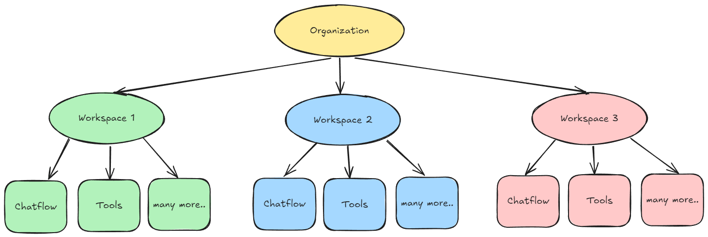

# 워크스페이스


워크스페이스는 클라우드 및 엔터프라이즈 플랜에서만 사용 가능합니다.


초기 로그인 시 기본 워크스페이스가 자동으로 생성됩니다. 워크스페이스는 다양한 팀 또는 비즈니스 단위 간에 리소스를 분할하기 위해 사용됩니다. 각 워크스페이스 내에서 역할 기반 액세스 제어(RBAC)를 사용하여 권한 및 액세스를 관리합니다. 이를 통해 사용자는 자신의 역할에 필요한 리소스 및 설정에만 액세스할 수 있습니다.

<figure><figcaption></figcaption></figure>

## 관리자 계정 설정

<details>

<summary>자체 호스팅 엔터프라이즈의 경우 다음 환경 변수를 설정해야 합니다</summary>

```
JWT_AUTH_TOKEN_SECRET
JWT_REFRESH_TOKEN_SECRET
JWT_ISSUER
JWT_AUDIENCE
JWT_TOKEN_EXPIRY_IN_MINUTES
JWT_REFRESH_TOKEN_EXPIRY_IN_MINUTES
PASSWORD_RESET_TOKEN_EXPIRY_IN_MINS
PASSWORD_SALT_HASH_ROUNDS
TOKEN_HASH_SECRET
```

</details>

기본적으로 Flowise의 새 설치에는 관리자 설정이 필요합니다. 이는 처음에 데이터베이스의 루트 사용자를 설정하는 것과 동일합니다.

<figure><figcaption></figcaption></figure>

설정 후 사용자는 Flowise 대시보드로 이동합니다. 왼쪽 사이드바에서 사용자 및 워크스페이스 관리 섹션을 볼 수 있습니다. 기본 워크스페이스가 자동으로 생성되었습니다.

<figure><figcaption></figcaption></figure>

## 워크스페이스 생성

새 워크스페이스를 생성하려면 새로 추가를 클릭합니다.

<figure><figcaption></figcaption></figure>

생성한 워크스페이스에서 사용자 자신이 조직 관리자로 추가된 것을 볼 수 있습니다.

<figure><figcaption></figcaption></figure>

워크스페이스에 새 사용자를 초대하려면 먼저 역할을 생성해야 합니다.

## 역할 생성

왼쪽 사이드바의 역할로 이동하여 역할 추가를 클릭합니다.

<figure><figcaption></figcaption></figure>

사용자는 각 리소스에 대한 세분화된 권한 제어를 지정할 수 있습니다. 유일한 예외는 **사용자 및 워크스페이스 관리**(역할, 사용자, 워크스페이스, 로그인 활동)의 리소스입니다. 이러한 리소스는 현재 계정 관리자만 사용할 수 있습니다.

여기서는 모든 것에 액세스할 수 있는 편집기 역할을 만듭니다. 그리고 보기 전용 권한이 있는 다른 역할을 만듭니다.

<figure><figcaption></figcaption></figure>

## 사용자 초대

<details>

<summary>자체 호스팅 엔터프라이즈의 경우 다음 환경 변수를 설정해야 합니다</summary>

```
INVITE_TOKEN_EXPIRY_IN_HOURS
SMTP_HOST
SMTP_PORT
SMTP_USER
SMTP_PASSWORD
```

</details>

왼쪽 사이드바의 사용자로 이동합니다. 자신을 계정 관리자로 볼 수 있습니다. 이는 별표가 있는 사람 아이콘으로 표시됩니다.

<figure><figcaption></figcaption></figure>

사용자 초대를 클릭하고 초대할 이메일, 할당할 워크스페이스, 역할을 입력합니다.

<figure><figcaption></figcaption></figure>

초대 보내기를 클릭합니다. 초대된 이메일은 초대장을 받게 됩니다.

<figure><figcaption></figcaption></figure>

초대 링크를 클릭하면 초대된 사용자는 가입 페이지로 이동합니다.

<figure><figcaption></figcaption></figure>

가입하고 초대된 사용자로 로그인하면 할당된 워크스페이스에 있게 되며 사용자 및 워크스페이스 관리 섹션이 없습니다.

<figure><figcaption></figcaption></figure>

여러 워크스페이스에 초대된 경우 우측 상단의 드롭다운 버튼에서 다른 워크스페이스로 전환할 수 있습니다. 여기서는 **보기 전용** 권한으로 워크스페이스 2에 할당되었습니다. 챗플로우의 새로 추가 버튼이 더 이상 보이지 않는 것을 알 수 있습니다. 이는 사용자가 보기만 할 수 있고 생성, 업데이트, 삭제할 수 없도록 보장합니다. 동일한 RBAC 규칙이 API에도 적용됩니다.

<figure><figcaption></figcaption></figure>

이제 계정 관리자로 돌아가서 초대된 사용자, 상태, 역할, 활성 워크스페이스를 볼 수 있습니다.

<figure><figcaption></figcaption></figure>

계정 관리자는 다른 사용자의 설정을 수정할 수도 있습니다.

<figure><figcaption></figcaption></figure>

## 로그인 활동

관리자는 모든 사용자의 모든 로그인 및 로그아웃을 볼 수 있습니다.

<figure><figcaption></figcaption></figure>

## 워크스페이스에서 항목 생성

워크스페이스에서 생성된 모든 항목은 다른 워크스페이스에서 격리됩니다. 워크스페이스는 조직 내에서 사용자와 리소스를 논리적으로 그룹화하는 방법으로, 리소스 관리 및 액세스 제어를 위한 별도의 신뢰 경계를 보장합니다. 각 팀에 대해 고유한 워크스페이스를 생성하는 것이 권장됩니다.

여기서는 **워크스페이스 1**에 **Chatflow1**이라는 이름의 챗플로우를 생성합니다.

<figure><figcaption></figcaption></figure>

**워크스페이스 2**로 전환하면 **Chatflow1**은 보이지 않습니다. 이는 에이전트플로우, 도구, 어시스턴트 등 모든 리소스에 적용됩니다.

<figure><figcaption></figcaption></figure>

아래 다이어그램은 조직, 워크스페이스, 및 워크스페이스와 관련된 다양한 리소스 간의 관계를 보여줍니다.

<figure><figcaption></figcaption></figure>

## 자격 증명 공유

자격 증명을 다른 워크스페이스와 공유할 수 있습니다. 이를 통해 사용자는 다양한 워크스페이스에서 동일한 자격 증명 세트를 재사용할 수 있습니다.

자격 증명을 생성한 후 계정 관리자 또는 RBAC에서 자격 증명 공유 권한이 있는 사용자는 공유를 클릭할 수 있습니다.

<figure><figcaption></figcaption></figure>

사용자는 자격 증명을 공유할 워크스페이스를 선택할 수 있습니다.

<figure><figcaption></figcaption></figure>

이제 자격 증명이 공유된 워크스페이스로 전환하면 공유 자격 증명을 볼 수 있습니다. 사용자는 공유된 자격 증명을 편집할 수 없습니다.

<figure><figcaption></figcaption></figure>

## 워크스페이스 삭제

현재 계정 관리자만 워크스페이스를 삭제할 수 있습니다. 기본적으로 워크스페이스 내에 여전히 사용자가 있으면 워크스페이스를 삭제할 수 없습니다.

<figure><figcaption></figcaption></figure>

먼저 초대된 모든 사용자의 연결을 끊어야 합니다. 이는 워크스페이스에서 특정 사용자만 제거하려는 경우 유연성을 제공합니다. 워크스페이스를 생성한 조직 소유자는 워크스페이스에서 연결을 끊을 수 없습니다.

<figure><figcaption></figcaption></figure>

초대된 사용자의 연결을 끊은 후 워크스페이스 내에 남은 유일한 사용자가 조직 소유자인 경우 삭제 버튼을 클릭할 수 있습니다.

<figure><figcaption></figcaption></figure>

워크스페이스를 삭제하는 것은 되돌릴 수 없는 작업이며 워크스페이스 내의 모든 항목이 계단식 삭제됩니다. 경고 상자가 표시됩니다.

<figure><figcaption></figcaption></figure>

워크스페이스를 삭제한 후 사용자는 기본 워크스페이스로 돌아갑니다. 시작 시 자동으로 생성된 기본 워크스페이스는 삭제할 수 없습니다.
